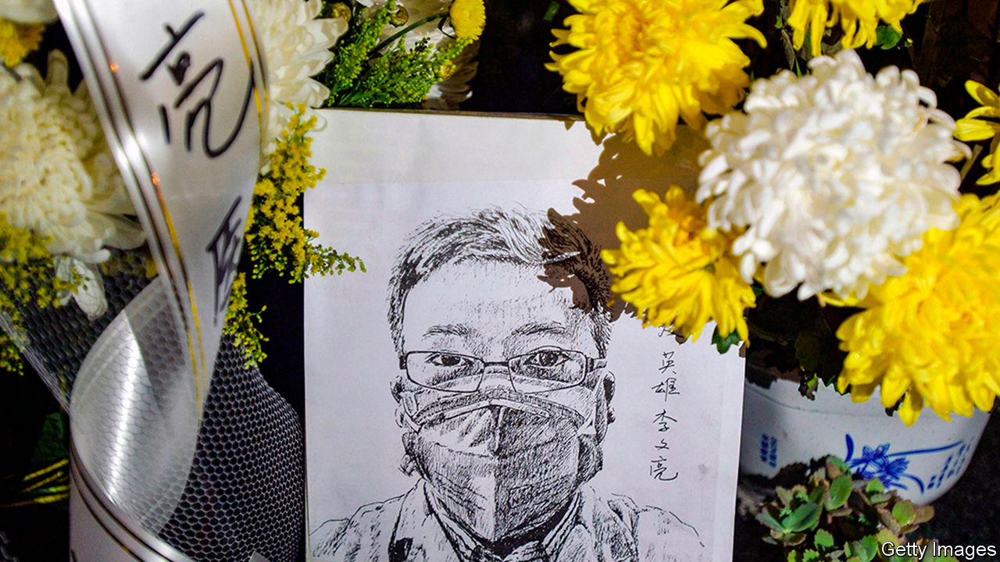

## The man who knew

# Li Wenliang died on February 7th

> The doctor who was one of the first to warn of a new coronavirus was 33

> Feb 13th 2020

BUSY THOUGH he was as an ophthalmologist at Wuhan Central hospital, rushed off his feet, Li Wenliang never missed a chance to chat about his favourite things on Weibo. Food, in particular. Japanese food with lashings of wasabi, plates of steaming beef noodles, the Haidilao hotpot restaurants that had kept him going when he spent three years in Xiamen just after his medical training—and fried chicken. The drumsticks at the railway station were the best, and he never missed a chance to grab some when he was there; but then the chicken at Dicos fast-food was so delicious that he just had to compliment the chef. A big basket of that, washed down with a Coke, was the peak of his existence.

As a result he got chubby, and as a result of that he tried to do sport, but apart from a bit of badminton early on he mostly exercised by live-streaming snooker, commenting live on Weibo and energetically querying the ref’s decisions. So, though he had once been slim and was still fairly good-looking, he had strayed far away from the willowy baby-faced look of Xiao Zhan, the boy-band actor whose music he loved. But he was a husband now and a father, secure in a stable profession, a man of weight. That had been his aim since his schooldays, when he decided to leave industrial Liaoning in the north-east, where his parents were unemployed, and go to college in the south. At Wuhan Central the pay was bad and the hours punishing, but as long as his patients were satisfied, he was happy. Egg pancakes (that wonderful dopamine hit on his tongue!) got him through the grim night shifts.

Since he shared every passing observation online, it was not surprising that on December 30th he put up a post about an odd cluster of pneumonia cases at the hospital. They were unexplained, but the patients were in quarantine, and they had all worked in the same place, the pungent litter-strewn warren of stalls that made up the local seafood market. Immediately this looked like person-to-person transmission to him, even if it might have come initially from bats, or some other delicacy. Immediately, too, it raised the spectre of the SARS virus of 2002-03 which had killed more than 700 people. He therefore decided to warn his private WeChat group, all fellow alumni from Wuhan University, to take precautions. He headed the post: “Seven cases of sARS in the Huanan Wholesale Seafood Market”. That was his mistake.

The trouble was that he did not know whether it was actually SARS. He had posted it too fast. In an hour he corrected it, explaining that although it was a coronavirus, like SARS, it had not been identified yet. But to his horror he was too late: his first post had already gone viral, with his name and occupation undeleted, so that in the middle of the night he was called in for a dressing down at the hospital, and January 3rd he was summoned to the police station. There he was accused of spreading rumours and subverting the social order. He then had to give written answers to two questions: in future, could he stop his illegal activities? “I can,” he wrote, and put his thumbprint, in red ink, on his answer. Did he understand that if he went on, he would be punished under the law? “I understand,” he wrote, and supplied another thumbprint.

His birthday resolution, posted on Weibo, had been to be a simple person, refusing to let the world’s complications bother him. So much for that. At least he had not been detained, which would have consumed his family with worry. At least his licence to practise had not been revoked. In fact, he had not even been fined. Yet why should he have been? He had been right to raise the alarm. The authorities were still denying that there was human-to-human transmission, and that was just wrong. He had spoken out before, when two trains had crashed in Wenzhou in 2011 with 40 deaths, demanding on Weibo the reinstatement of a journalist who had been sacked for asking about lack of safety on the line. The truth mattered. Public safety mattered. Public power should not be used for excessive interference. In this turmoil, though silent as promised, he went back to work, and then he was careless again.

On January 8th an 82-year-old patient presented with acute angle-closure glaucoma and, because she had no fever, he treated her without a mask. She too turned out to run a stall in the market, and she had other odd symptoms, including loss of appetite and pulmonary lesions suggesting viral pneumonia. It was the new virus, and by January 10th he had begun to cough. The next day he put an N95 mask on. Not wanting to infect the family, he sent them to his in-laws 200 miles away, and checked into a hotel. He was soon back in the hospital, this time in an isolation ward. On February 1st a nucleic-acid test showed positive for the new coronavirus. Well, that’s it then, confirmed, he wrote on Weibo from his bed.

He was an optimistic sort. Though the household finances were pretty stretched, he felt sure he would win the big prize in the online lucky grab-bag run by Luo Yonghao, the founder of the Smartisan tech company (whose products he much coveted), and got that same lucky feeling when he tried to win a pair of AirPods Pro, though he ended up with neither. When it came to this new virus, though it might take him half a month to regain full lung function, he would soon be back on the front line fighting. After all, he was the man who in 2012—when the world had been supposed to end—had announced on Weibo that he was going to save it. (“Though if the sun rises as usual…don’t thank me. I’m just doing my duty.”)

His fame had spread far and wide, too. Reporters, even from the New York Times, wanted interviews. These had to be done by text and via WeChat, since from late January he could not breathe on his own and was hooked up to continuous-flow oxygen. It didn’t help as much as he expected—his blood-oxygen saturation levels got no better. But online he could go on making defiant and upbeat remarks. There had to be more transparency. The truth was important. A healthy society should never have just one voice. And to the young woman reporter who wanted a selfie of him (as if he was Xiao Zhan, ever perfectly groomed, cute and slim), he sent an apology along with the photo of his masked, tubed and haunted face: sorry, he hadn’t washed his hair for a while. ■

## URL

https://www.economist.com/obituary/2020/02/13/li-wenliang-died-on-february-7th
