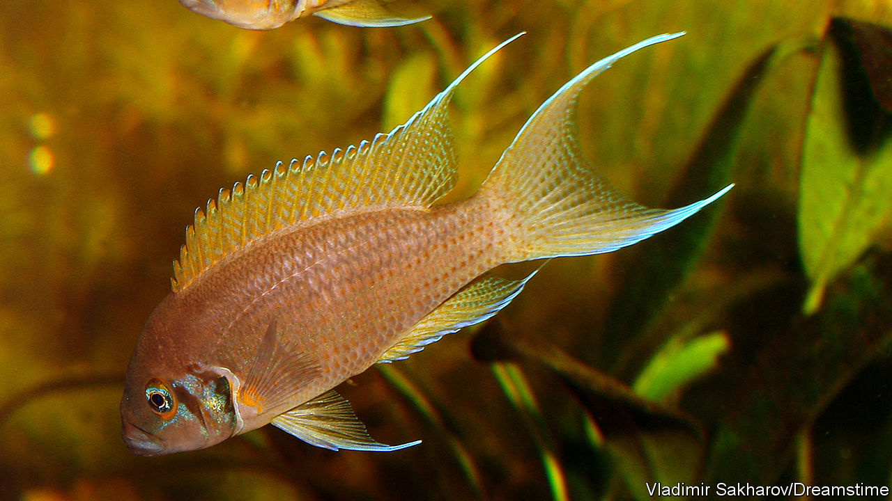

## Animal behaviour

# Fish, like people, must pay for their accommodation

> Otherwise bad things may happen to them

> Feb 13th 2020

TENANTS WHO don’t pay the rent are a bane of landlords everywhere. And landlords who use heavy tactics to enforce payment are similarly a bane of tenants. Nor are these problems confined to human beings. Property-owning cichlid fish seem as ruthless about receiving what they are owed as any 19th-century tenement holder in the Lower East Side of New York.

The fish in question, Neolamprologus pulcher, inhabit Lake Tanganyika in east Africa. They are co-operative breeders, meaning that dominant individuals do the breeding and subordinates assist in various ways, in exchange for immediate survival-enhancing benefits that may lead to the ultimate prize of becoming dominant themselves. In the case of N. pulcher the main benefit is having somewhere to live. Dwellings, in the form of shelters dug out from sand under rocks, are controlled by dominant pairs. These dominants permit subordinates to share their accommodation, and those subordinates pay for the privilege by keeping the property in good repair and defending the dominants’ eggs and fry against predators.

Though co-operative breeding by vertebrates has evolved several times (famous examples include the meerkat mongooses of southern Africa and the scrub jays of Florida), the question of how rental payments are enforced has never been definitively settled. The presumption is that dominants punish subordinate defaulters. But it is hard to prove, by observing wild animals, that this is what is happening.

What was needed to clear the point up was an experiment. And fish are easier to experiment on than mongooses or jays. Jan Naef and Michael Taborsky of the University of Bern, in Switzerland, therefore acquired 96 specimens of N. pulcher and created menages of a pair of dominant landlords and a subordinate tenant in sand-bottomed aquaria.

Left alone, the fish behaved much as they would have done in the wild, with the tenant doing the grunt work of maintaining the hollows in the sand, and good relations pertaining between all. However, if a tenant was prevented for a time from fulfilling its duties, by trapping it behind a partition inserted into the aquarium for that purpose, things changed. When the partition was removed, the landlords attacked it, and it showed a big increase in submissive behaviour for several minutes before things returned to normal.

Whether similar treatment would be meted out for a failure to defend the landlords’ eggs has yet to be determined. When prevented by a partition from driving away predators, tenants were not subsequently on the receiving end of aggression from landlords—but since there were no eggs to defend at the time, that may not have been part of the contract. The predators in question, a species called Telmatochromis vittatus, are not a threat to adult specimens of N. pulcher, only to eggs and fry. It is nevertheless clear from Dr Naef’s and Dr Taborsky’s experiment that, for cichlids at least, the rent must be paid in a timely fashion, or punishment will be faced.■