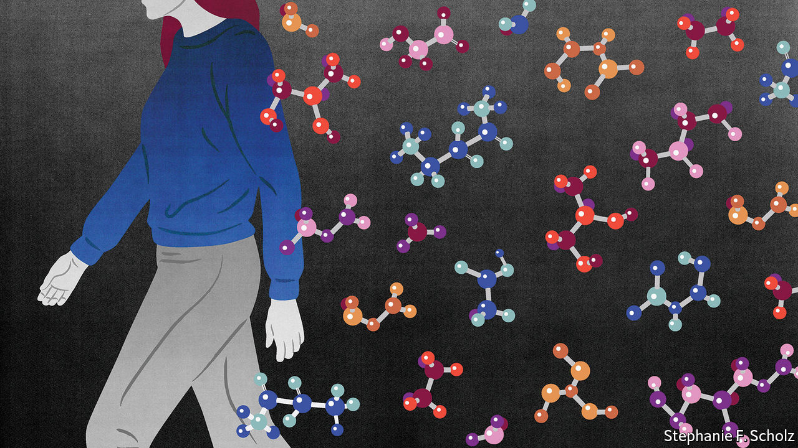

## Metabolites and you

# People leave molecular wakes that may give away their secrets

> They shed loads of chemicals

> Feb 13th 2020

GENES CAN tell tales about you, from who your ancestors were to how likely you are to develop a range of diseases. And it seems probable that in the future they will tell more: your personality type, perhaps, or your intelligence. For these reasons, many countries have laws limiting what use employers and insurance companies can make of such information. America, for example, has the Genetic Information Nondiscrimination Act, which makes it illegal for health insurers and employers to use genetic information to discriminate against customers and employees.

There is much, however, that genes cannot reveal. They are blind to what you eat, how you exercise, how safe the place you live in is, how you unwind at the end of the day and which god you worship. Just as well, you might think, considering how easy it is to obtain samples of DNA from saliva, sweat or hair, and how cheap it is becoming to analyse such samples. But it is not just DNA that people scatter to the wind as they go about their business. They shed a whole range of other chemicals as well, in their breath, their urine, their faeces and their sweat. Collectively, and somewhat inaccurately, these molecules are referred to as metabolites. Some truly are the products of metabolic activity within people’s bodies. Others are substances an individual has come into contact with, or consumed or inhaled. All, though, carry information of one sort or another.

Until recently this did not matter much, for two reasons. One was that, in practice, taking samples for analysis required either voluntary collaboration or legal duress. It could not be done clandestinely. The other was that interpreting the complicated patterns of metabolites is hard. But both of these obstacles are now being overcome.

The most common way of analysing metabolite content is gas chromatography-mass spectrometry. This technique sorts molecules by their weight, producing a pattern of peaks that correspond to different substances. But the same weight can be shared by many molecules, so the results may be ambiguous. Nor, even if a molecule can be identified unambiguously, is its wider significance always obvious to a particular investigator.

There are, however, a lot of information sources out there, in the form of publicly available metabolite databases. And last year a team led by Pieter Dorrestein of University of California, San Diego, invented a way, which they call a metabolite search engine, of linking them up so that a sample can be compared simultaneously with the contents of all of them.

The databases themselves are getting better, too. According to Dr Dorrestein, researchers in the field were able, as recently as four years ago, to identify only 2% of the metabolites found in samples. Today, that has increased to 6% and is climbing quickly. “It is reasonable”, he says, “to assume that in another four years we will be able to annotate 20% of the molecular signatures that we encounter, based on the advances that are being made.”

Another area of progress is the type, size and state of preservation of samples that can be interrogated. No longer are blood, urine or breath required. Sweat, tears, saliva and even dental plaque will do. A study just published by Feliciano Priego-Capote at University of Cordoba, in Spain, for example, shows it is possible to extract much meaningful information from even a dried-up drop of sweat—indeed, Dr Priego-Capote is able to find in dried sweat substances that are undetectable at the moment in fresh perspiration.

Such information can reveal a lot. Your god? Regular exposure to burning incense, and thus frequent visits to a church that uses it, will be detectable from the chemicals in the smoke. Not a Christian? Kosher and halal diets are detectable by the absence of metabolites from certain foodstuffs those diets forbid. Your out-of-office activities? Habits like drinking, smoking and narcotic use are visible as numerous chemicals—not merely the active pharmaceuticals which produce the relevant high or low. Your exercise levels? These are flagged up by lower than normal levels of things like leucine, glycerol and phenylalanine. Your local environment? Breathing in polluted air has a marked impact on the profile of your metabolites. Your general health? Illnesses ranging from Parkinson’s disease (altered levels of tyrosine and tryptophan) to diabetes (sugars and sphingomyelin) leave abundant metabolic traces. “The day is coming soon”, observes Cecil Lewis, a molecular anthropologist at University of Oklahoma, who is studying the matter, “when it will be possible to swab a person’s desk, steering wheel or phone and determine a wide range of incredibly private things about them.”

In contrast with DNA, the use to which knowledge of metabolites might be put has little legal restriction. Dr Lewis, and others like him, worry about the consequences of this. At the moment, sampling for alcohol or illegal drug use, say, has to be overt, because it involves a blood, urine or breath test. That is true regardless of who is collecting the sample, whether it be the police or an employer. This also keeps purposes clear. A firm might feel it has the right to test employees for drug use, and the law might support that. But techniques like Dr Priego-Capote’s make it easier, as Dr Lewis observes, to sample clandestinely, and bring a temptation to push back the boundaries of what is being searched for. They would, for example, allow companies to detect, if they chose to look, such private matters as whether an employee was taking antidepressants.

Metabolite data, even the sort obtained openly, will also be of interest to medical-insurance companies, who may insist on the provision of samples as a condition of the provision of cover. They, too, might take an interest in matters of diet and exercise, penalising those who do not conform to prescribed healthy regimes.

The police may be tempted to push the boundaries as well. The fourth amendment to America’s constitution protects against unwarranted searches and seizure of evidence. This means it is hard to force someone to give a sample. But if obtaining such merely requires taking a swab of a surface in a public place—perhaps a keyboard someone has just used—the amendment is unlikely to apply.

That is not necessarily wrong, if it means more criminals are caught and convicted. But it needs to be thought about carefully, because many metabolites are sticky. Cocaine is a case in point. Studies have shown that as many as two-thirds of the dollar bills in circulation in America carry traces of this substance, which might thus end up on the fingertips of the innocent, as well as the guilty.

Perversely, this might even help someone who really had taken the drug. The law in many jurisdictions permits employers to fire employees for unlawful conduct, even if it happens outside the workplace. But as Michelle Terry of WKS Law in Los Angeles, observes, given how sticky research has shown cocaine metabolites to be, it is hard to guess how the courts would rule if someone lost their job for testing positive, yet claimed never knowingly to have touched the stuff.■

## URL

https://www.economist.com/science-and-technology/2020/02/13/people-leave-molecular-wakes-that-may-give-away-their-secrets
