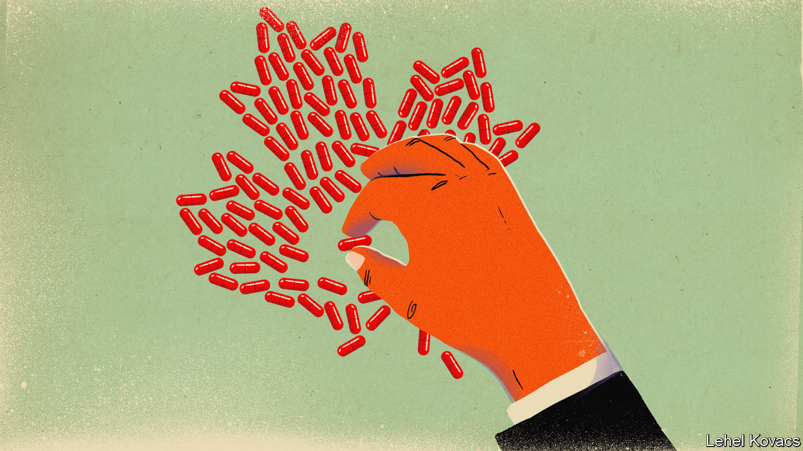
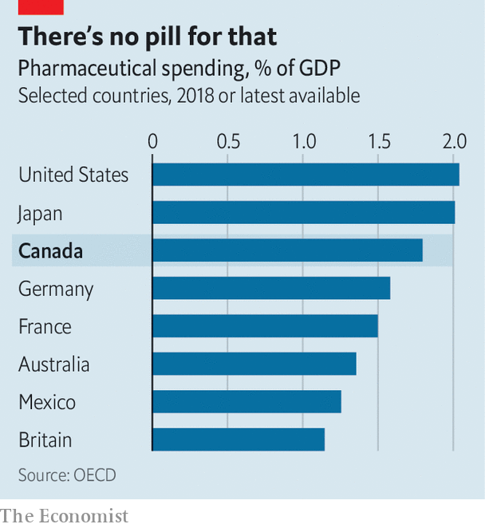

## Justin Trudeau’s drug problem

# Canada ponders a federal programme for pharmaceuticals

> The country’s vaunted public health-care system has a big gap

> Feb 15th 2020TORONTO

IN JULY Bernie Sanders hopped on a bus in Detroit with some Americans who have diabetes. They rode across the Canadian border to buy insulin at a tenth of the price they would pay at home. For Mr Sanders, who won the New Hampshire primary on February 11th, joining an “insulin caravan” had obvious appeal. He promises “Medicare for all”, suggesting that every American should enjoy the lavish public health spending that the elderly receive. He praises Canada for its tough negotiations with drug firms. “We should be doing what the Canadians do,” he declared.

Canadians have their doubts. Canada’s pharmaceutical prices are 25% higher than the average in the OECD, a club of 36 mainly rich countries. American prices are higher still, largely because the United States has powerful drug firms, no price-setting regulator and lots of citizens who receive health insurance through their employers and have little idea how much it costs. Unlike Canada, the United States also lets drugmakers advertise directly to consumers. As a share of GDP, Canada’s pharmaceutical spending is the fifth-highest in the OECD (see chart).

It is the only country with publicly financed universal health care that does not provide universal coverage for prescription drugs. A fifth of Canadians have no drug insurance. Nearly 1m say they spend less on food or heating to pay for them. Hundreds of people die and tens of thousands harm their health because they stop taking medicines, according to a report in 2018 by a nurses’ union.

Politicians now agree that Canada has a drug problem. Justin Trudeau, the Liberal prime minister, who has led a minority government since a parliamentary election in October, calls drug prices a “terrible financial barrier”. In December the government said it would introduce “national pharmacare”, some sort of federal drug-insurance benefit. That leaves big questions unanswered. Just how Mr Trudeau goes about fixing drug coverage will be one of the biggest decisions of his second term.

Currently, most Canadians get drugs through a patchwork of public and private insurance schemes. Around 60% are enrolled in one of more than 100,000 private plans, mostly through their employers. Provincial governments provide insurance to groups such as old or jobless people, and in some cases to poor families. The federal government covers indigenous Canadians and members of the armed forces. This fragmented system leaves people out, including many low-wage and self-employed workers.

A federal board sets a ceiling on prices for patented drugs, using international benchmarks to determine what is excessive. Provincial governments collaborate with each other and with the federal government to bargain prices down further. But Canada’s complex public-private system weakens its negotiating power. It does not have the market clout of England’s National Health Service, almost the sole buyer of prescription drugs in its market.

The main question facing Mr Trudeau is whether to fill in the gaps with a modest federal scheme, or replace the patchwork with a universal plan. He is under pressure to pick the bolder option. Two-thirds of voters want a universal plan. The left-leaning New Democratic Party (NDP), whose votes Mr Trudeau will sometimes need, backs universality. So did a government-appointed panel in June. “Every single darn study always comes to the same conclusion,” says Don Davies, the NDP’s health spokesman.

The panel forecast that a universal plan would reduce overall spending on prescription drugs, which is around C$34bn ($26bn) a year. By 2027 Canada would spend 10% less than currently projected. That is because the federal government could negotiate lower prices for bulk purchases of drugs, said the panel. It could also speed up the switch to (much cheaper) generics when patents expire. Employment costs would fall by C$750 a year per worker, because employers would no longer feel obliged to pay for drugs. Other things being equal, this should translate into higher wages. Families’ out-of-pocket expenses would also fall by C$350. Other health-care costs would also drop. Patients who skip medication tend to get sicker and need to go to hospital. This is much more expensive than taking the drugs would have been, and the taxpayer picks up the tab.

But Mr Trudeau is wary of an ambitious national plan that would push up federal spending. The advisory panel reckons that universal coverage would eventually cost the federal government an additional C$15bn a year, more than half this year’s expected budget deficit. It would probably also lead to an increase in taxes. Opponents make an argument that will sound familiar to Americans: people with private insurance get better coverage than they would under a public scheme. As in the United States, few Canadian workers realise that the high cost of employer-provided health insurance comes out of employees’ wages, collectively.

Provinces and territories, which are in charge of public health care, might also resist drug reform. In 2011 the federal government, then led by the Conservatives, cut in half the annual increase in its contribution to provincial and territorial health budgets. Provincial governments suspect that pharmacare will be used to dump more costs on them. It is the “most expensive and disruptive option” for provinces, says Tyler Shandro, the health minister of Alberta, a western province governed by Conservatives. Provincial leaders have already said they want the right to use the money that would be spent on universal pharmacare for their own health-care priorities. 

Before the election Mr Trudeau promised a C$6bn “downpayment” on pharmacare over four years, far less than needed for a universal programme. Support for a more modest plan could come from the Bloc Québécois, a nationalist party from Quebec that has more seats in Parliament than the NDP. Quebec is the only province with universal public coverage for citizens who lack private insurance. The Bloc is unlikely to endorse a federal programme that replaces it.

The government has begun an economy drive. It is lowering price ceilings by removing the highest-cost countries, such as the United States, from federal benchmarks. That will reduce national spending on drugs by a modest C$130m a year on average over the next decade, it expects. The government also plans to establish a national drugs agency to improve co-ordination with provinces in bargaining with pharmaceutical firms and to consider ways to standardise and expand drug coverage. But this may take years. Until then, Canada will not be quite the role model that Mr Sanders thinks it is.■

Correction (February 13th): A previous version of this story mis-named the New Democratic Party. This has been changed.

## URL

https://www.economist.com/the-americas/2020/02/15/canada-ponders-a-federal-programme-for-pharmaceuticals
