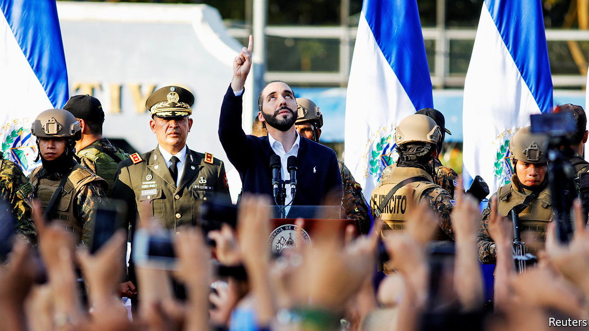

## Bukele up

# El Salvador’s president summons the army to bully congress

> Nayib Bukele may get his way, at the price of damaging democracy

> Feb 13th 2020

NAYIB BUKELE, the president of El Salvador, draws notice outside his country for his youth, his jet-black beard and his mastery of social media. Now his authoritarianism is a trending topic. The sight of Mr Bukele entering the National Assembly on February 9th, alongside soldiers toting machine guns, shocked onlookers at home and abroad. He plonked himself in the empty chair reserved for the president of congress. “I liked seeing those empty seats,” he tweeted. “It made it easier for me to imagine them full of honest people who work for the people.”

Congress accused the president of staging an “attempted coup”. The Constitutional Court rebuked Mr Bukele. El Faro, a Salvadorean news website, called his stunt “the lowest moment that Salvadorean democracy has lived in three decades”. He retorted, not very reassuringly, “If I were a dictator, I would have taken control of everything.”

Eight months into his presidency Mr Bukele, who at 38 is the world’s second-youngest head of state, has an approval rating of 90%. But his left-leaning New Ideas party, founded in 2018, has not had a chance to win seats in congress. The legislature is dominated by two parties: the left-wing FMLN, the successor to a guerrilla movement that fought a decade-long civil war in the 1980s, and the right-wing Arena party, which defended the government in that war. Mr Bukele has so far used his popularity to get his way in congress, persuading it to enact a budget, for example.

But for three months the legislature has failed to approve a loan that would finance Mr Bukele’s security plan. Tired of waiting, he ordered lawmakers to convene for an extraordinary session. When no quorum was reached, he summoned the army and thousands of supporters, invoking an article of the constitution that gives citizens the right to “insurrection”.

Congress had already consented to more than $400m of spending for his security plan, which includes a strategy for fighting gangs, more money for social programmes and an upgrade of equipment for the police. So far, though, congress has withheld approval of a $109m loan from the Central American Bank for Economic Integration, a multilateral bank based in Tegucigalpa, Honduras, to be used to buy equipment. Some lawmakers worry about reports that a $26m contract to supply cameras will go to a Mexican firm that gave free flights on a private jet to the deputy justice minister. (He denies wrongdoing.)

Mr Bukele’s popularity will depend partly on his success in fighting gangs, which earn most of their money by extorting it from ordinary Salvadoreans. In 2015 El Salvador’s murder rate of more than 100 per 100,000 people was the world’s highest. Lately violence has fallen. In 2019 the murder rate was a third of its peak. In January this year there were 120 killings, fewer than in any month since the end of the civil war in 1992. That is not just the president’s doing. Violence has dropped in all the countries of the Northern Triangle (which includes Honduras and Guatemala). But there is little evidence that extortion has declined in El Salvador. Mr Bukele’s security plan is aimed at curbing non-lethal crime as well as murder.

During his brief tenure, he has behaved both like a technocrat and a populist showman. This month he announced that Ricardo Hausmann, an economist at Harvard University, would advise his government. But his proposed anti-corruption commission looks as if it will have little power.

Mr Bukele could have been more patient. He will probably gain control over congress in legislative elections due next year. Rather than wait, he has triggered a constitutional crisis and memories of military dictatorship and the civil war, in which 75,000 people died.

Mr Bukele eventually called off the army, and grudgingly agreed to comply with an order by the Constitutional Court that he keep the soldiers out of congress. The president may have delighted some of his supporters by bullying the legislature. Salvadoreans who care about the health of their democracy are rightly worried. ■

## URL

https://www.economist.com/the-americas/2020/02/13/el-salvadors-president-summons-the-army-to-bully-congress
