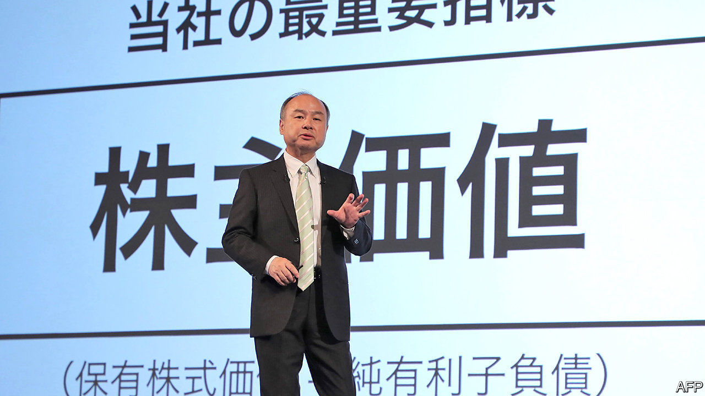
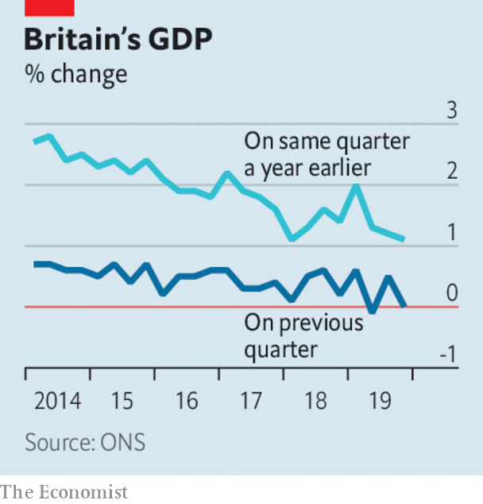

# Business this week

> Feb 15th 2020

SoftBank reported only a tiny operating profit of ¥2.6bn ($24m) for the latest quarter because of more losses at its Vision Fund for startups, which has come under scrutiny after a number of poor investments, most notably in WeWork. The drop in earnings comes after Elliott, an activist hedge fund known for its combative push for change at the companies it invests in, pressed the Japanese conglomerate to undertake a $20bn share buy-back. Son Masayoshi, SoftBank’s boss, took a conciliatory approach to Elliott’s intervention, saying “We are thankful that such a distinguished investor has joined us as a friend.”

The day before it released its earnings, SoftBank had some good news when a federal judge ruled in favour of  T-Mobile’s takeover of Sprint. SoftBank, which is Sprint’s parent company, saw its share price soar by 12% after the acquisition cleared its last hurdle. But media reports suggest that Deutsche Telekom, the parent company of T-Mobile, might seek better terms because Sprint’s financial position has weakened since the deal was announced in April 2018.

Tidjane Thiam was ousted as chief executive of Credit Suisse, following last year’s revelations that the Swiss bank had conducted surveillance on two former executives. With a plot worthy of a spy novel, the bank’s former chief operating officer hired private detectives to trail the executives. One monitoring episode was even dubbed “Operation Küsnacht” after the rich suburb in which it was carried out. Mr Thiam insists he was unaware of the spying. He was supported by investors, but that was not enough to save his job. The bank, meanwhile, reported a 69% rise in annual net profit.

Barclays said that its chief executive, Jes Staley, was being investigated by regulators about his past links to Jeffrey Epstein, a deceased financier who trafficked under-age girls for sex. Mr Staley says he has had no contact with Epstein since taking the reins at the bank in December 2015. The board expressed confidence in Mr Staley, who has been “sufficiently transparent”.

Amid continuing tension between staff and management, Google’s head of human resources said she was leaving the role to spend more time with her family. Google has warned its employees to tone down their sometimes public opposition to its dealings, such as a censored search engine in China and defence work.

British GDP was flat in the final quarter of 2019 compared with the previous three months. Year on year, the economy grew by just 1.1%, the weakest by that measure since the start of 2018. A lack of capital investment was a major drag on the economy in the fourth quarter, a factor that also had a negative impact in the previous two quarters.

Turkey’s banking regulator intervened to prop up the lira during a bout of volatile trading, tightening the restrictions on foreign-exchange swaps and other forex transactions between Turkish and foreign banks that were imposed in August 2018 during a run on the currency. The regulator’s intervention did little to boost the lira, which still traded at nine-month lows of above six to the dollar.

In a move that would create China’s first global carmaker, Geely announced that it intends to merge with Volvo, which its chairman, Li Shufu, bought in 2010 but is run as a separate operation. The combined company would list in Hong Kong. By integrating the two marques, Mr Li who has investments in several other carmakers and mobility firms, may be seeking to create a multibrand corporate model similar to that of Volkswagen.

Weighed down by fines associated with emissions-cheating software Daimler’s annual net profit plummeted by 64% to €2.7bn ($3bn), its worst performance in a decade despite record sales of Mercedes-Benz cars. Daimler is also struggling with the industry’s shift to electric cars.

The International Energy Agency found that, “defying expectations”, global energy-related carbon-dioxide emissions didn’t grow last year, even though the world economy grew by 2.9%. Emissions actually fell in America by 2.9%, in the EU by 5% and in Japan by 4%. But emissions were up in developing countries, thanks to their use of coal, with Asia responsible for the vast bulk of the increase.

With his feet firmly under the table as the new chief executive of BP,Bernard Looney set out a target for the energy company to achieve net zero carbon-dioxide emissions by 2050 and to push for carbon pricing. BP assured investors it could do this without hurting the bottom line, or “performing while transforming” as it put it, but was vague about the role of fossil fuels in its newfound battle against climate change. More details are promised in September.