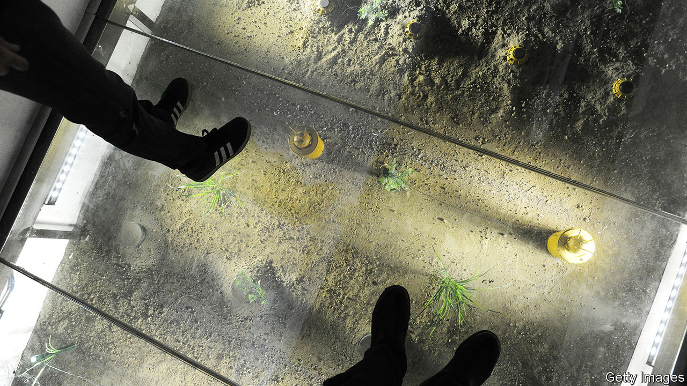

## Watch your step

# Donald Trump loosens America’s restrictions on landmines

> The new ones are supposed to blow themselves up

> Feb 13th 2020

DURING THE Gulf war of 1991, no fewer than 117,000 landmines were showered over Kuwait and Iraq by American planes. This barely dented the Pentagon’s vast stockpile of 19m. Just under a quarter of the devices scattered in the path of Saddam Hussein’s army were anti-personnel landmines (APLs), the sort that would soon be banned by the Anti-Personnel Mine Ban Convention of 1997, widely known as the Ottawa treaty, a cause famously championed by Princess Diana. It was the last occasion on which America made significant use of APLs. But a new ruling by the Trump administration suggests that the weapons could make a comeback.

The Ottawa treaty has 164 parties, all of which ban the production and use of APLs (anti-vehicle mines, among others, are still allowed). America is not among them. When the treaty was finalised, America declined to join (other holdouts include China, Cuba, Iran, Russia and Syria). President Bill Clinton said he hoped America would sign up later but his successor, George W. Bush, flatly rejected the idea. In 2014 Barack Obama made an important compromise by confining the use of APLs to the Korean peninsula, where he pointed to “unique circumstances”—America’s need to defend a long border against a large North Korean army. But everywhere else, America would at last come into line with the treaty. “We were signalling our clear aspiration to eventually accede to the Ottawa Convention,” said the White House at the time.

Mr Trump, who generally takes the view that anything favoured by his predecessor is inherently suspect, and has already loosened rules on cluster munitions since December 2017, rescinded Mr Obama’s landmine policy on January 31st, allowing senior commanders outside the Korean peninsula to use APLs once more and permitting their production to resume. The Pentagon said that it had conducted a study which demonstrated “a critical capability gap” in its arsenal.

Landmines have a number of military uses. They are typically used to channel opposing armies away from particular areas and into others. A minefield can force an enemy to turn, which exposes their flank and makes them especially vulnerable, says Vincent Brooks, a retired general who commanded American forces in South Korea in 2016-18. They can also be used to “canalise” the enemy, channelling attackers into unfavourable terrain, where they may be more exposed to concentrated artillery fire. But for all that, America has made little use of landmines in the past three decades, having cleared its last minefield, at the Guantanamo naval base in Cuba, in 1996-99 and having used a single APL in Afghanistan in 2002 (the purpose is unknown).

Why has Mr Trump decided he needs them now? The memorandum setting out the change in landmine policy opens by pointing to “the re-emergence of long-term, strategic competition”, language that the Pentagon typically uses to refer to China and Russia. Some experts suggest that the need to slow and disrupt a possible Russian offensive through eastern Europe is a possible rationale, especially because NATO’s strategy relies on buying time to reinforce its frontline positions.

But the policy shift probably has much more to do with North Korea than either of those countries. Although Mr Obama’s restrictions permitted the use of APLs on the Korean peninsula, after the Pentagon said it could not do without them, he had earlier pledged that America would not produce any new ones, even to replace existing stocks. Since the batteries and other components in landmines degrade over time, that policy essentially amounted to an eventual blanket ban, with the aim of forcing the armed forces to shift to remotely detonated mines (which are not covered by Ottawa). America’s stockpile was last replenished in 1997, and is expected to become obsolete by the early 2030s. Mr Trump’s new guidance crucially allows the development and production of new devices. The Pentagon may be especially eager to restock its cupboard as nuclear talks with North Korea falter and the prospect of conflict returns.

Yet landmines are reviled weapons, and not without good reason. “They’re indiscriminate,” says General Brooks, “so anyone or anything that moves through that area can be a problem.” That includes friendly forces—modern armies shun static defences in favour of what they call “manoeuvre warfare”, so today’s defensive minefield can be tomorrow’s headache. And that also includes civilians. Landmine casualties have fallen sharply over the years, but at least 2,000 people were killed or wounded by manufactured or improvised APLs in 2018, according to data collected by the Landmine and Cluster Munition Monitor, a research group. Laying a mine can cost a few dollars; clearing one can require $1,000.

The Pentagon has an answer to this. It says that it only possesses, would only produce and would only use “non-persistent” landmines with the capacity to self-destruct or, failing that, to self-deactivate, with a battery losing its charge, within 30 days (some models can blow themselves up in as little as a few hours). It claims that such features are remarkably reliable. In 2004 the Bush administration said it had tested over 67,000 landmines in a variety of conditions “with no failures of the self-destruct system”. Today the Pentagon says that only six landmines out of 1m are expected to remain active as duds, a rate of less than one in 167,000. But experts and NGOs roll their eyes at such claims.

“When the technology is brought into the battlefield, we see that the actual data doesn’t match with the promises,” says Erik Tollefsen, head of Weapons Contamination for the International Committee of the Red Cross. He says that impressive reliability rates are usually derived from tests in sterile conditions, and prove wildly exaggerated in practice. In 2002 a report by the Government Accountability Office, an agency that audits the federal government, noted that during the Gulf war one in 10,000 mines were expected to remain active, which would have produced 12 duds. The actual figure was almost 2,000.

The development of “smart” landmines has stalled in part because research funding plummeted when the Ottawa treaty came into force 20 years ago. “There isn’t a full technological solution to it that’s 100% certain at this point,” acknowledges General Brooks. “But honestly that’s the nature of anything and everything that happens in conditions of war”.

Others argue that there are perfectly viable alternatives. In 2001 a Pentagon-sponsored study by the National Research Council, an arm of the United States National Academies, noted that “the rapid emergence of new technologies after 2006 will create opportunities for the development of systems that can outperform today’s antipersonnel landmines and that would be compliant with Ottawa”. In particular, remotely activated mines (rather than victim-activated ones) are allowed under the treaty if the person triggering the device has the would-be victim in sight, although this makes them harder to use at range and hostage to a breakdown of communications. In 2018 Finland—a late and reluctant signatory to Ottawa, given its long border with Russia—said it was developing a new, remote-controlled variety of anti-personnel “bounding” mine that leaps into the air and fires metal bullets downwards. In the world of weaponry, that is what passes for humane. ■

## URL

https://www.economist.com/united-states/2020/02/13/donald-trump-loosens-americas-restrictions-on-landmines
