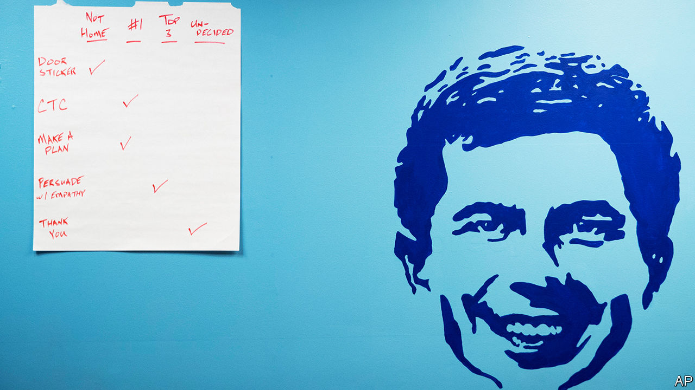

## Seeking an edge, edge

# Is Pete Buttigieg doing well or badly?

> The joint victor of Iowa did well again in New Hampshire, yet remains stuck in the polls

> Feb 15th 2020SOUTH BEND, INDIANA

ORDINARILY A candidate who comes first equal in Iowa and backs that up with a strong second in New Hampshire would leap to the front of the primary pack. In the case of Pete Buttigieg, who won 24% of New Hampshire’s primary votes to Bernie Sanders’s 26%, one week after narrowly taking the most delegates from Iowa’s caucuses, that has not happened. In YouGov’s poll for The Economist, Mr Buttigieg remains stuck behind Mr Sanders, Joe Biden (still), Elizabeth Warren and Mike Bloomberg. Voters who have seen plenty of Mr Buttigieg in the early states evidently think he might be the party’s best bet to beat Donald Trump in November. Democrats elsewhere still seem unsure about who he is.

Mr Buttigieg is ridiculously young to be doing so well. It is 13 years since the pudgy-faced Rhodes scholar graduated from Oxford. Since then he has already got through three brief careers. First he was a globe-trotting financial analyst at McKinsey, a consultancy. Then he became a navy reservist, volunteering for an active tour as a “dirt sailor” (one who serves with the army) in Afghanistan. He completed eight years as mayor of South Bend, a once-glum-but-now-reviving city of 100,000 souls in northern Indiana where Mr Buttigieg was brought up by his parents, both professors at Notre Dame university. The fact that Mrs Buttigieg was a linguist and Mr Buttigieg senior was an expert on Gramsci is sometimes used to cast doubt on his rustbelt credentials. But the Midwest is home to cultural theorists as well as welders.

In conversations with The Economist over the past year, Mr Buttigieg has compared his rise to that of Emmanuel Macron in France or Matteo Renzi in Italy. Each was under 40 when first elected. America has never had a presidential candidate quite like him, not just because of his age or his family’s Maltese ancestry. He has taken to calling himself a “progressive veteran”. He is a brainy polyglot able to converse in Arabic, Dari, French, Norwegian and Spanish, among other tongues. He likes to chat about philosophy. One wealthy donor, who has spent time in conversation with all the main Democratic contenders, lauds him as “fantastic” and the “most intellectually curious by a mile” of all of them.

More striking, he is gay, married and unabashed in talking about how his Christian (Episcopalian, formerly Catholic) faith brought him to the “love of his life” his husband Chasten, a teacher. That seems to be a powerful combination for many voters. Some may be hostile to having a gay candidate, but plenty of conservative Democrats are swayed by his faith and his talk of respect for fellow veterans. At rallies older voters get weepy when he describes finding love. Some also swoon at his thoughtfully articulated sentences.

Mr Buttigieg has shown some guts too. Over six months in Kabul, as a lieutenant, he was officially deployed in counter-intelligence but in fact was often used “as a glorified driver”. Taking others around the Afghan capital—he counted 119 sorties outside the base—meant he was at some risk, but he never came under attack. He says “it was scary” at times, such as when rockets were fired at the base.

He was perhaps braver when, on his return, he published a column that first spelt out how he came to accept he was gay. “I was well into adulthood before I was prepared to acknowledge the simple fact…It took years of struggle and growth for me to recognise,” he wrote. For a buttoned-up man, that bout of self-examination, just before he sought re-election as mayor in 2015, was difficult. The city’s voters, more liberal than most Hoosiers, cheered his frankness and he won with 80.4%.

A self-described introvert (though he played guitar in a teenage band, “Turkish Delight”) he has never been shy of stating his ambitions for office. At Harvard, in 2004, he told a student newspaper that “politics is in my bones” and said he planned to devote his life to it. He also wrote columns on domestic and foreign politics for the Harvard Crimson. One could prove to be relevant this year: he pondered the lessons of the “intense and unpredictable” 1968 Democratic convention.

In his earliest electoral bid, a no-hoper effort to be Indiana’s state treasurer in 2010, he spent a year criss-crossing the state in a green Taurus. He learned fundraising (he is adept at it, with only Mr Sanders outdoing him for donors). Jeff Harris, his first campaign manager, now a political operative, recalls that he put in 50 hours a week calling potential donors, between glad-handing voters and local party chiefs. He lacked gumption only once, when he declined to sample dishes of deep-fried turkey testicles and brain sandwiches offered in rural southern Indiana.

Crushed in a landslide, nonetheless “he won by losing”, reckons Jack Colwell, a political columnist in South Bend. That race—and his aborted run to be Democratic national chairman in 2017—brought him to public attention and the eyes of party chiefs. In the mayoral races, managed by Mike Schmul (an old friend who now runs his presidential campaign), he proved popular among old voters and moderates who have abandoned the Republican Party.

As for his record in South Bend, that was decent but not miraculous: economic decline and population loss went on for decades after Studebaker closed a massive car plant in 1963. Mr Colwell reckons the young, technocratic mayor was the “catalyst” in getting outsiders to invest, clearing abandoned housing, improving city services, seeing poverty and joblessness fall and the population stabilise. Tony Flora, a union leader in the city, praises him for standing with organised labour, and for helping undocumented workers, notably Latinos, get identity papers.

Yet some say he overstates his success. Several other cities in the Midwest—Ann Arbor, Kalamazoo, Madison—have done well too, partly lifted by years of national economic recovery. South Bend was also helped by the presence of Notre Dame on its boundary. One political rival grumbles that Mr Buttigieg is most skilled at spin, taking credit, and self-promotion. Another complains that the ex-mayor verges on monomania when it comes to his career.

Some African-Americans in the city have also criticised Mr Buttigieg, mostly because he demoted the city’s first black police chief and removed a black fire chief soon after taking office in 2011. South Bend has seen a fall in the numbers of black police officers and signs of rising racial segregation in housing. Questions about this dog him on the trail. Even sympathisers agree that Mr Buttigieg was too slow to take such concerns seriously. The candidate has admitted he was naive in failing to see how badly segregated the city’s schools still are. His polling among African-American Democrats remains dire, despite (or perhaps because of) making a long list of promises to right past wrongs on race.

At just 38, he lacks any national or even state-level governing or legislative experience. And though no one has ever before jumped from a mayor’s office directly to the White House, he can at least say that voters in the first two primary states have shrugged off such historic niceties. Gramsci advocated “pessimism of the spirit; optimism of the will”. That could be an unofficial Buttigieg campaign slogan as the primary heads to larger, more racially mixed states.■

Dig deeper:

Sign up and listen to Checks and Balance, our new [newsletter](https://www.economist.com//checksandbalance/) and [podcast](https://www.economist.com//podcasts/2020/04/24/checks-and-balance-our-weekly-podcast-on-american-politics) on American politics[The Democratic primaries will be a contest between radicals and repairers](https://www.economist.com//leaders/2020/02/06/the-democratic-primaries-will-be-a-contest-between-radicals-and-repairers)[Mike Bloomberg’s (very expensive) moment](https://www.economist.com//united-states/2020/02/15/mike-bloombergs-very-expensive-moment)[Bernie Sanders and Pete Buttigieg emerge from New Hampshire as the Democrats’ favourites](https://www.economist.com//united-states/2020/02/12/bernie-sanders-and-pete-buttigieg-emerge-as-the-democrats-favourites)

## URL

https://www.economist.com/united-states/2020/02/15/is-pete-buttigieg-doing-well-or-badly
