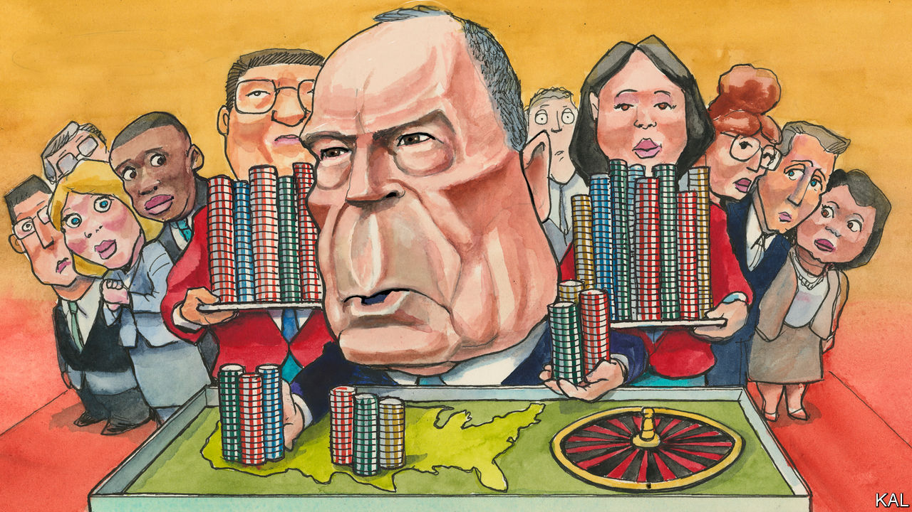

## Lexington

# Mike Bloomberg’s (very expensive) moment

> The former mayor of New York’s lavish spending and weak rivals make him a contender

> Feb 15th 2020

ON A RAINY afternoon in Chattanooga, the queue for Mike Bloomberg trailed around the block. Eleven weeks into his presidential campaign, the former New York mayor and world’s 12th-richest man is already well known in Tennessee. This was his fourth visit to the state, one of 14 that will hold its primary vote on March 3rd. He is also dominating its airwaves, with television ads touting his criticisms of Donald Trump, mayoral record and philanthropic support for gun control and climate-change policy running on a loop. “It’s almost like it was with Obama,” said a sodden Chattanoogan retiree, marvelling at the size of the crowd.

The back-to-front oddity of Mr Bloomberg’s campaign has drawn a lot of scorn. Presidential primaries have traditionally been decided by the first four early-voting states which, because of his late entry to the race, he is sitting out. His politics, as a former Republican, once synonymous with racially insensitive policing, also looked hopeless to many leftist commentators. Yet self-made billionaires tend not to be bad at reckoning their odds. And, sure enough, while Mr Bloomberg’s rivals knocked lumps out of each other in Iowa and New Hampshire, his aggressive campaigning in the Super Tuesday states has produced the biggest, fastest polling surge of the contest.

He sits third in The Economist’s national polling aggregate, on 16%. And with Joe Biden falling, he may soon be second to Senator Bernie Sanders, the winner in New Hampshire. This has already attracted an impressive ripple of endorsements, including from three members of the Congressional Black Caucus—hitherto Mr Biden’s biggest champion—this week. And if the primary were indeed to start looking like a face-off between Mr Bloomberg and the widely mistrusted Mr Sanders, many more would follow. Diminutive, prickly and poor at public speaking, Mr Bloomberg is almost nothing like Barack Obama—save potentially in one regard. Unlike their more uniform opponents, Democrats’ first concern is to find a leader capable of uniting their party’s ethno-politically divided coalition. Mr Obama did so magnificently—which is why Mr Biden, his bumbling deputy, has been afforded such an extended stab at assuming the role. The nascent enthusiasm for Mr Bloomberg, before he has contested a primary or debated any of his Democratic rivals, suggests he might soon be auditioned for it.

There are two reasons for his rise. First, the vastness of his spending. He is estimated to have splurged over $300m on TV, radio and digital advertising alone. To put that in perspective, Amy Klobuchar, a rival moderate, recently had $5m in hand. Mr Bloomberg has also assembled a huge and talented campaign team—with so far 2,100 employees, many of whom earn twice what other campaigns pay. The resources and professionalism of his rallies are on a different level from his rivals’. When it became clear that the venue in Chattanooga could not accommodate at least 200 of those queuing, his technicians rigged up a sound system outside the building within minutes. At a later event in Nashville, over 1,000 attendees were served a barbeque supper and all the “I like Mike” badges and T-shirts they could carry.

The second thing in Mr Bloomberg’s favour is that the verdict of the earliest states is far from decisive. The centre-left is currently split between Pete Buttigieg, Ms Klobuchar and the fading Mr Biden. This has made Mr Sanders, through his dominance of the smaller left-wing faction, a weak front-runner. To challenge him, either Mr Biden would have to rally his erstwhile non-white supporters, or else Mr Buttigieg or Ms Klobuchar would have to win them. Yet Mr Biden looks blown. And, notwithstanding their attributes, Mr Buttigieg and Ms Klobuchar are still giving many voters pause. Neither a gay mayor nor a woman has yet made it to the White House. The fact that Mr Bloomberg is himself a “short, divorced Jewish billionaire from New York”, as he once self-deprecatingly termed himself, does not now seem disqualifying.

In reality, no candidate looks able to unite Democrats as Mr Obama did: Mr Bloomberg would certainly alienate many Sandernistas. Yet the best argument for his candidacy may be that he is unusually able to focus wandering Democratic minds on the common enemy: Mr Trump. The many symmetries between the two New Yorkers are glaring and unfailingly to Mr Bloomberg’s credit. He is a self-made billionaire; Mr Trump inherited his wealth and bankrupted his companies. Mr Bloomberg has a record of improving government by bringing business-like efficiencies to it; the president is a wrecker. Mr Bloomberg is one of America’s most generous philanthropists; Mr Trump used his family foundation to buy a portrait of himself to hang in one of his golf clubs. And if Democrats doubt that such comparisons are important, they should reflect that, if Mr Bloomberg were his opponent, Mr Trump would think about little else. A recent quip by Mr Bloomberg about Mr Trump’s lesser wealth (asked about the prospect of two billionaires vying for the presidency, he asked: “Who’s the other one?”) was plainly intended for an audience of one.

There are still huge questions about his candidacy. His support has been inflated by high name-recognition in places where his opponents are absent. If he performs badly in his first clashes with them—starting with a televised debate in Las Vegas on February 19th—it could shrivel. Having been largely ignored by his rivals thus far, he is also due some potentially damaging attention. The unearthing this week of some past thuggish remarks by Mr Bloomberg in support of his controversial policing was an early taste.

A bigger fear is that, instead of capitalising on the Democrats’ divided field, he may fracture it further. He could nab enough of Mr Biden’s support with non-whites to stop Mr Buttigieg or Ms Klobuchar uniting the centre-left, yet be unable to do so himself. Perhaps his qualities are worth the risk. But if it backfires, he will have done more than almost anyone to make Mr Sanders the nominee.■

Dig deeper:Sign up and listen to Checks and Balance, our new [newsletter](https://www.economist.com//checksandbalance/) and [podcast](https://www.economist.com//podcasts/2020/04/24/checks-and-balance-our-weekly-podcast-on-american-politics) on American politics[The Democratic primaries will be a contest between radicals and repairers](https://www.economist.com//leaders/2020/02/06/the-democratic-primaries-will-be-a-contest-between-radicals-and-repairers)[Who will be Donald Trump’s most forceful foe?](https://www.economist.com//united-states/2020/02/01/who-will-be-donald-trumps-most-forceful-foe)[Bernie Sanders and Pete Buttigieg emerge from New Hampshire as the Democrats’ favourites](https://www.economist.com//united-states/2020/02/01/who-will-be-donald-trumps-most-forceful-foe)

## URL

https://www.economist.com/united-states/2020/02/15/mike-bloombergs-very-expensive-moment
