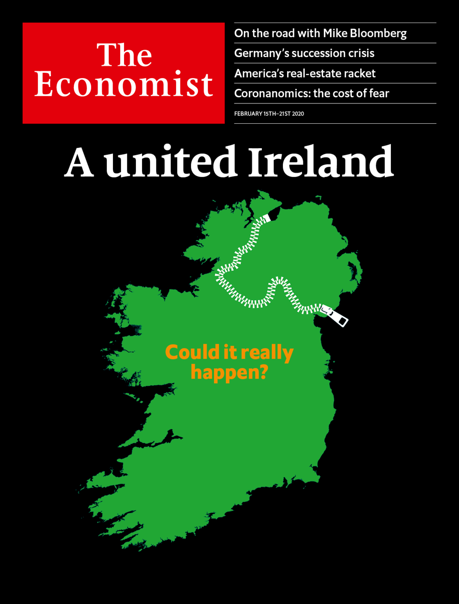

## Irish unification is becoming likelier

### The world this week
#### [Politics this week](./The%20world%20this%20week/politics-this-week.md)
#### [Business this week](./The%20world%20this%20week/business-this-week.md)
#### [Kals cartoon](./The%20world%20this%20week/kals-cartoon.md)
### Leaders
#### [Irish unification is becoming likelier](./Leaders/irish-unification-is-becoming-likelier.md)
#### [Angela merkel should quit soon](./Leaders/angela-merkel-should-quit-soon.md)
#### [How chinas coronavirus epidemic could hurt the world economy](./Leaders/how-chinas-coronavirus-epidemic-could-hurt-the-world-economy.md)
#### [Why the senate should reject judy sheltons nomination to the fed](./Leaders/why-the-senate-should-reject-judy-sheltons-nomination-to-the-fed.md)
#### [The cost of buying and selling homes is too high](./Leaders/the-cost-of-buying-and-selling-homes-is-too-high.md)
### Letters
#### [Letters to the editor](./Letters/letters-to-the-editor.md)
### Briefing
#### [Brexit and sinn feins success boost talk of irish unification](./Briefing/brexit-and-sinn-feins-success-boost-talk-of-irish-unification.md)
### Asia
#### [Why the philippines is the only country where divorce is illegal](./Asia/why-the-philippines-is-the-only-country-where-divorce-is-illegal.md)
#### [The philippines tears up a defence pact with america](./Asia/the-philippines-tears-up-a-defence-pact-with-america.md)
#### [An ethnically motivated attack alarms multi ethnic kazakhstan](./Asia/an-ethnically-motivated-attack-alarms-multi-ethnic-kazakhstan.md)
#### [Indias ruling party receives a drubbing in delhi](./Asia/indias-ruling-party-receives-a-drubbing-in-delhi.md)
#### [Indonesias government wants to get on with china in private](./Asia/indonesias-government-wants-to-get-on-with-china-in-private.md)
### United States
#### [Immigration to america is down wages are up](./United%20States/immigration-to-america-is-down-wages-are-up.md)
#### [Acquittal has emboldened donald trump](./United%20States/acquittal-has-emboldened-donald-trump.md)
#### [Is pete buttigieg doing well or badly](./United%20States/is-pete-buttigieg-doing-well-or-badly.md)
#### [Donald trump loosens americas restrictions on landmines](./United%20States/donald-trump-loosens-americas-restrictions-on-landmines.md)
#### [American drinkers of european wine face mounting tariff bills](./United%20States/american-drinkers-of-european-wine-face-mounting-tariff-bills.md)
#### [Mike bloombergs very expensive moment](./United%20States/mike-bloombergs-very-expensive-moment.md)
### China
#### [Chinas official holiday ends but not the woes of its firms](./China/chinas-official-holiday-ends-but-not-the-woes-of-its-firms.md)
#### [Xi jinping sends in the hard men to deal with the wuhan virus](./China/xi-jinping-sends-in-the-hard-men-to-deal-with-the-wuhan-virus.md)
#### [Li wenliangs death exposes the costs of chinas authoritarianism](./China/li-wenliangs-death-exposes-the-costs-of-chinas-authoritarianism.md)
### The Americas
#### [Canada ponders a federal programme for pharmaceuticals](./The%20Americas/canada-ponders-a-federal-programme-for-pharmaceuticals.md)
#### [El salvadors president summons the army to bully congress](./The%20Americas/el-salvadors-president-summons-the-army-to-bully-congress.md)
#### [What is peronism](./The%20Americas/what-is-peronism.md)
### Middle East & Africa
#### [Why the united nations cannot end wars in the arab world](./Middle%20East%20&%20Africa/why-the-united-nations-cannot-end-wars-in-the-arab-world.md)
#### [Qatar the gulf emirate famed for openness is silencing critics](./Middle%20East%20&%20Africa/qatar-the-gulf-emirate-famed-for-openness-is-silencing-critics.md)
#### [Secular israelis on buses strike a blow for religious freedom](./Middle%20East%20&%20Africa/secular-israelis-on-buses-strike-a-blow-for-religious-freedom.md)
#### [One law for the mighty in kenya](./Middle%20East%20&%20Africa/one-law-for-the-mighty-in-kenya.md)
#### [Omar al bashir sudans ex dictator could at last face justice](./Middle%20East%20&%20Africa/omar-al-bashir-sudans-ex-dictator-could-at-last-face-justice.md)
### Europe
#### [Angela merkels presumed successor quits as party boss](./Europe/angela-merkels-presumed-successor-quits-as-party-boss.md)
#### [Albin kurtis new start in kosovo](./Europe/albin-kurtis-new-start-in-kosovo.md)
#### [How russian show trials expose imaginary plots](./Europe/how-russian-show-trials-expose-imaginary-plots.md)
#### [The struggle to give brittany its own emoji](./Europe/the-struggle-to-give-brittany-its-own-emoji.md)
#### [Make europe boring again](./Europe/make-europe-boring-again.md)
### Britain
#### [Atonement and forgiveness in belfast](./Britain/atonement-and-forgiveness-in-belfast.md)
#### [Ripping into the rip off merchants](./Britain/ripping-into-the-rip-off-merchants.md)
#### [Rishi sunak is britains new chancellor of the exchequer](./Britain/rishi-sunak-is-britains-new-chancellor-of-the-exchequer.md)
#### [Oxford university restores maasai artefacts](./Britain/oxford-university-restores-maasai-artefacts.md)
#### [Why britains conservative government is shifting leftward](./Britain/why-britains-conservative-government-is-shifting-leftward.md)
#### [Why trend growth is collapsing in britain](./Britain/why-trend-growth-is-collapsing-in-britain.md)
#### [Why britains public conveniences are anything but](./Britain/why-britains-public-conveniences-are-anything-but.md)
#### [The paradox of britains buses](./Britain/the-paradox-of-britains-buses.md)
#### [The perils of lennonism](./Britain/the-perils-of-lennonism.md)
### International
#### [Chinas neighbours are rushing to contain the spread of the new coronavirus](./International/chinas-neighbours-are-rushing-to-contain-the-spread-of-the-new-coronavirus.md)
#### [The new coronavirus could have a lasting impact on global supply chains](./International/the-new-coronavirus-could-have-a-lasting-impact-on-global-supply-chains.md)
### Business
#### [The battle for the middle eastern arms market is heating up](./Business/the-battle-for-the-middle-eastern-arms-market-is-heating-up.md)
#### [Burger kings owner tries to regain its sizzle](./Business/burger-kings-owner-tries-to-regain-its-sizzle.md)
#### [Admen have a clever new way to trick sports fans](./Business/admen-have-a-clever-new-way-to-trick-sports-fans.md)
#### [Elliott management guns for softbank](./Business/elliott-management-guns-for-softbank.md)
#### [Youngsters job preferences and prospects are mismatched](./Business/youngsters-job-preferences-and-prospects-are-mismatched.md)
#### [Chinese management schools are thriving](./Business/chinese-management-schools-are-thriving.md)
#### [American state capitalism will not beat china at 5g](./Business/american-state-capitalism-will-not-beat-china-at-5g.md)
### Finance & economics
#### [Technology is poised to upend americas property market](./Finance%20&%20economics/technology-is-poised-to-upend-americas-property-market.md)
#### [The imf undergoes structural reform](./Finance%20&%20economics/the-imf-undergoes-structural-reform.md)
#### [The world bank loses another chief economist](./Finance%20&%20economics/the-world-bank-loses-another-chief-economist.md)
#### [Companies are tying their loans to measures of do goodery](./Finance%20&%20economics/companies-are-tying-their-loans-to-measures-of-do-goodery.md)
#### [African countries like their currencies strong](./Finance%20&%20economics/african-countries-like-their-currencies-strong.md)
#### [Looking at the world through the eyes of options traders](./Finance%20&%20economics/looking-at-the-world-through-the-eyes-of-options-traders.md)
#### [Wage gains for low earners have helped sustain americas economic expansion](./Finance%20&%20economics/wage-gains-for-low-earners-have-helped-sustain-americas-economic-expansion.md)
### Science & technology
#### [People leave molecular wakes that may give away their secrets](./Science%20&%20technology/people-leave-molecular-wakes-that-may-give-away-their-secrets.md)
#### [Energy related emissions of carbon dioxide have stabilised for now](./Science%20&%20technology/energy-related-emissions-of-carbon-dioxide-have-stabilised-for-now.md)
#### [Fish like people must pay for their accommodation](./Science%20&%20technology/fish-like-people-must-pay-for-their-accommodation.md)
#### [A new spacecraft will examine the sun close up](./Science%20&%20technology/a-new-spacecraft-will-examine-the-sun-close-up.md)
### Books & arts
#### [Why an excess of democracy can lead to poor decisions](./Books%20&%20arts/why-an-excess-of-democracy-can-lead-to-poor-decisions.md)
#### [The oscars triumph of parasite](./Books%20&%20arts/the-oscars-triumph-of-parasite.md)
#### [The original sins of grammarians still plague the rulebooks](./Books%20&%20arts/the-original-sins-of-grammarians-still-plague-the-rulebooks.md)
#### [Tom stoppards haunting new play about the holocaust](./Books%20&%20arts/tom-stoppards-haunting-new-play-about-the-holocaust.md)
### Economic and financial indicators
#### [Economic data commodities and markets](./Economic%20and%20financial%20indicators/economic-data-commodities-and-markets.md)
### Graphic detail
#### [Analysts stock recommendations are coloured by their cultural biases](./Graphic%20detail/analysts-stock-recommendations-are-coloured-by-their-cultural-biases.md)
### Obituary
#### [Li wenliang died on february 7th](./Obituary/li-wenliang-died-on-february-7th.md)
