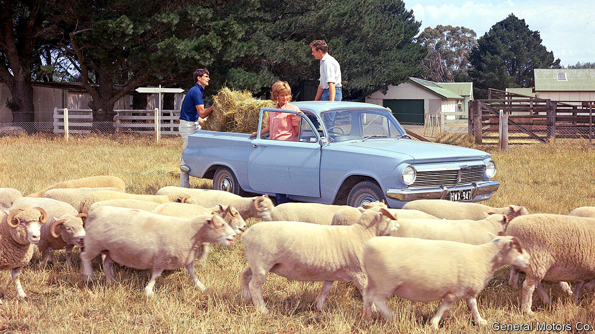

## Holden folds

# Holden, a (sort-of) Australian icon, succumbs to globalisation

> The cars, said to be as Aussie as meat pies and kangaroos, were actually made by GM

> Feb 20th 2020SYDNEY

“SHE’S A BEAUTY!” grinned the prime minister of the day, Ben Chifley, as the first car built entirely in Australia rolled off the assembly line in 1948. The Holden FX, as it was known, was greeted as a totem of a young nation joining the ranks of industrialised economies. Better yet, it had an Australian pedigree, even if General Motors owned the factory. Holden had been a saddle-making firm in Adelaide that began to manufacture car bodies to go with imported engines and chassis in 1919. GM bought it in 1931, but retained the brand. For a long time its advertising slogan was “People Trust Holden”. So when GM announced this week that it was eliminating the brand, indignation and nostalgia abounded.

Scott Morrison, the prime minister, scolded GM for allowing Holden to “wither away” even though “Australian taxpayers put millions into this multinational company.” Unions blamed his government for slashing the subsidies which might have kept Holden sputtering on. The government is so devoutly free-market that it will “not lift a finger” to protect Australian jobs, grumbled Sally McManus of the Australian Council of Trade Unions.

GM says it cannot justify further investment in a long-unprofitable business. Although Holden made almost half of all new cars sold in Australia in the late 1950s, locals nowadays prefer nippier runarounds or sleek SUVs to the chunky sedans it is known for, even if, as an ad jingle put it, the essence of Australia is “football, meat pies, kangaroos and Holden cars”. (The jingle was an adaptation of an ad about Chevrolet being an all-American brand.) Last year Holden flogged just 43,000 vehicles, a third of its sales a decade ago.

Holden had already closed its last factory in Australia in 2017; its vehicles are now imported, from Thailand among other places. Ford and Toyota closed Australian assembly lines at the same time, leaving Australia with no carmakers. To be competitive, analysts reckoned, Australian factories needed to churn out 200,000-300,000 cars a year. On the eve of its plant’s closure, Holden was making just 80,000. It didn’t help that “the nearest significant market was 10,000km away,” notes John Daley of the Grattan Institute, a think-tank. What is more, KPMG, an accounting firm and consultancy, calculated that in 2012 Australia was the second most expensive place to make car components, after Japan. High labour costs, inevitably, played a part.

The industry survived so long only because successive governments refuelled it with subsidies. GM guzzled about A$2bn ($1.3bn) before the handouts were cut by Mr Morrison’s party in 2013. Rightly so, according to a report released the following year by the Productivity Commission. It found no evidence that they had helped the wider economy, concluding that the “costs of such assistance outweigh the benefits”.

Manufacturing’s share of Australia’s economy peaked in the 1960s, in Holden’s heyday. It now accounts for just under 6% of GDP, well below the level of most other rich countries. But that has not stopped the Australian economy—and local wages—from growing faster than their peers. ■

## URL

https://www.economist.com/asia/2020/02/20/holden-a-sort-of-australian-icon-succumbs-to-globalisation
