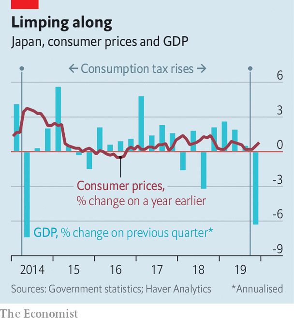

## Fiscal, natural, viral

# Japan’s GDP shrinks dramatically after a tax rise and a typhoon

> Coronavirus may compound matters

> Feb 20th 2020

ECONOMISTS STILL argue about the merits of Abenomics, the experimental mix of policies introduced by Japan’s prime minister, Abe Shinzo, seven years ago, in an effort to chase away deflation and stagnation. But two lessons are beyond debate. Japan’s bond market is remarkably docile despite the government’s towering debt. Japanese households, however, are painfully sensitive to increases in the consumption tax, a broad value-added tax imposed on most of their purchases. After the government raised the tax from 8% to 10% on October 1st, the economy shrank at an annual pace of 6.3% in the fourth quarter of 2019, according to figures released on February 17th (see chart ).

The tax increase was an unforced error. The government faces no immediate need for additional revenue. Despite gross debt nearing 240% of GDP, its borrowing remains absurdly cheap. The yield on a ten-year government bond is stuck at about zero, where the country’s central bank, the Bank of Japan (BoJ), has pegged it since 2016. That peg obliges the BoJ to buy as much government debt as necessary to keep long-term interest rates low. Such determined efforts to stimulate borrowing are needed chiefly because private spending has been weak—too weak, at least, to lift inflation to the BoJ’s target of 2% from the current 0.8%. Thus the consumption-tax rise was doubly strange. It made it even harder for firms to sell goods to Japan’s inhibited consumers, for the sake of reducing the number of bonds Japan’s government sells to a customer who has sworn to bid for them anyway. It was like adding ballast to the waterlogged side of a ship.

The error was foreseeable as well as unforced. A rise in the same tax in 2014 was followed by a similarly dramatic contraction in the economy, undermining the early momentum of Mr Abe’s reflationary push. The government had hoped to avoid a repeat of that experience by sparing food, newspapers and drinks (except alcohol) from the higher rate and by adding various compensatory measures. These included free child care and education for pre-school kids and a “rewards” system giving discounts to customers who make cashless purchases in small shops and convenience stores. These measures may have softened the blow in some ways: consumer spending on non-durable goods fell by less last quarter than it did in the 2014 episode. Unfortunately, these offsetting measures were themselves offset by another aggravating factor: the impact of Typhoon Hagibis, which inundated many towns and killed almost 100 people in October. As a consequence, capital spending by firms shrank even faster than it had after the tax increase six years ago.

The economy’s prospects for recovery are threatened further by the new coronavirus. Covid-19 has already killed one person in Japan; 73 have been infected (not counting hundreds diagnosed on a cruise ship docked in Yokohama, south of Tokyo). Japan is tightly integrated into Asian manufacturing supply chains that will be disrupted by factory shutdowns in China. It has also been counting on the Tokyo Olympics, which start in July, to lift spirits and spending. That happy prospect must now be in doubt. The government has already said that only elite athletes can take part in the Tokyo marathon on March 1st.

Faced with these fiscal, meteorological and viral setbacks, how will policymakers respond? The government has announced a fiscal stimulus worth about $120bn (2.4% of GDP), which will help repair typhoon damage and shield the country from future floods and other disasters. But the money will be spread over more than a year and may not add much to the prior trajectory of spending. The BoJ, for its part, seems largely out of ideas. Inflation has persistently undershot its target, which would call for easier monetary policy. But the BoJ’s tiered system of interest on the reserves that banks deposit with it, with some of them earning a negative rate (-0.1%), is already unpopular with savers, banks and insurance companies. An even lower rate might be counterproductive if it inflicts too much damage on Japan’s financial institutions, which struggle to pass the negative rates on to their own depositors.

A possible solution, proposed by Stefan Angrick of Oxford Economics, a British consultancy, would be for the BoJ to pay positive interest on more reserves, to shore up the banks’ profitability, but even lower rates on the remainder, to help stimulate borrowing. A more sharply tiered system like this helped Switzerland’s central bank cut interest rates to -0.75%.

One twist is that all three of Japan’s recent disasters—the tax increase, the typhoon and the virus—ought to put upward pressure on prices, even as they depress demand. That should prevent any return to outright deflation. But even policymakers desperate to ensure Japan escapes from deflation are unlikely to prefer stagflation. ■