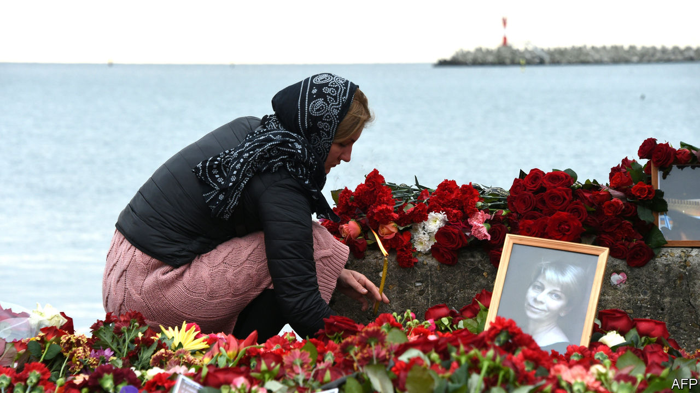

## The grey zone

# Compromise and survival in Vladimir Putin’s Russia

> Joshua Yaffa’s book charts the territory between defiance and collusion

> Feb 22nd 2020

Between Two Fires. By Joshua Yaffa. Tim Duggan Books; 368 pages; $28. Granta Books; £20.

PEOPLE WHO devote themselves to helping the unfortunate are not always loved by the more comfortable. They are a pain in the conscience; they can be gratingly pious. But in her heyday as a friend of Moscow’s dying and destitute, Elizaveta Glinka, a medical philanthropist known as Doctor Liza, was likeable as well as inspiring. Whether she was ministering to rough sleepers at a Moscow railway station or visiting patients facing lonely deaths at home, her style was both sensitive and practical. She could cajole awkward bureaucrats and relieve the afflicted. She frankly acknowledged her own fear of death; it came to her three years ago, when a flight carrying visitors to the Russian garrison in Syria crashed into the Black Sea.

Among the tales of integrity and compromise in Vladimir Putin’s Russia that Joshua Yaffa narrates in his wonderfully insightful new book, Glinka’s story is the most poignant. In a process minutely traced by Mr Yaffa, an American journalist and previously a contributor to The Economist, things changed for her when Russian-backed fighters staged their rebellion in Ukraine in 2014. She began organising the evacuation of children, many of them wounded, from the war zone, dealing pragmatically with both sides of the deadly conflict. But her apolitical, common-sense approach, effective as it had proved in Moscow, came to entail moral hazards on the battlefield.

As Glinka’s national profile rose, so did her connections with the Russian elite, and she was obliged to collude with the fiction that the Kremlin bore no blame for the unfolding mayhem in Ukraine. Her powerful contacts, including Mr Putin himself, abetted her humanitarian work and tried to bask in her moral glow. Her older, liberal-minded friends concluded that she had sold out to the country’s rulers. Those rulers lamented her death loudly, proclaiming her a quasi-saint; more long-standing acquaintances mourned with an extra tinge of sadness, feeling she was a good person whose record was ultimately tainted.

All Mr Yaffa’s well-told and neatly interlinked stories describe individuals whose response to Russia’s authorities belongs somewhere on the spectrum between defiance and calculating collusion. His subjects include Kirill Serebrennikov, a theatre director who was placed under house arrest; and an entrepreneurial zookeeper in Crimea who, after the peninsula was annexed, initially expected to benefit but fell foul of the new Russian masters. In a revealing exchange, the director of a prison-camp-turned-museum in Perm tries to persuade Mr Yaffa, and perhaps herself, that its response to official pressure—evolving from a warning against totalitarianism to a softer take on the Soviet era—is justified, if only because closure might be the alternative. As Glinka seemed to do in the final part of her life, the director makes a utilitarian case for compromise.

Some compromise reluctantly, others with apparent eagerness. One of Mr Yaffa’s profiles is of the television boss Konstantin Ernst, who after a mildly bohemian youth used his cinematographic talents to hone Mr Putin’s image as Russia’s strong-willed saviour. Some readers will wish that Mr Yaffa had devoted more space to characters who preserved their integrity to the end, even if that meant paying a heavy penalty. He does offer one striking portrait of a person who fits firmly in that category: the dissident Russian Orthodox cleric Father Pavel Adelgeim, who was murdered in 2013 by a mentally deranged man.

In his youth, Adelgeim had endured travails for his Christian faith. He was sent to a labour camp for professing “anti-Soviet” opinions, where he suffered a work accident which cost him a leg. Later he learned that a fellow-seminarian, who would go on to make a decent career as an ecclesiastical diplomat, had denounced him. By telling the priest’s life-story, Mr Yaffa is able to sketch in outline the recent history of the Russian Orthodox church—from a precarious existence under communism, to a phase of flourishing in new-found freedom, to one of symbiosis with the state.

Adelgeim was one of the few clerics who challenged this trend. In particular, he questioned the harshly authoritarian power structures that emerged within the church, mirroring those of the secular regime. This stance enraged the bishop under whom he served in north-western Russia, and the cleric found himself demoted and isolated in the church, though still revered by his flock. Some admirers called him “the last free priest” in Russia. That is an over-simplification. Last year, for instance, around 200 priests signed a petition of protest against the incarceration of people who had taken part in anti-government demonstrations.

It is to Mr Yaffa’s credit that in general he avoids simplifying. Even when he describes people who seek cynical advantage from the powerful, the picture is never completely dark; when he portrays moral heroes, he never presents them as infallible. That is how things are in life, perhaps nowhere more so than in Russia. ■