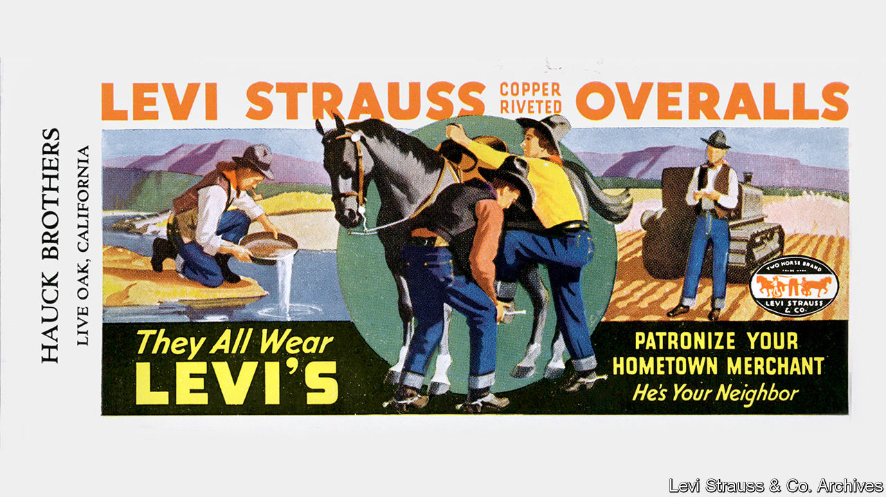

## Rhapsody in blue

# The legend of Levi Strauss

> An exhibition in San Francisco shows how American denim conquered the world

> Feb 20th 2020SAN FRANCISCO

HE WAS BORN in a Bavarian village in 1829, fleeing anti-Semitism with his family at 17. From New York he caught a steamer to California, a newly minted American citizen, with a view to expanding the family’s dry-goods business. But these were the heady days of the Gold Rush, and the young man dreamed of making it big. His initiative paid off so well that you may be wearing his invention now: his name was Levi Strauss.

Technically, the entrepreneur who went by “Uncle Levi” didn’t invent the copper rivets on denim “waist overalls” that became his firm’s stock-in-trade. The idea came from a tailor in Nevada who bought cloth from Strauss to make work clothes for labourers. In 1872 Jacob Davis persuaded him to jointly file for a patent for an “improvement in fastening pocket openings”, and to shift from selling fabric to finished trousers. The rest is a history of marketing genius—documented in the largest-ever public display of artefacts from the Levi Strauss & Co. archive.

“Levi Strauss: A History of American Style” at the Contemporary Jewish Museum in San Francisco deftly weaves together corporate, cultural and social trends to tell the story of one of the country’s most famous exports. When Strauss died in 1902 he was eulogised as one of San Francisco’s foremost philanthropists and a pillar of the Jewish community. Nobody could have anticipated that the firm he bequeathed to four nephews would define America’s style and become a global juggernaut. It did that by cannily roping its product to two mythic American figures: the cowboy and the rebel.

Levi’s 501 jeans were tough. The oldest pair on display dates to 1890; another was used to tow a car. Marketed originally to farmers, mechanics and miners, they became the garb of choice for Western horsemen. It wasn’t long before John Wayne and Clark Gable were wearing them into the sunset, followed by glamorous hoodlums played by Marlon Brando and James Dean.

The brand’s advertising rode the countercultural wave, capitalising on its status as a badge of coolness and freedom. Marilyn Monroe wore Levi’s; Andy Warhol immortalised them. Even Albert Einstein was spotted in a Levi’s bomber jacket. Jeans that graced the haunches of the famous—including Patti Smith, Madonna and Beyoncé—fill the gallery and span the decades.

At any given moment a big chunk of humanity is wearing blue jeans, the show’s curators observe. Levi’s have been coveted behind the Iron Curtain and fetishised in Japan; they have been ripped, embroidered and covered in ink. Not too shabby for a kid from Bavaria.

## URL

https://www.economist.com/books-and-arts/2020/02/20/the-legend-of-levi-strauss
