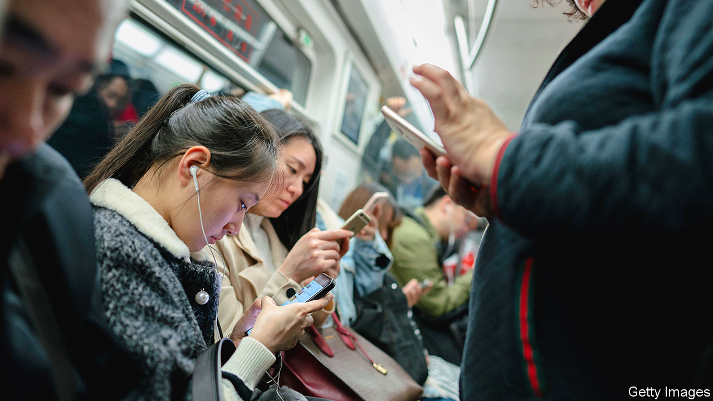

## Paradise lost

# Whose internet is it anyway?

> Memoirs by an alumna of Silicon Valley and an internet user chart the web’s history

> Feb 20th 2020

Uncanny Valley. By Anna Wiener. MCD Books; 288 pages; $27. Fourth Estate; £16.99.

Lurking: How a Person Became a User. By Joanne McNeil. MCD Books; 288 pages; $28.

IN THE PAST decade the number of people using the internet has leapt from 1.8bn, or a quarter of the world, to 4.1bn, well over half. Internet companies grew with their user bases. Ten years ago Facebook had roughly 2,000 employees; today 45,000 people work for it full-time, mostly in Silicon Valley. Google went from 24,000 staff to 119,000 in the same period. Add in other big firms such as Apple and Netflix, dozens of unlisted “unicorns” and thousands of startups, and the head-count in the valley is equal to a fair-sized city.

Who are these people? A handful are stereotypical wunderkinds, too busy building apps that improve the human condition to waste time on human emotions (or finish their degrees). But many—all the normal folk in sales, marketing, HR, customer support—are like Anna Wiener, the author of “Uncanny Valley”, a memoir about working in the tech industry of the 2010s. Like most people, the condition they mainly want to improve is their own.

In her telling, Ms Wiener, a sociology major who had the misfortune to graduate into the global financial crisis, starts her professional career as an assistant to a literary agent in New York. Tired of being privileged yet “downwardly mobile”, she joins a tech startup on the east coast, flubs it, but fails upwards to a better-paid job in San Francisco. Once there she observes first-hand the absurdities and extravagances of the industry. One of her employers is a meritocracy-obsessed cult with a name-your-own-salary policy that leads to an enormous gender pay gap. It marks its first round of venture-capital funding by building an exact replica of the Oval Office.

Another outfit unironically releases a sinister feature called Addiction which, as Ms Wiener ghostwrites in the blog post announcing it, “allows companies to see how embedded they are into other people’s lives”. She is at her best when describing the carelessness that would give the tech industry its well-deserved reputation for hubris. “Don’t be evil” is a blithe motto if the definition of “evil” is unexamined.

In New York, Ms Wiener recalls, “I had never considered that there were people behind the internet.” But in San Francisco “it was impossible to forget”. After all, she was one of them. Occasionally she has pangs of conscience, asking a friend, “Do you think I work at a surveillance company?” But such concerns fall by the wayside in a cloud of ecstasy and clean air, as she finds the twin millennial grails of a decent salary and comprehensive health care. Ever the ingénue, Ms Wiener does not set out to straddle the world like a colossus. She and legions like her are content merely to peep about from under the legs of digital history’s great men—men like the founder of “the social network everyone hated”, as she periphrastically refers to him.

“Of course, I hate [Facebook]. Who doesn’t?” writes Joanne McNeil in “Lurking”, a memoir of using, rather than making, the internet. She is almost apologetic about this judgment, noting that her lapse from reasoned criticism to diatribe is reserved for this single platform, a “digital cesspool” that is “one of the biggest mistakes in modern history”. The passage comes after more than 200 pages of reminiscences about the internet of yore—a place where people could choose to be “private or public, anonymous or named, factual or make-believe”. Ms McNeil covers niche New York chat rooms; the web’s early suburbs, known as GeoCities; and the proto-social networks of Friendster and Myspace, guiding readers, Virgil-like, to the Zuckerberg inferno.

What happened? How did the web become “a hell that is fun, ruled by idiots and thieves”? The key is the smartphone, which brought the internet into everyday life. When Steve Jobs unveiled the iPhone in 2007, “the internet” and “real life” were still separate domains; people had to “get online” to move from one to the other. That was a disincentive, and anyway many had better ways to spend spare time than sit in front of a screen. A decade later, smartphones in hands, the distinction had evaporated. Suddenly anyone could be online—and they were, everywhere and all the time.

The people behind the internet continued to believe that most users were versions of themselves, “white, male, age 25 to 34, college-educated”. In reality the internet is more diverse, says Ms McNeil, taking in women and users of other ages, LGBT folk, ethnic minorities and all combinations thereof. True—but her idea of diversity is itself a narrow one. In fact, in the period she chronicles, the average internet user became poorer, older, less white and less likely to speak English. Seen through this lens, bemoaning the decline of “the internet” is a bit like complaining that flying has lost its glamour, or that a favourite bar has been overrun by strangers. Nobody goes there any more—it’s too crowded, as Yogi Berra once quipped.

America developed the internet, powerful American companies still run big swathes of it, and jobsworth American workers like Ms Wiener merrily push pixels around inside those behemoths. Yet just 6% of the world’s internet users are American. A vanishingly small proportion ever hung out in the AOL chat rooms or LiveJournal blogs of Ms McNeil’s lost nirvana. And the cultural influence of those early American users is steadily waning.

Perhaps the starkest example of this is the rise of TikTok, an app that lets people create and share short, goofy videos. It is owned by ByteDance, a giant Chinese startup; last year, several American senators speculated that it might pose a national-security risk. TikTok denied allegations that its moderators took account of Chinese sensitivities, insisting it had never been asked to remove content by China’s government (and would not comply if it were).

TikTok is unusual. When your home market is small or poor (as in much of the world), or hived off into a separate silo (like China’s), it is hard to build global firms. All the same, even if the business of the internet remains anchored in California, its culture—the movies and music, flirtations and conversations—is expanding all the time, confounding the Silicon Valley types who thought they owned it. There is no longer such a thing as “the internet”, but many internets, belonging to many people, distinct but overlapping. It is not dying, as Ms McNeil fears, just respawning. ■

## URL

https://www.economist.com/books-and-arts/2020/02/20/whose-internet-is-it-anyway
