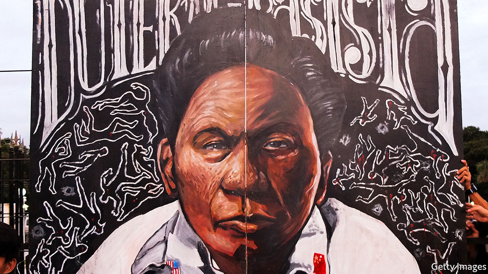
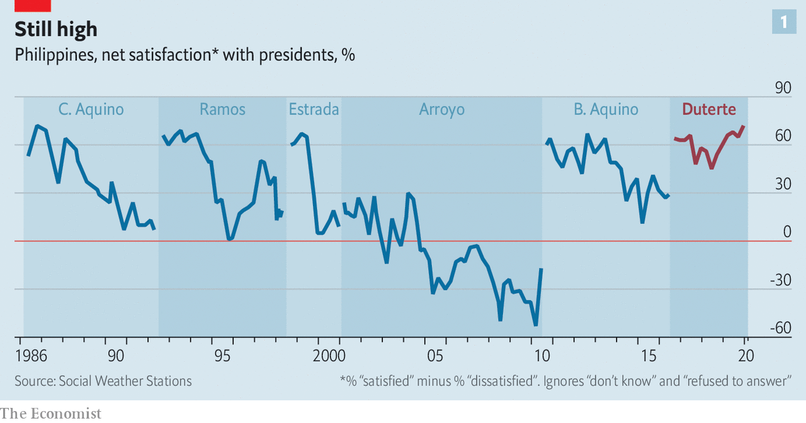
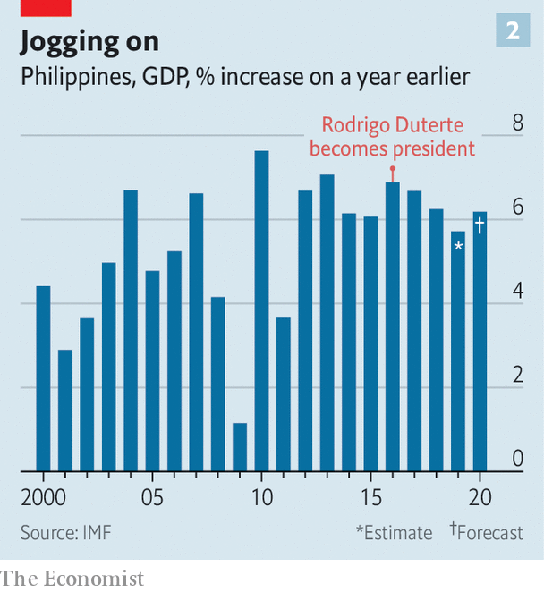
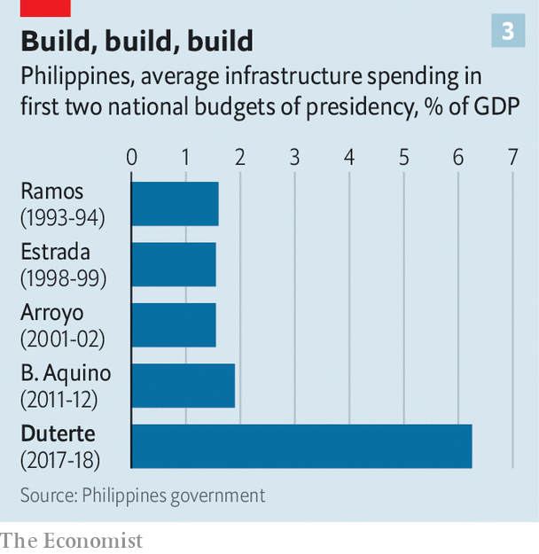
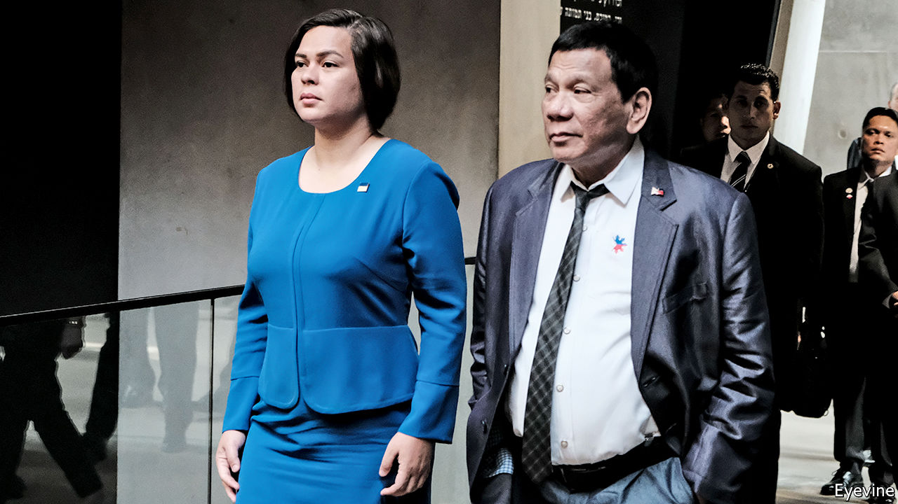

## Shoot-to-kill in the Philippines

# Rodrigo Duterte’s lawless war on drugs is wildly popular

> And he is unlikely ever to be held to account for it

> Feb 20th 2020MANILA

THE WOMEN agree among themselves. As field staff for Social Weather Stations (sws), a pollster in Metropolitan Manila, they find that the vast majority of Filipinos approve of President Rodrigo Duterte’s campaign against illegal drugs. People repeatedly tell them that they just want the drugs trade controlled, and the results of their inquiries show that almost two in three Filipinos believe that the number of drug users in their area has dropped since Mr Duterte came to power in 2016. Their own experience tells them something similar. They say they can now go about their polling in parts of drug-ravaged cities that were once too dangerous.

“Find them all and arrest them. If they resist, kill them all.” Mr Duterte’s hard line on drug dealers and other miscreants was at the core of his election campaign. The number of suspected criminals dispatched since his victory is hard to assess, but large. The country’s human-rights commission believes the total number of extra-judicial killings to be some 27,000. One can only guess how many private scores have been settled under cover of the drug war. The death toll bears comparison to the 30,000 who “disappeared” under the Argentinian junta of the late 1970s, though Argentina’s population was a lot smaller—there are 106m Filipinos.

The police, for their part, reported more than 23,000 “homicide cases under investigation” during the two years from July 2016; it is unclear how such cases are incorporated into the compilation of official crime statistics, and which involve drugs. Police data also show a 21.5% drop in reported crime over the same period. But Leni Robredo, the vice-president, claimed in January that figures presented to a government anti-drugs committee showed just 1% of the country’s total supply of crystal meth had been seized over the past three years. Ms Robredo is a staunch critic of the president—Filipinos elect their president and vice-president on separate tickets—and Mr Duterte’s allies derided her claim, though not always compellingly. The president’s spokesman argued that even if Ms Robredo’s calculations were accurate “it does not mean it’s a failure”.

In all this uncertainty, the costs of the bloodshed to Mr Duterte’s reputation are much easier to gauge. There have been almost none. Filipinos harbour few illusions about the drugs war. Polls published by SWS last month found that more than three in four see “many” human-rights abuses in the campaign; an even higher share believes that “ninja cops” sell on the drugs they have confiscated. Nevertheless, most Filipinos—including, often, people whose families have lost loved ones—continue to support the campaign and the man who promised it to them. More than three years into his six-year term he remains consistently popular. Filipino presidents often enjoy popularity for their first few years in office before falling quickly from grace, as Mr Duterte’s immediate predecessor, Benigno Aquino III, did (see chart 1). Mr Duterte looks likely to maintain his touch to the end.

If Mr Duterte’s remarkable rhetoric—in office he has labelled both the pope and Barack Obama sons of whores, called God “stupid” and offered to eat the liver of a terrorist—and explicit encouragement of extrajudicial killing outrages some in the country’s political elite, their disquiet does not count for much with the people. Indeed, what looks like hand-wringing may bolster the president’s support.

The voters elevated Mr Duterte from mayor of Davao, a tough city on the southern island of Mindanao, to president because they were tired of the status quo overseen by an entrenched and arrogant elite. When, in 1986, protests ousted Ferdinand Marcos, the dictator who had run the country since 1965, there was a widespread hope that the restoration of democracy would bring economic and social progress. Income per head did indeed increase nearly sevenfold over the next three decades, and life expectancy rose by seven years to 71. But many Filipinos were discontent. Infrastructure was crumbling; corruption was rampant. Inequality, though falling, remained pervasive. “People saw electoral politics as a basketball game among the elite with the ball being passed between them,” says Sheila Coronel, a journalist.

Mr Duterte’s vulgar hyperbole—by his own estimate, only two in every five of his statements are true—showed that there was a new type of player on the court. But his aggressive populism does not alienate the middle class and university graduates: indeed they cleave to him. His sexism does not seem to put off women any more than his blasphemy and anticlericalism puts off the four in five Filipinos who still declare themselves Catholic.

Term limits mean Mr Duterte cannot capitalise on this with a second election campaign when his six years are up in 2022. Instead he has a “legacy campaign” launched with a huge shindig in Manila on January 17th. Beyond the chilling discovery that the public has supported his brutality in deed as well as word, what sort of legacy will it be?

Economic performance, in which he has little interest, has been adequate (see chart 2). His enthusiasm for infrastructure spending will leave his successor with plenty of big juicy projects in the pipeline. His move towards China in foreign policy may prove contentious—or may look like getting ahead of the curve.

Other aspects of his legacy-to-be look more troubling: those which, like the tolerated bloodshed, lower the bar for future presidents. Beyond the matter of his own rhetoric, he has benefited from virulent social-media trolling campaigns—Manila is home to hundreds of troll farms whose computer whizzes can be hired to splatter a client’s opponents or boost his favourites. He has bullied and intimidated the press. The latest outrage, for his critics, came on February 10th when the government filed a petition in the supreme court to void the franchise of media giant ABS-CBN, which it claims to have been engaged in “highly abusive practices”. He has taken various actions to limit the risk of his eventually facing justice over extrajudicial killings.

And he has not delivered the deep elite-uprooting change he promised. At the launch of his legacy campaign, when a communications minister declared him “a father to our nation”, it might have been more salient to note that he is father to Sara Duterte-Carpio, his successor as mayor of Davao and potentially as president. All in all, he seems unlikely to leave the Philippines with a political system more responsive to the needs of the people, or better placed to fulfil the promise of democracy. This is because, though extreme, Mr Duterte is not a departure from the Philippines’ dysfunctional political system. He is its grim product.

The Philippines is a country of strong political characters and weak political parties. Politicians tend to join the party of a winning president upon his or her entry into office to ensure continued funds for their districts; one of the reasons to think that Mr Duterte looks set for continued success is that he gained further such support in last year’s mid-term elections. The opposition now holds just four of the senate’s 24 seats. And only three of them actually sit. The fourth, Senator Leila de Lima, has been locked up for three years for her alleged links to drug lords.

Senate elections are hard slogs, with all the candidates competing nationally. A pre-existing fan base as a movie or sports star makes things easier; Senator Manny Pacquiao, once one of the world’s greatest boxers, combines his legislative duties with continuing to defend his WBA (super) welterweight title. If you can’t boast 39 knockouts in 71 matches, a well-known surname makes an excellent alternative. Devolution of power to local authorities after the overthrow of Marcos further entrenched the power of the fairly small number of families, often large landowners, that control fiefs around the Philippines. It is they who play Ms Coronel’s basketball game.

For all that Mr Duterte presents himself as an outsider unfamiliar with Manila’s swamp, it is from this world of established power that he comes. He mastered local politics as a scion of a well-nested family in Mindanao, the poorest part of the country; his father was, for a time, a provincial governor there. Originally a prosecutor, Mr Duterte was appointed to his first political job in 1986, when he was 40. He ran for mayor of the island’s largest city, Davao, two years later and dominated its politics for more than two decades, avoiding pesky term limits by switching jobs with his daughter. For a while he became a member of congress, just for a change.

The city provided a base in which to establish his reputation. He introduced a public smoking ban and a curfew after 10pm for loiterers and youngsters. His first campaign against drugs took place there: tales of its brutal tactics helped secure his presidential victory.

Along with a propensity for violence, he also brought a mayoral enthusiasm for infrastructure to the presidency. Under Mr Aquino the average infrastructure spend was 3% of GDP. Mr Duterte wants to get that up to 7%. (In nearby Indonesia, where the economy is much larger and an infrastructure push is also under way, the equivalent number sits just under 6% of GDP.) This translates into $158bn-$178bn allocated for roads, bridges, airports and other projects through a scheme known, with characteristic subtlety, as “Build, Build, Build” (see chart 3).

That enthusiasm has been matched with friendliness towards the world’s builders supreme. Mr Duterte has secured Chinese promises of $9bn in infrastructure investment (though only $900m-worth has been signed over in formal agreements). China says it sees common aims between its Belt and Road Initiative and Mr Duterte’s zeal for construction. Whereas Mr Aquino challenged China’s claims in the South China Sea—or the West Philippine Sea, as Filipinos know it—Mr Duterte has joked about making the Philippines a “province” of China. It is one of the few areas where he is at odds with the public.

In his campaign Mr Duterte said that he would hire “the economic minds of the country” to ensure growth. In practice this has meant leaving things largely in the hands of Carlos Dominguez, the finance secretary, and his team. The economy expanded 5.9% in 2019 and looks set to do better this year; the country remains one of the zappier growth prospects in South-East Asia. Debt levels are manageable and remittances from Filipinos working abroad as maids, sailors and nurses, equivalent to about a tenth of the economy, prop up household spending.

In 2018 the first batch in a series of tax reforms lifted the income-tax threshold and raised the top rate from 30% to 35%, as well as increasing consumption taxes on a range of goods, including petrol and sugar. The inflationary pain which followed was eased by getting rid of the country’s limit on the volume of rice imports. Over the rest of his term Mr Duterte’s advisers intend to ease the corporate tax rate from 30% (the highest in the region) down to 20%. The hope is that these reforms will make the country more enticing for investors.

Growth was higher in the early 2010s. But then its proceeds went largely to the well off; in 2015 26% of the population was living on less than $3.20 per day. According to a recent report from the World Bank, that share should drop to below 20% this year. Lower rice prices since the tariff reform and the consistent support provided by a 12-year-old conditional-cash-transfer system have been a particular help. “[Mr Duterte’s] heart is with the poor,” reckons one Manila business executive.

Many of the country’s poorest people live on Mindanao, where unrest and terrorism have contributed to their misery. Here, on his home turf, Mr Duterte has been active. In 2017 government forces fought a five-month-long battle against terrorists with links to the so-called Islamic State who were holed up in the city of Marawi. The terrorists were eventually beaten, and the two and a half years of martial law which accompanied the fighting have now come to an end, though thousands of people remain displaced. Elsewhere on Mindanao Mr Duterte pushed through a peace deal that brought to an end decades of fighting in what is now the Bangsomoro Autonomous Region.

The president’s plans for decentralisation on a national scale have not fared as well. A large-scale federalist revision to the constitution, never one of Mr Duterte’s more popular proposals, has been abandoned. But a task force he established to work on smaller constitutional adjustments has produced several interesting ideas. One proposed amendment would devolve some more power and resources from Manila, in line with a supreme-court ruling last April which found that local governments should get to keep more of the revenues they collect. A constitutional change easing controls on foreign ownership might also be a boon to prosperity.

Tightening the rules on campaign financing and on swapping political parties is also under debate, as is an amendment to discourage dynasticism, perhaps by banning close relations from succeeding each other. These initiatives will struggle to pass given that congress is stuffed with dynasties. High-ranking politicians bluster when asked about them. But there is appetite for the reforms away from Congress. The task force behind the ideas says hundreds of mayors and governors across 60 provinces have signed up in support of them. That matters: a national plebiscite might be part of the process which introduces the amendments.

The president’s popularity, along with his willingness to challenge convention, might allow him to side with the people on reforms more risk-averse politicians would avoid—such as those which lessen the clout of political families. His time in office, though, does little to suggest he will afford himself the opportunity.

In 2018 his daughter, Ms Duterte-Carpio, founded a loose coalition called Hugpong ng Pagbabago (Faction for Change). The president’s standing helped propel almost all its candidates in the mid-terms to victory. One of its successful senatorial candidates was Imee Marcos, the daughter of the dictator. Mr Duterte has boasted that his father stood by hers in Marcos’s “darkest hours”, and relations between the two families remain warm. Imee’s brother Bongbong ran for vice-president in 2016. Since Mr Marcos lost to Ms Robredo he has waged a constant battle to overturn her victory in the courts.

The intensity of his efforts may stem from persistent anxiety over the president’s health. In the past Mr Duterte has used fentanyl to help him cope with back pain. In 2018 he did little to curb speculation that he might have cancer after receiving a colonoscopy. In October he spoke about suffering from a chronic autoimmune disease, and was forced to cut short a trip to Japan owing to “unbearable pain” caused by a motorcycle fall.

If he survives to retirement, Mr Duterte will be keen on a less litigious, and indeed carceral, one than those endured by his three most recent predecessors. Mr Aquino has faced various charges related to government spending on infrastructure projects and, separately, to a botched counter-terrorism operation in 2015. His predecessor, Gloria Macapagal Arroyo, spent nearly five years in detention until the supreme court acquitted her of misusing state lottery funds in 2016. While in office Ms Arroyo pardoned her predecessor, Joseph Estrada, who was sentenced to life in prison for plunder in 2007.

In March the Philippines withdrew from the International Criminal Court, which had been conducting a preliminary inquiry into whether Mr Duterte and other officials had committed crimes against humanity during the drug campaign. The chief justice of the supreme court—“the kingpin of the judiciary”, in Dutertese—was ousted in 2018 after she pushed back against the drug war. Subsequent vacancies on the bench have been filled with relatively youthful judges who will serve long after Mr Duterte’s departure from office loses him his immunity from prosecution.

All the while Mr Duterte keeps up his attacks on the media. Parallels with America, the archipelago’s former colonial ruler, readily suggest themselves. Filipinos are more likely to express a favourable opinion of President Donald Trump than almost anyone else in the world, according to the Pew Research Centre, an American think-tank. Mr Trump returns the favour. In January America cancelled the visa of Senator Ronald Dela Rosa, an ally of Mr Duterte’s in the drug war. Mr Duterte declared his intention to respond by cancelling a long-standing agreement which allows American troops to participate in joint exercises in the Philippines. America’s embassy in Manila labelled this “a serious step with significant implications”. Mr Trump, though, said he didn’t mind.

The president’s peaceful retirement may end up depending on the identity of his successor. Speculation is rife that Ms Duterte-Carpio will try to fill her father’s shoes. They have not always agreed on policies. But she is not unlike him. She rose to national attention when, as mayor of Davao herself, she punched a sheriff in a dispute over the demolition of slum housing.

She has not declared a run for the presidency; but today would be too soon to do so. In principle, were he to throw his weight behind the anti-dynasticism measure, her father could stop her rise. “If the reforms get through then you can argue that Duterte was the chemotherapy the country needed,” argues Julio Teehankee of De La Salle University in Manila, a critic of the oligarchic elite. That might be a fitting legacy for the man elected president on the basis of promises to be savage and deadly. For the scion of a powerful political family, though, it looks unlikely.■

## URL

https://www.economist.com/briefing/2020/02/20/rodrigo-dutertes-lawless-war-on-drugs-is-wildly-popular
