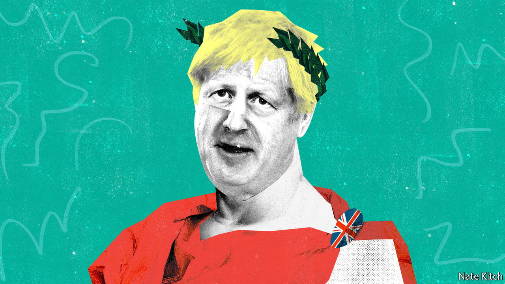

## Bagehot

# Britain’s imperial prime minister

> Boris Johnson is busy accumulating power in Number 10

> Feb 20th 2020

THE EMPEROR NERO was reportedly in the habit of dipping dissidents in tar and using them to light his dinner parties. Boris Johnson has not so far shown an inclination to use his ministers as human torches, but there is nevertheless something imperial about his progress. He dispenses with colleagues with a chilling nonchalance. He barrels into prime minister’s questions every Wednesday, his shirt-tail flapping behind him, to the cheers of the massed Tory benches. A recent cabinet meeting opened with a bizarre call-and-response chant, with the prime minister bellowing a series of questions—“How many hospitals are we going to build?” and so on—and ministers replying in unison.

The American presidency is imperial by nature. Presidents live in a big white house and get ferried about town in an armoured car nicknamed “the Beast”. Directly elected by the people, they are exceedingly hard to remove from office. The British prime ministership is more malleable: Herbert Asquith, a Liberal who held the office in the early 20th century, observed that it is ultimately “what the holder chooses, and is able, to make it”. Prime ministers have few resources—they work with a small staff in a poky town house—and their autonomy is limited, since they serve at the pleasure of their party. Theresa May spent three years being tormented by her fellow Tories before her miserable demise.

Three things determine whether they will be emperors or wimps: the nature of their personality, the quality of the people sitting around the cabinet table and the size of their majority. In Mr Johnson’s case all three dials are turned to “maximum imperial”. His biography of Britain’s greatest prime minister, Winston Churchill, was a disguised mission statement. He also has an imperial taste for vengeance. He cites “The Godfather” as his favourite film, for “the multiple retribution killings at the end”.

While Margaret Thatcher had big figures such as Geoffrey Howe and Nigel Lawson (who eventually assassinated her) around her cabinet table, and Tony Blair had his nemesis Gordon Brown, this Churchill wannabe has nobody who can stand up to him. He is not so much primus inter pares (Walter Bagehot’s description of a prime minister) as primus inter poodles. His only powerful colleague, so far, is his chief strategist and consigliere, Dominic Cummings, whom he can sack at will.

Mr Johnson’s 80-seat majority has also issued him with a blank cheque. The majority is in many ways a personal one: millions of people voted Tory, many for the first time, because of the combination of his personality and his message of getting Brexit done. It enables him to steamroller opposition.

This willingness to assert power goes along with a sense of fragility. Mr Johnson is in office thanks to the votes of people who had lost faith in politics. He knows that he will retain their support only if he can deliver for them, which is why the word “delivery” is on every minister’s lips these days. That means delivering not just Brexit but also the things for which Brexit is a surrogate: a better deal for the north; more police and hospitals; government support for the just-about managing. Mr Johnson calculates that in order to honour his promises to the electorate he needs to assert the supremacy of Number 10 and to treat departments of state less as centres of power than as delivery mechanisms.

Mr Cummings is at the heart of this centralisation project. He is pushing forward with his long-cherished plan of turning ministers’ special advisers, or “spads”, into a sort of New Model Army that sees its primary loyalty as being to Number 10 rather than to individual ministers. On February 13th the chancellor of the exchequer, Sajid Javid, resigned rather than agree to the merger of Number 11’s advisers with those at Number 10. Mr Cummings is also succeeding in spreading fear across Whitehall. “When the Eye of Sauron is off the Whitehall machine”, a “senior Downing Street figure” told the Sun newspaper in menacing Cummings-speak, “things stop working.”

What are we to make of Mr Johnson’s imperial turn? Critics worry that the last thing an over-centralised country needs is more centralisation of power. Other experiments with hyperactive regimes in Downing Street had lamentable side-effects: Mrs Thatcher left local government shrivelled. They also worry about destroying the checks and balances that prevent Number 10 from making big mistakes or spending money that the country doesn’t have. But these worries need to be set against two considerations.

The first is that there is nothing inherently sinister about Mr Johnson’s plan to encourage Numbers 10 and 11 to work more closely together. On the contrary: the Treasury’s traditional practice of keeping Number 10 in the dark about its budget and spending plans has led to embarrassments, as when Philip Hammond raised taxes on the self-employed only to have to reverse himself almost immediately because he had forgotten a manifesto pledge. The idea that Number 10 will steamroller the Treasury because its spads sit on a committee with Treasury spads is absurd. The Treasury has more than a thousand civil servants to rely on. The power of the chancellor depends largely on his abilities, and Rishi Sunak, the new chancellor, is more talented than his predecessor.

The second point is that beefing up Number 10 is no bad thing, at least in the short term. The government is confronted with two of the biggest problems Britain has faced since the second world war: taking Britain out of the EU and addressing the political discontent that led to Brexit. It needs a thriving policy unit to develop an economic model to replace, or at least to adjust, the one that has prevailed since the 1980s. It needs an updated version of Mr Blair’s delivery unit to monitor the government’s success or otherwise in achieving its goals.

The real problem with Emperor Boris is not that he is gathering power. He probably needs to do more of it. It is that his government is frittering away its authority by picking fights with judges and journalists rather than focusing on delivering its core promises. ■