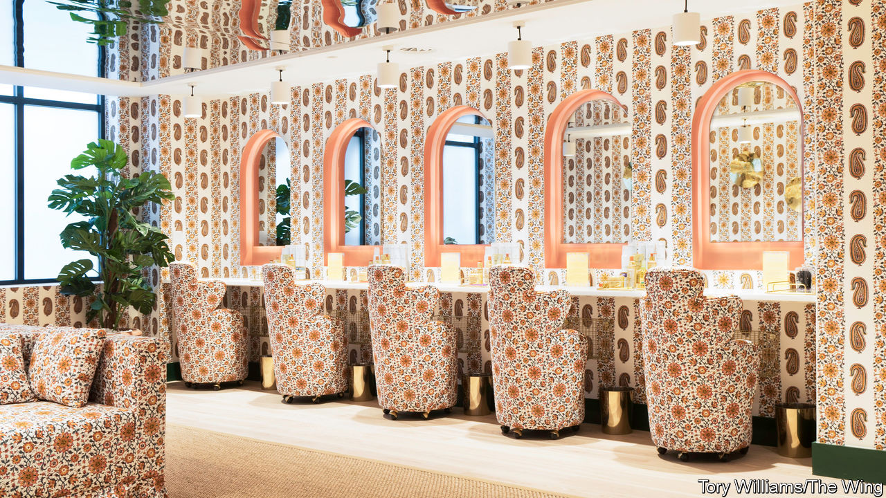

## Clubbing together

# The rise of Britain’s woke members’ clubs

> Out with cocaine-fuelled hedonism, in with gender politics

> Feb 22nd 2020

NAMED AFTER Marx, who famously did not want to belong to any club that would accept him as a member, the Groucho sold itself as the “antidote” to the gentlemen’s clubs of London’s St James’s district when it opened in 1985. With a heavy drinking culture, artistic spirit and cocaine-driven largesse, the club captured the zeitgeist. Of late it has been swept up in Soho’s commercialisation, and is now owned by a private-equity firm. Despite offering reduced fees for under-30s and a vegan menu, it is not the magnet for youth it once was.

Today’s antidote is a breed of clubs promoting values rather than loucheness. They offer a similar aesthetic to those of the 1980s and 1990s: all have adopted the velvet chesterfields and modern British art customary at the Groucho Club and Soho House, another club popular among media types. The new ingredient is “wokeness”.

In October The Wing, a glossy feminist utopia that does not admit men, opened its first branch outside America, where there are ten. Candidates to join the new outpost in Fitzrovia are asked, for instance, to describe how they have “promoted or supported the advancement of women” and what they think is the “biggest challenge facing women today”. At the clubhouse, oil paintings of Phoebe Waller-Bridge and Mary Beard (feminist heroes in acting and academia respectively) line the walls, the library is free from books written by men, and badges dispensed at reception allow everyone to indicate their preferred personal pronoun. Members are described either as “the cohort” or “the witches” (liked for its connotations of subverting male power).

The Wing’s native British equivalent is AllBright. There are two in London, and there will be three in America by the end of the year. Like The Wing, it offers an additional service beyond somewhere stylish to socialise and work: self-help. At The Wing, recent events have covered self-sabotage, boundary-setting and how to be “sober and social”. At AllBright, group sessions have discussed impostor syndrome and how to overcome fear. Cognitive behavioural therapy and psychoanalysis are available by the hour. Mindless hedonism is off the menu.

For mixed company, “people passionate about driving positive impact” can join The Conduit in Mayfair, opened by a former chairman of Soho House, which claims to be “a platform for catalysing and supporting new ideas and collective action”. For eco-enthusiasts there is Arboretum in Covent Garden, a leafy idyll where “people who care about the planet convene, create and collaborate”. Its deli promises dishes free from dairy, refined sugars, additives and chemicals.

Other than the offer of cheap drinks by some traditional clubs to attract younger members, little has stirred in St James’s. As a result, clubland is increasingly diverse. There are ever more clubs for a modern Marx to be rejected by, and even more reason to reject them.