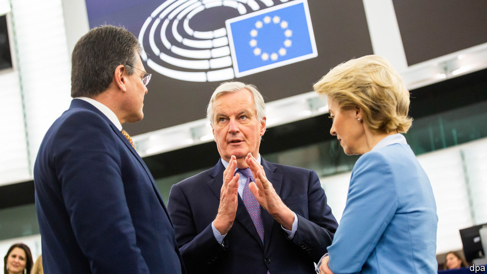
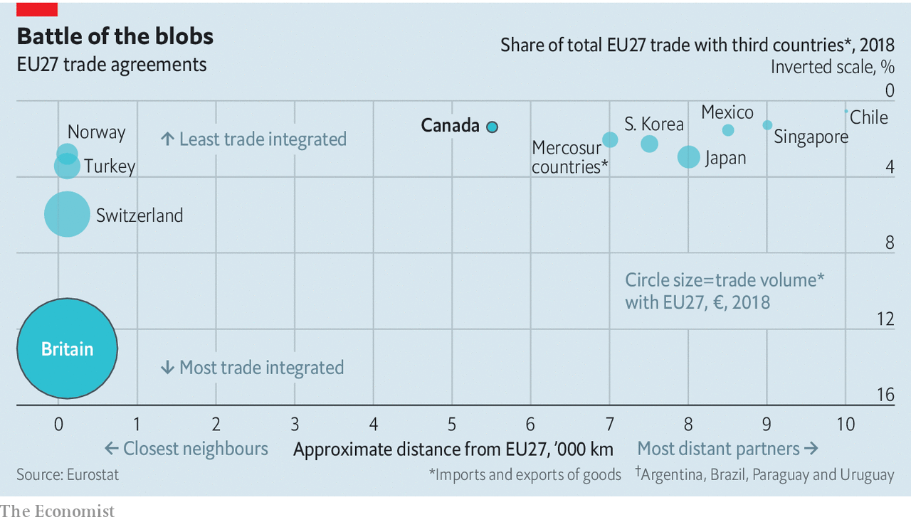

## Brexit negotiations

# Why Britain isn’t Canada

> The EU explains its rejection of Britain’s position in a chart

> Feb 22nd 2020

BREXIT NEGOTIATIONS are all about Canada at the moment. The government says it wants the kind of free-trade agreement that the eu has with Canada, and accuses the European Commission of changing its terms by suddenly demanding a level playing-field of rules on state subsidies and social, environmental, labour and other regulations to prevent unfair competition—conditions not required of Canada. The commission retorts that Boris Johnson accepted “robust commitments to ensure a level playing-field” in the political declaration attached to the Brexit withdrawal agreement. It also tweeted a slide showing just why Britain is not like Canada: the bigger the trade flows and the shorter the distance, the more substantial the risk of being undercut by looser rules.■

## URL

https://www.economist.com/britain/2020/02/22/why-britain-isnt-canada
