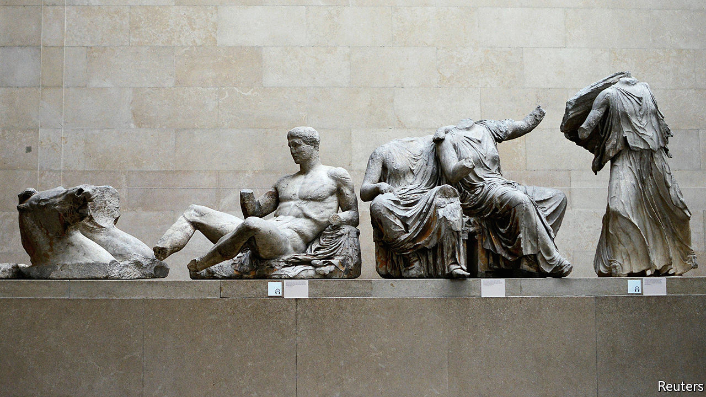

## Exploiting Brexit talks

# Will Britain lose the Elgin marbles?

> Greece sets its own conditions for any future EU trade deal with Britain

> Feb 20th 2020

LIKE PRIZE fighters before a bout, the EU and UK are taking up ever tougher stances ahead of upcoming trade talks. On February 17th David Frost, the British negotiator, said Britain’s rejection of any EU supervisory role was not a negotiating tactic but the point of the whole Brexit project. A day later his EU counterpart, Michel Barnier, reiterated that any deal would require acceptance of some EU rules. Meanwhile EU member states are gleefully adding conditions of their own to the negotiating mandate.

One is a proposal by Greece, backed by Cyprus and Italy, to demand “the return or restitution of unlawfully removed cultural objects to their country of origin”. The Greeks insist piously that this refers solely to the fight against trade in stolen artefacts, since London is a centre for antique dealing. But EU diplomats note that the Greek government thinks that the Parthenon marbles in the British Museum were stolen by Lord Elgin in the early 1800s. And Greece’s culture minister has said that Brexit increases European support for their return.

The British Museum strongly supports the fight against trade in illicit antiquities. But it also insists the sculptures were acquired legally. The government says it will not even discuss their return, which would require a special act of Parliament. What this spat really shows is the use of Brexit talks to pursue other grievances. Spain is going after Gibraltar. Several countries want to keep on catching British fish. France talks of getting rid of British passport controls at Calais. Since any trade deal needs unanimous approval, why not pile on other conditions? At least it creates bargaining weapons to use in an eventual showdown in what look like being rancorous negotiations running up to the deadline at the end of the year.