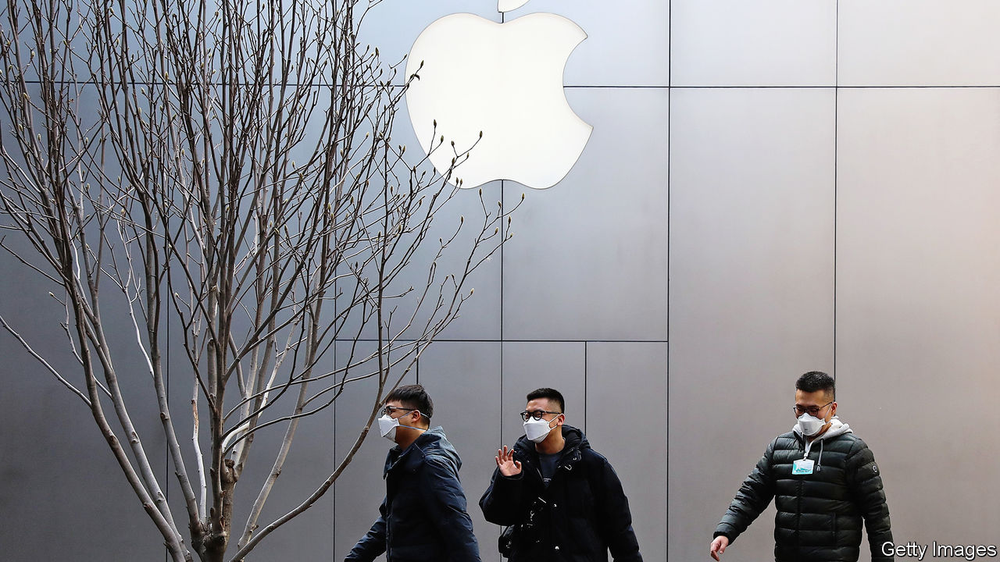
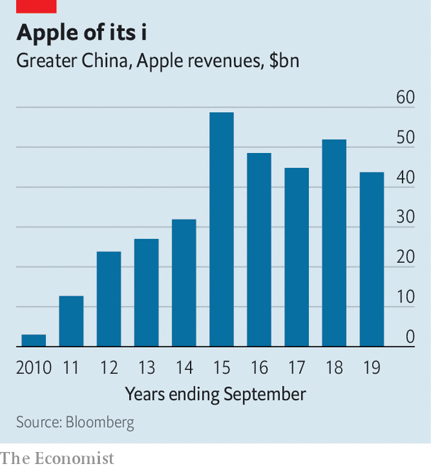

## Red plateau

# Apple’s Chinese troubles

> The coronavirus is just the start

> Feb 20th 2020

NO AMERICAN COMPANY makes as much money in China as Apple. While few make that much money at all, Apple raked in $44bn of revenues in Greater China during the 2019 financial year, mostly from selling iPhones. That is more than the global sales of United Airlines and Nike and about as much as Tencent, a domestic tech giant. Few countries have as much power as China to shape Apple’s fortunes.

The virus that has swept across the country is doing just that, hurting both manufacturing operations and sales of iPhones in Apple’s second-biggest market. Many of the migrant workers on whom Apple and its contract manufacturers depend have not yet returned to their posts as the movement of people is restricted by the government. Shoppers have not yet returned to the streets. As a result, on February 17th Apple warned investors that it would miss its revenue guidance for the quarter. The firm’s shares, which have been on the ascent since last summer, dropped by nearly 2% after the announcement.

The short-term threat to Apple’s business in China is best understood against the backdrop of the firm’s longer-term success. Apple’s Chinese fortune was built in the first half of the past decade, when its revenues in the country grew from $2.8bn in 2010 to $59bn in 2015. Sales have slipped in subsequent years (see chart), but were still sufficient for the Chinese market to account for 18% of Apple’s total revenues over the past ten years, second only to America. Apple says that it is gradually reopening its retail shops and that all of its iPhone manufacturing sites have reopened too, although their ramp up is going more slowly than it anticipated. Even if the virus outbreak proves to be no more than a blip, the 2020s are unlikely to treat Apple so well.

Its vital Chinese manufacturing operations are threatened by conflict with America over trade and technology. The trade war may also have damaged Apple’s brand. The number of iPhones it sells in China is plummeting. Most importantly Apple’s new strategy for growing revenue by selling subscriptions to services is far more complicated in China than selling iPhones. Apple’s engine of growth may not just be dormant, but extinct.

Start with supply chains. Apple is deeply dependent on China’s high-tech manufacturing ecosystem. Only China offers the labour and infrastructure needed to manufacture hundreds of thousands of devices a day, the volume Apple must produce in the run up to the release of a new phone. During Apple’s China boom Foxconn, a Taiwanese contract manufacturer, was the driving force behind the building of a new factory town near Zhengzhou in Henan province, to support iPhone manufacture. No other contract manufacturer could get close to that scale. The local government shelled out $1.5bn to help build factories and housing for 400,000 workers, and $10bn for a new airport.

That dependency leaves Apple’s manufacturing base exposed to the economic and technological conflict between America and China. Smart lobbying has kept its products outside America’s tariffs regime so far, but other threats loom. America’s Department of Commerce is working on new rules that would curtail the export of technical components to China. Such barriers could cripple Apple’s manufacturing there. It has nowhere else to turn. Efforts to establish a manufacturing base in Brazil failed. Indian operations have proved more fruitful, but are still small. Apple is bound to China and the virus shows how strongly.

Sales of Apple’s core product, the iPhone, are also on the wane in China. According to Canalys, a research firm, iPhone sales in China dropped by 21% in 2019, to 27.5m, even after price cuts, a tactic that Apple rarely employs. Selling fewer phones means not only lost sales but also deprives Apple of future revenues. Sales of services, like app-store purchases and Apple Music, and wearables like AirPods and watches, designed to integrate with the device, are linked to iPhone sales. Though Apple still has plenty of Chinese iPhone users, slipping sales put a cap on the future revenue.

Apple must also grapple with the Chinese government. The firm has always walked a fine line, quietly making compromises like agreeing to store users’ cloud data on Chinese servers. The company’s leaders are adamant that the devices which Apple sells in China come with the same encryption, security and privacy mechanisms that are offered in the rest of the world. But the government’s desire to control information and data means that there are products that Apple cannot offer to Chinese iPhone users, denting revenues and making its devices less appealing.

China’s Communist Party has proved surprisingly adept at stuffing the genie of a free internet back into its bottle. Apple has had to help. In 2017 the firm removed virtual-private-network apps from its Chinese app store. These let Chinese netizens jump through cracks in the Great Firewall and out onto the wider internet. Anything where Apple plays a more explicit editorial role, like its new curated news and streaming services, is beyond the pale. Not being able to sell its full range of services in China means Apple is leaving money on the table for every active iPhone in the country. App Store sales make up most of Apple’s services revenue, and while those are growing in China, the complete absence of its latest service plays will matter in future.

Apple’s latest quarterly results, released on January 28th (before the scale of the virus outbreak was clear), showed worldwide iPhone sales rebounding after a disappointing performance the previous year. Apple says that it is “fundamentally strong, and this disruption to our business is only temporary.” Revenues grew by 9% to $91.8bn. Sales of accessories and services that cluster around the iPhone grew too. Tim Cook, Apple’s boss, said that Apple had seen “double-digit” growth from sales of iPhones, services and wearables in mainland China. Although some specific product categories grew fast, overall sales in China were up by just 3% for the quarter, slower than anywhere but Japan, where sales shrank.

There is one ray of light in China. The 5G iPhone, with much faster connectivity, is reportedly due to go on sale in late 2020. But will it provide a sales bonanza? What a 5G iPhone will offer to well-heeled Chinese customers that they do not already have is unclear. Chinese consumers in large cities are used to high-quality mobile-phone connections. It is common to see an entire metro carriage of commuters streaming high-definition video on the move, something that few American or European networks can handle. Phones made by Huawei, a Chinese tech giant, are as good or better than anything Apple offers.

Even the success of a 5G iPhone would only be a temporary salve. As the decoupling of the American and Chinese technological ecosystems grinds on, it will only get harder for Apple to tap into the Chinese market and run its Chinese supply chains efficiently. That Apple was the first large American company to issue a revised forecast as a result of the virus shows just how dependent the firm is on China, for both supply and demand. Opportunities elsewhere may make up for some lost revenues—selling streaming services to Americans is a good business, if competitive. But it will be almost impossible for Apple to find a new growth engine quite as powerful as China.■

## URL

https://www.economist.com/business/2020/02/20/apples-chinese-troubles
