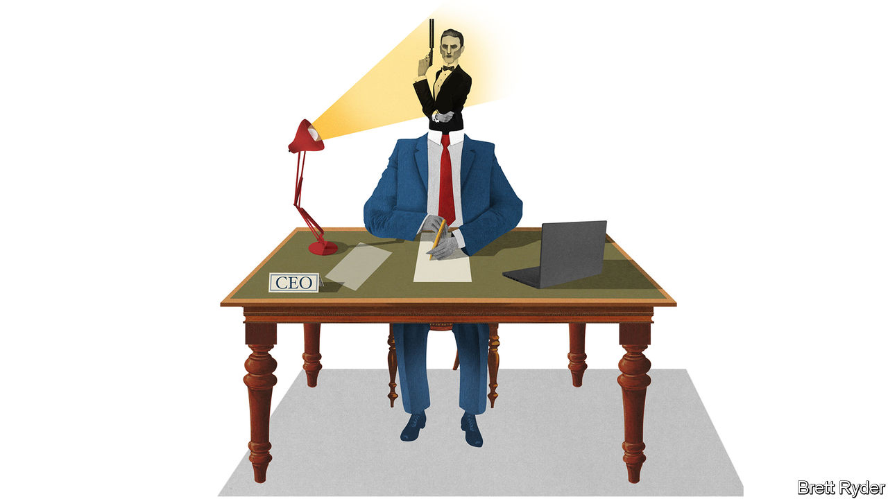

## The CEO who loved me

# Spies often use businesses as cover

> It can end in tears

> Feb 22nd 2020

ESPIONAGE AND business have long been entangled. In “Live and Let Die”, Ian Fleming’s second novel, James Bond masquerades as a businessman working for Universal Export, a flimsy front company for MI6 that occupies a “big, grey building near Regent’s Park”. In “On Her Majesty’s Secret Service”, published almost a decade later, the game is up. “As cover, solid cover, Universal was ‘brûlé’ with the pros”, rues Bond. “It had been in use too long. All the secret services in the world had penetrated it by now. Obviously Blofeld knew all about it.”

Ernst Blofeld, head of Spectre, a global criminal syndicate—a man in need of secret communications—would doubtless also have been wise to Crypto AG, a Swiss company that rose to dominate the global market for cipher machines after the second world war. By the 1990s it was apparent that the firm was in bed with the National Security Agency (NSA), America’s eavesdroppers. The truth, it turns out, was even more remarkable. From 1970 to the 2000s, at least, Crypto AG was wholly owned by the CIA and, until 1993, the BND, Germany’s spy agency, according to the Washington Post. “It was the intelligence coup of the century,” crowed a CIA report. “Foreign governments were paying good money…for the privilege of having their most secret communications read.”

The history of intelligence is littered with such front companies, used to collect intelligence or carry out covert skulduggery. “Active Measures: The Secret History of Disinformation and Political Warfare”, a forthcoming book by Thomas Rid, describes how the CIA seed-funded and controlled a printing house in Berlin in the 1950s to spread propaganda in the Soviet bloc. It published political pamphlets and news magazines, forged and real, as well as a lonely-hearts newsletter, a women’s magazine, and even publications devoted to astrology and jazz. It was one of many publishing houses and publications around the world that were covertly subsidised by the CIA and KGB to spread influence.

Some fake firms have been devilishly crafty. In the 1970s, at the height of the Troubles, the British Army established a brothel and launderette in Belfast. Not only could soldiers use laundry vans to move around discreetly, but IRA suspects’ clothes could be tested for explosive residue (both operations were eventually exposed and shot up). MI6 similarly operated a bogus travel agency that would lure republicans to Spain with free holidays, where they could be recruited as double agents. In the 1980s Mossad, Israel’s spy agency, ran a Sudanese beach resort that was used to smuggle out thousands of Jews from neighbouring Ethiopia.

As well as creating sham companies, spies have also cultivated a cosy relationship with the real corporate world. MI6 and the CIA were both reputed to have close dealings with oil companies and the press. Kim Philby, a Soviet double-agent in MI6, served briefly as this newspaper’s correspondent in the Middle East shortly before his defection. More recently, American telecoms firms have been paid hundreds of millions of dollars a year to co-operate with the government, often going beyond legal obligations to do so; the NSA has lauded AT&T for its “extreme willingness to help”. American spies are also reported to have paid RSA, a security company, $10m to use a flawed technique that made it easier to break a widely used form of encryption (the company denies this).

Such clandestine suborning is even simpler for dictators. The KGB would occasionally divert flights by Aeroflot, the Soviet national airline, to collect intelligence from the air. Today, America fears that Huawei, a Chinese telecoms giant that wants to build Western 5G networks, could help China’s espionage efforts.

In some respects, the private sector is more important to spooks than ever. Tech companies hold more personal data than state-owned telecoms firms ever did. And as the use of biometric border controls makes it trickier for spies to travel under an alias—fingerprints are harder to fake than passports—the CIA and others have relied increasingly on recruiting and placing employees in legitimate companies so they can travel under their real names with commercial cover.

What is in it for the suits? Money, for a start. Before it was bought outright, Crypto AG was handed large sums of cash both to buy its loyalty and to ensure that its back-doored cipher machines would have an edge over competitors. Companies might also get access to secrets. MI6 would funnel useful titbits to national champions like BP and British Airways, according to a former intelligence officer. Today the CIA provides pliant corporate partners with “special, tailor-made briefings”, according to a recent report by Jenna McLaughlin and Zach Dorfman for Yahoo News.

Yet cloak-and-dagger arrangements can go badly wrong. Companies that collaborate with spooks can put—often unwitting—employees abroad at risk. In 1992 Hans Buehler, a salesman for Crypto AG, was detained in Iran for nine months and freed only after a $1m ransom payment (he claimed he knew nothing of the firm’s back doors). Then there are the reputational costs. An aggrieved Mr Buehler went to the press, and the firm’s secret trickled into the open, prompting German spies to walk out of the deal (with a tidy five-fold return on the original investment). Crypto AG was wound up in 2018; its once-illustrious brand name is now destroyed.

A worse fate befell Ferranti, a British engineering firm that purchased International Signal and Control (ISC), an American arms contractor that turned out to be a CIA front for rampant gun-running. Ferranti went bankrupt in short order. When James Guerin, ISC’s CEO, was convicted of fraud and illicit arms dealing, Bobby Ray Inman, a former deputy director of the CIA, wrote to the judge with a character reference: “Mr Guerin displayed patriotism toward our country…even though it could have risked unfavourable publicity for his company.” Alas, gratitude from the spooks is scant consolation for aggrieved shareholders.■