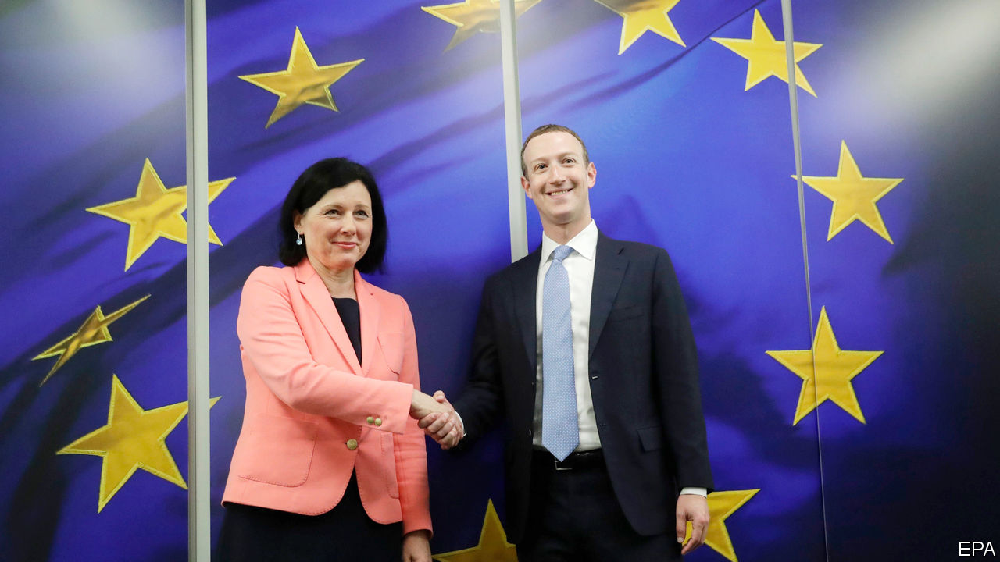

## The Brussels effect, cont

# The EU wants to set the rules for the world of technology

> On data protection, artificial intelligence, competition and more

> Feb 20th 2020BERLIN AND SAN FRANCISCO

MARK ZUCKERBERG might not have liked everything he heard, but Facebook’s boss got the timing right for a recent visit to Brussels. He was among the first outsiders to hear about the European Union’s ambitious plans to keep the technology industry in check, outlined in a series of documents made public a few days later, on February 19th. His visit is an admission that political paralysis in Washington, DC, has handed the EU the opportunity to become the world’s most important source of tech regulation.

Europe is both gnome and giant in the tech world. The continent has lots of cutting-edge technology but hardly any significant digital platforms. It accounts for less than 4% of the market capitalisation of the world’s 70 largest platforms (America boasts 73% and China 18%). At the same time, the EU is a huge market, with a population of more than 500m, which no tech titan can ignore. It contributes about a quarter of the revenues of Facebook and Google.

This combination has given rise to what Anu Bradford of Columbia Law School calls, in a new book of the same name, the “Brussels effect”. Digital services are, in her words, often “indivisible”. It would be too expensive for big tech firms to offer substantially different services outside the EU. As a result, most have adopted the General Data Protection Regulation, Europe’s strict privacy law, as a global standard. Governments, too, have taken more than a page from the EU’s data-protection book. About 120 countries have now passed privacy laws, most of which resemble the GDPR and its predecessors.

The European Commission wants to repeat the trick in other areas. The main document presented this week, a white paper on artificial intelligence, is a grab bag of measures to foster the use of AI in Europe and to limit its perceived dangers. The commission also released a “strategy” to promote the use of data, the most important input for AI applications. The idea is to create a “single European data space” in which digital information flows freely and securely. To make that happen, the commission wants, among other things, to eliminate legal barriers that keep firms from sharing data, as well as investment in cloud services that facilitate sharing.

Both papers are part of the EU’s overall “digital strategy”, which was also presented. Later this year the commission will put forward a draft of a “Digital Services Act”. Dominant tech firms should expect stricter rules not only about how they police the content that users generate, but the extent to which they can discriminate against rivals that use their services. All this is rounded up by a review of competition policy. Details are scarce, but proposed legislation in Germany indicates the direction of travel: data will become far more important for determining whether a company is dominant and whether it has abused its market power.

There are signs that the Brussels effect will work its magic again. Facebook is not the only tech giant to accept Europe as the world’s main source of tech regulation for some time to come. Sundar Pichai, the boss of Alphabet, Google’s parent, recently paid a visit to the Belgian capital. He called for “sensible regulation” of AI. Brad Smith, Microsoft’s president, is a regular guest. America’s tech titans also increasingly use the EU to influence the debate at home. It saves some lobbying there, if they can help shape widely adopted regulations that emanate from Europe.

But the Brussels effect may be less effective than in the past. The ground on which the debate over privacy legislation was conducted had been long established before the GDPR, but regulation in AI is nascent. Experts still quarrel over such basic questions as what AI actually is. And the EU, where politicians tend to favour stricter regulation, may overdo it. This could push the tech giants to differentiate their regional offerings after all (and stymie Europe’s startups). Worse, the data strategy could easily turn protectionist.

If the EU’s digital plans became restrictive policy driven by protectionism, that would limit Europe’s ability to set global rules which could help to give its firms a much-needed leg up. It would also make it much harder for the EU to establish what the digital world will badly need, should regulation of tech remain stalled in America even after the presidential election. At risk is Europe’s role as a third “techno-sphere”—one that is not controlled by a handful of tech titans, as it is in America, or by the Chinese state.■

## URL

https://www.economist.com/business/2020/02/20/the-eu-wants-to-set-the-rules-for-the-world-of-technology
