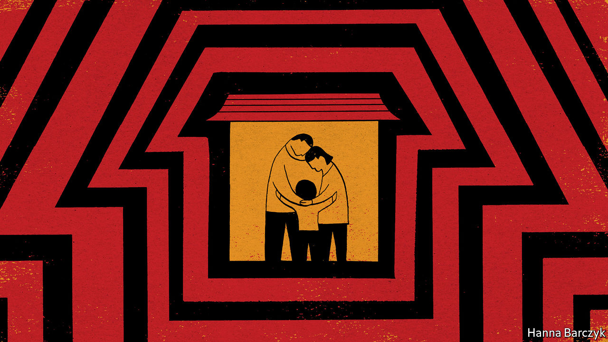

## Chaguan

# Amid a virus lockdown, how are China’s migrant workers surviving?

> A sense of powerlessness can hurt as much as dwindling savings

> Feb 22nd 2020

“FAMILY IS HAPPINESS,” reads the motto over the front door of a village house in the north-west of Sichuan province. From the mahjong table beneath a velvet dust-cloth, to the child-sized chair facing a television flanked by pink plastic speakers, all is ready for a family reunion. The home’s owners, grandparents in their 50s, have had six weeks to clean and tidy, their longest break in years from lives of toil in Beijing. Alas, the couple did not choose this extended holiday, nor the loss of pay it involves. In common with many of China’s 173m long-distance migrant workers, their jobs have been halted by the new coronavirus. Worse, during this subdued lunar new year they have not seen their only child, a 32-year-old chef. Curbs on travel have left him stuck in the next-door province of Shaanxi with his wife and eight-year-old son.

In medical terms, covid-19 has largely spared this corner of Sichuan. As The Economist went to press there were 22 confirmed cases and no deaths in the nearest large city, Mianyang, and in the villages that surround it, with their fir trees and duck ponds and fields of yellow rapeseed. Still, quarantine restrictions have shut down bus services. Villages are closed behind checkpoints guarded by local officials and volunteers in masks and red armbands, wielding digital thermometers and disinfectant sprays.

China is a country of half-idled factories, of office towers emptied of white-collar staff, and restaurants without diners. Chaguan this week travelled to Sichuan, 1,700km south-west of Beijing, to meet a few of the blue-collar workers who are suffering the consequences. He found people who are at once more resilient and more vulnerable than their peers in the rich world. Migrants hunkered down in home villages talk of picking free vegetables, or bartering with neighbours. Less happily, meat prices are high. Pork prices have soared since herds were devastated by African swine fever, an animal pandemic that reached China in 2018. None of those who spoke to Chaguan questioned strict government controls, for the virus scares them. Neither they nor their village are named here. These are jumpy times in which Communist Party leaders have demanded that news reports should be filled with “positive energy”.

Chaguan chatted with workers on plastic stools outside a three-storey home built in 2008 at a cost of about 120,000 yuan ($17,130). It sits on land owned by a 54-year-old grandfather who works in Beijing as a casual painter and decorator. He is paid 3,000 yuan in a good month. His wife, also 54, cleans an insurance company’s offices, earning about two-thirds of that. Their combined earnings make them middle-income workers in China, but they watch every yuan. They rent a room in a shared apartment for a little over 1,000 yuan a month. They make packed lunches and take buses to work. The wife explains that, with underground train tickets starting at three yuan, “If I take the metro I won’t have any money left.” They have lived in Beijing since 2004 but have barely explored the city, apart from a visit to the Great Wall and another to see Mao Zedong in his mausoleum.

Each morning now, they check for a smartphone message from the cleaning firm that employs the wife, telling her to return to Beijing. As out-of-town arrivals to the capital they will have to spend two weeks in self-isolation, or face legal penalties. Loneliness does not worry them. “Quarantine isn’t that different from what we usually do, we just stay put,” shrugs the husband. Money is more of a concern, for he will earn nothing while isolated. In a good month the couple save just over 1,000 yuan after rent and living expenses. For years, their savings went towards building their house, which they will leave to their son. Now they regularly send money to help fund their grandson’s studies in Mianyang. “We have to. That’s how it is in the countryside,” says the wife.

Chinese savings rates are high by world standards—even the poor routinely save 20% of their disposable income. In contrast, a study in 2017 by America’s Federal Reserve found that 44% of Americans lack the savings to pay an unexpected $400 bill. China’s skimpy pensions and health insurance, notably in rural areas, explain much of that thrift. Westerners are helped with lots of costs, says a young man visiting the village from Mianyang. “Chinese people, we’re on our own,” he laughs. Life under lockdown is cheaper here than usual because social visits are banned. Every three households have been given a ticket, allowing one person to buy supplies for them all from the local market. For now, the grandparents who normally work in Beijing are spending savings. They could survive another half a year, they think, but no more.

A sense of powerlessness can hurt as much as dwindling funds. A visit to Mianyang’s almost-deserted railway station found a middle-aged couple heading, unhappily, back to Zhejiang province, where infection rates are rather high. They both work in Jiaxing, near Shanghai, at a factory that makes linings for much-needed face-masks, and so have been ordered to return. They do not know if they will be paid for the two-week quarantine that awaits them, which they have heard will be monitored via the GPS function on their phones. They do not even know whether their landlord will let them back into the room that they rent from him. Reports abound of migrants being denied entry to residential compounds, as local officials and property managers impose harsh rules, some of their own invention. If they are barred from their home the factory has offered dormitory beds, says the wife. “There is no option. We have to go back,” sighs the husband.

In truth, China’s economy needs migrant labour just as much as those workers need their pay. Hard, solitary lives explain why the average age of such workers is now over 40. The young often prefer to work nearer home. Though covid-19 would test any country, the epidemic is casting fresh light on a Chinese society divided by cruel inequalities of wealth, political clout and urban versus rural class. This is a crisis with many sorts of victim. ■

Read more of our coverage of the covid-19 outbreak:[Experts predict that covid-19 will spread more widely (February 22nd)](https://www.economist.com//international/2020/02/22/experts-predict-that-covid-19-will-spread-more-widely)[In China, newly confirmed cases of coronavirus infection are falling (February 20th)](https://www.economist.com//china/2020/02/22/in-china-newly-confirmed-cases-of-coronavirus-infection-are-falling)[Covid-19 presents economic policymakers with a new sort of threat (February 20th)](https://www.economist.com//finance-and-economics/2020/02/22/covid-19-presents-economic-policymakers-with-a-new-sort-of-threat)[How China’s coronavirus epidemic could hurt the world economy (February 13th)](https://www.economist.com//leaders/2020/02/15/how-chinas-coronavirus-epidemic-could-hurt-the-world-economy)