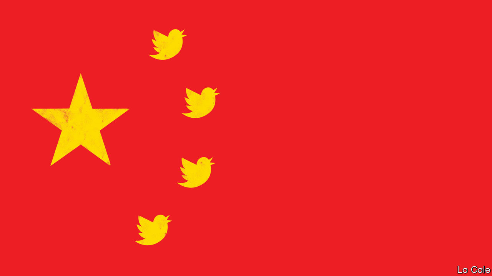

## Discovering Twitter

# China finds a use abroad for Twitter, a medium it fears at home

> The country’s diplomats are learning to play rough online

> Feb 20th 2020

AS THE CRISIS deepened over the outbreak of covid-19, China’s leader, Xi Jinping, convened a meeting of the country’s most powerful body, the Politburo Standing Committee. One topic the seven men discussed on February 3rd was how to manage publicity. Officials, they agreed, must “tell the story of China’s fight against the epidemic, and show the Chinese people’s spirit of unity and togetherness”. In response, Chinese diplomats have been turning to a medium that most of them eschewed until just a year ago: Twitter. Blocked in China, it is fast becoming a favoured tool for the Communist Party as it tries to amplify its voice globally.

Two academics who study the Chinese foreign ministry’s use of social media, Zhao Alexandre Huang and Rui Wang, found only 17 Chinese diplomatic Twitter accounts in October 2018. Now they count more than 80. They are being used to promote the heroic work of China’s doctors and nurses and relay messages of support from Western leaders. “No winter lasts forever, every spring is sure to follow,” said China’s foreign ministry spokeswoman, Hua Chunying, on February 14th in her first ever tweet. They also go on the offensive. “You speak in such a way that you look like part of the virus and you will be eradicated just like virus. Shame on you,” said Zha Liyou, China’s consul-general in Kolkata, India, in a tweet on February 16th aimed at a critic of China’s handling of the outbreak.

Such spontaneous name-calling by Chinese diplomats was unusual until recently. But since Mr Xi became China’s leader in 2012, he has encouraged his diplomats to be more robust in their efforts to boost China’s “discourse power”. The Economist slid into the direct messages of several Chinese envoys to ask why they were turning to Twitter. Li Xiaosi, the ambassador to Austria, replied that Mr Xi had “asked Chinese diplomats to tell China’s stories well and present a true, multidimensional and panoramic view of China”. Mr Zha, in Kolkata, wrote that telling the “true story” of China was his “sole purpose”.

Before the epidemic, such diplomats often used Twitter to dismiss reports of human-rights abuses in Xinjiang. “Many westerners’ #COUNTER_TERRORISM logic: I drop bombs in sovereign countries which caused huge civilian casualties, I’m protecting human rights!” tweeted Cao Yi, a Chinese consul in Beirut on January 2nd. “You set up education&training centers to prevent extremism which made #Xinjiang free of terrorist attacks, you have no human rights!”

The tweets get noticed. In July one of the country’s most outspoken Twitter-diplomats, Zhao Lijian, who has about 240,000 followers, posted a message saying that white people avoid a mostly black district in Washington. Susan Rice, a former American ambassador to the UN, tweeted that Mr Zhao, who was then the deputy chief of mission in Islamabad, was a “racist disgrace”. She called on Cui Tiankai, China’s ambassador in Washington, to “do the right thing and send him home”. Mr Zhao fired back that she was “shockingly ignorant”. But Mr Cui asked that word be conveyed to Ms Rice that he did not approve of Mr Zhao’s tweet, that Mr Zhao did not work in Washington and that his Twitter account did not reflect China’s stance. The offending tweets were soon deleted.

Mr Zhao has since relocated to Beijing, where he is deputy chief of the foreign ministry’s Information Department. Part of the provocateur’s duties: getting more of China’s envoys to tweet. ■