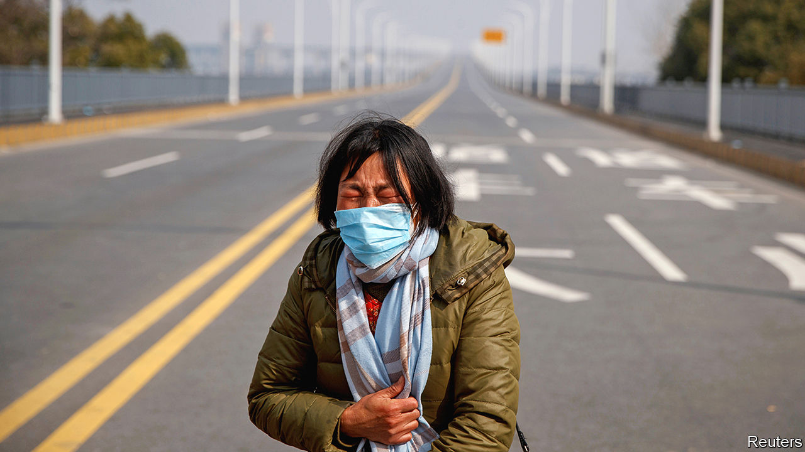

## Casualties of war

# In China, newly confirmed cases of coronavirus infection are falling

> Yet many Chinese are still enduring tight quarantine

> Feb 22nd 2020BEIJING

CHINESE OFFICIALS call it “waging war on two fronts”. One involves battling the coronavirus that has infected more than 74,000 people in China and killed about 2,100 since it was discovered in the central city of Wuhan in December. The other is a struggle to revive the economy. The daily number of newly diagnosed infections has mostly fallen since February 13th. But a month after imposing the most extensive quarantine measures ever enforced during an epidemic, most local governments are hesitant to ease up.

Some coastal cities have made it easier for businesses to obtain approval before resuming work and have eased requirements for returning workers to provide proof of their health. But controls remain harsh. Hubei province, of which Wuhan is the capital, is still under the tightest lockdown. Since late January it has been all but sealed off from the rest of the country. Until mid-February residents of Wuhan—a city more populous than London—had at least been allowed to stroll in the streets. But lately the authorities have stepped up the “wartime measures” that officials have put in place to fight the spread of covid-19, as the disease caused by the virus is known.

First, local officials began stopping people from leaving their homes more than once every two days. Then the government banned all non-urgent excursions, even for buying necessities. Local officials help to arrange the delivery of essentials to each home. One resident of Wuhan says that in his district, households must choose their food supplies from a short list of slightly differing parcels.

Many less-affected cities outside Hubei are also regulating their citizens’ comings and goings. In Zhengzhou, the capital of neighbouring Henan province, officials have issued households with exit passes to be shown at checkpoints at the entrances to their housing complexes. This is supposed to prevent non-essential outings. Similar restrictions are in place in several other big cities, including in the far-western region of Xinjiang. The New York Times calculates that, by February 18th, epidemic-related limits on outdoor movement were affecting about 150m people nationwide.

In the biggest cities, such as Beijing and Shanghai, controls are not as strict. But since people began returning from their extended lunar new-year holidays checkpoints have been set up in neighbourhoods to prevent access by non-residents (how strictly rules are applied varies according to the enthusiasm of whoever is on duty). On February 14th Beijing’s city government said that people who enter the capital from any other province will have to self-quarantine for two weeks, Beijingers included.

The longer such measures linger, the harder it will be for officials fighting on the economic front. Wuhan is an industrial centre and Hubei’s GDP is bigger than Poland’s. In an internal speech on February 3rd, made public 12 days later, China’s leader, Xi Jinping, said the country’s original economic targets for the year “must be fulfilled”. This is an ambitious goal. Many of China’s firms have been crippled by tight quarantine measures and have yet to resume normal business despite a supposed return to work on February 10th in most areas. Businesses in Hubei had been scheduled to reopen on February 21st. The date has been pushed back to March 10th.

For some people, the restrictions are a nightmare. Even in lightly affected regions, hospitals remain closed to all but the most urgent cases (a mother in Hubei is pictured, pleading with police to allow her daughter through a cordon to get cancer treatment). Some people in Hubei find it difficult even to travel to pharmacies to pick up essential medicine. A charity worker says he calls up local officials to alert them to the needs of disabled residents. But the bureaucrats are often flustered by the calls, he says, because they are so overworked.

Many Chinese say they are afraid of catching covid-19 and that the government’s measures are a necessary price to pay for the protection of their health. But there are also many who believe the authorities’ response to the epidemic was bungled, especially in the days leading up to the lockdown in Hubei when officials were slow to acknowledge the virus’s threat. The Communist Party worries that public anger could threaten social stability (the need to maintain it was a big theme of Mr Xi’s recently published speech). Censors have been struggling to control online criticisms, which surged earlier this month following the death from covid-19 of a doctor who had been reprimanded by police for warning of the danger. Access has been throttled to foreign virtual private networks, which some people in China use to circumvent the “great firewall”.

Mr Xi is also waging war on another front: against overseas critics (see [article](https://www.economist.com//china/2020/02/20/china-finds-a-use-abroad-for-twitter-a-medium-it-fears-at-home)). On February 19th China ordered three of the Wall Street Journal’s China-based reporters to leave the country. It is the largest expulsion of accredited foreign journalists in China in decades. Officials say it is in response to an opinion piece entitled: “China is the real sick man of Asia”. That headline caused widespread offence, for it repeats a slur used by western and Japanese imperialists about China. The Journal says it did not realise this, and that its words were a play on an old cliché used of the Ottoman Empire and commonly revived in headlines about various countries. The Economist, the Guardian and the Financial Times have all called Britain “the sick man of Europe”, notes the Journal.

Mr Xi will probably not have to worry about embarrassing questions at the annual session of China’s parliament, the National People’s Congress. It is due to start in early March, but senior delegates will meet on February 24th to discuss whether to postpone it. They are expected to do so. China’s leaders will not want to send the wrong message by convening the congress at a time when many Chinese are effectively confined to their homes and when officials (which many of the nearly 3,000 delegates are) should be on the front lines, fighting the epidemic.

But the publication of Mr Xi’s speech could be a sign that he is confident of victory. It revealed that he was giving orders on containing the virus as early as January 7th, two weeks before what had hitherto been his earliest-known comments on the outbreak. By letting this be known, the party may want to show that if there was any coverup at that early stage, it was the fault of local officials, not his. The outlines are becoming visible of the party’s strategy when the war is eventually over. ■

Read more of our coverage of the covid-19 outbreak:[Experts predict that covid-19 will spread more widely (February 22nd)](https://www.economist.com//international/2020/02/22/experts-predict-that-covid-19-will-spread-more-widely)[Covid-19 presents economic policymakers with a new sort of threat (February 20th)](https://www.economist.com//finance-and-economics/2020/02/22/covid-19-presents-economic-policymakers-with-a-new-sort-of-threat)[How China’s coronavirus epidemic could hurt the world economy (February 13th)](https://www.economist.com//leaders/2020/02/15/how-chinas-coronavirus-epidemic-could-hurt-the-world-economy)

## URL

https://www.economist.com/china/2020/02/22/in-china-newly-confirmed-cases-of-coronavirus-infection-are-falling
