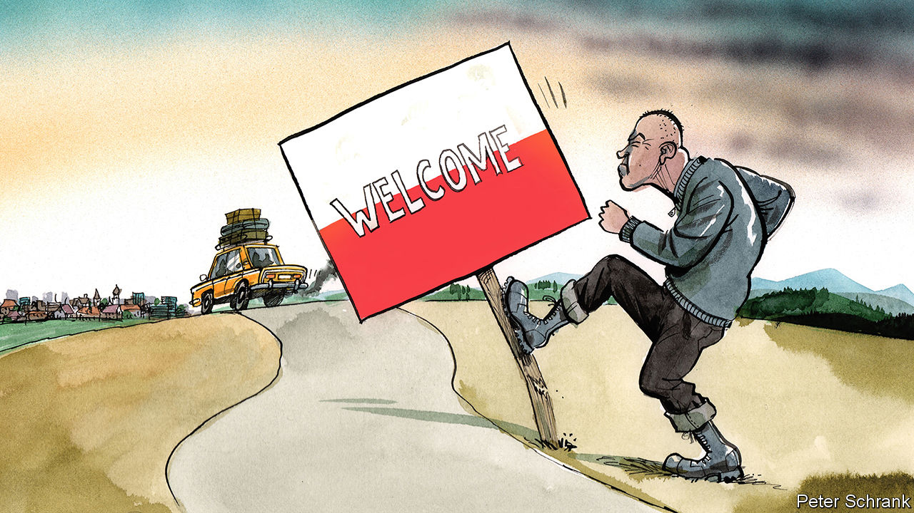

## Charlemagne

# Poland is cocking up migration in a very European way

> The Poles repeat Germany’s mistake: pretending immigrants will go home

> Feb 22nd 2020

FOR A GLIMPSE of how immigration is changing Poland, head to Hala Koszyki, an Instagram-friendly food hall in the middle of Warsaw. Take an Uber and there is a good chance the driver will be from Belarus. Inside, Ukrainian waiters and chefs toil over sushi and tapas. Outside, straddling their scooters, a group of UberEats riders from India and elsewhere in South Asia wait to take orders from any Varsovians who fancy a night in.

Poland, one of the EU’s most homogenous countries, is becoming a country of immigration. It took in more workers from outside the EU in 2018 than any other country—nearly five times more than Germany—and is likely to have repeated the trick again in 2019. Nearly 2m Ukrainians have arrived since 2014, pushed by a ropy national economy and a war in the country’s east, and pulled by higher wages in Poland. They are not alone. In the past three years 36,000 Nepalese, 20,000 Indians and 18,000 Bangladeshis have moved to Poland. It is a big shift: Poland, a country of 38m inhabitants, had only 100,000 foreigners of any stripe in 2011. Migration is seen as a political faultline in the EU, with an open west set against a closed east. Yet Poland is, quietly, starting to look more like its peers in western Europe.

Unfortunately, Poland is being a bit too European about it. Western Europe turned to immigration during the post-war economic boom. Unemployment plunged from about 8% in the 1930s to 3% in the 1950s and barely 1.5% in the early 1960s, triggering a labour shortage. Poland is enjoying a similar economic surge now. Unemployment, which peaked at 20% shortly before it joined the EU in 2004, is just over 3% today. Facing the same problem, Poland’s nationalist Law and Justice (PiS) government has tacitly arrived at the same solution: immigration. Public policy ought to benefit from second-mover advantage. Governments can observe and avoid the mistakes made by others. When it comes to immigration, western Europe offers plenty of lessons. Yet Warsaw seems to be ignoring them and enthusiastically repeating other countries’ cock-ups.

The first error is a belief that temporary workers will remain temporary. Citizens of Ukraine, Belarus and some other former Soviet countries can work for up to six months in Poland without a visa. Polish officials refer blithely to Ukrainians working in the “grey market” and paying no social insurance. Tricky questions, such as how to integrate new arrivals, are ducked. Why bother thinking about such things if the newcomers will soon go home? Similar “guest worker” schemes have been tried before. Germany welcomed about 2m guest workers from the 1950s to the 1970s. When many turned out to be permanent, the government decided not to kick them out. Former chancellor Willy Brandt, a Social Democrat, said doing so would be “irresponsible, inhumane and entirely uneconomical”. Poland’s ruling party would have fewer qualms over deportation. But its leaders might be deterred by the expense and the damage to the economy.

Another mistake is the assumption that since (apart from the Ukrainians) migrants are relatively few, they will not be noticed by Polish voters. Small numbers can have a big impact. In 2019 Poland granted long-term visas to about 24,000 people from Nepal, India and Bangladesh, according to the Polish Economic Institute, a think-tank. By comparison, Britain accepted migrants from the Caribbean at an annual rate of about 16,000 in the 1950s. With a population of 52m at the time, Britain was hardly swamped. But it was enough to trigger the rise of racial politics. In 1955 Winston Churchill suggested “Keep England White” as an election slogan.

Some Polish officials think they need not worry about integration because Ukrainians are culturally very similar to Poles. They look the same, are mostly Christian and speak similar languages. However, similarities are an imperfect shield against prejudice. White, Christian, football-mad lager drinkers were hardly a rare breed in Britain before the arrival of hundreds of thousands of Poles in the noughties. Yet a backlash against immigration from eastern Europe boosted support for Brexit, which upended British politics. Confederation, a far-right Polish party, is crusading against foreign workers. Its MPs bluntly state that national “purity” matters more than prosperity. So far, there is little interest: an anti-Ukrainian march by another party in 2018 drew only 10 people. But Poland has not tasted recession for nearly a generation, and who knows what might happen if the economy were to stall.

In any case, Poland may not be able to rely on an influx of Ukrainian workers for long. An improving Ukrainian economy and looser German immigration rules, which come into force in March, may encourage youngsters in Kharkiv to turn elsewhere. Businesses are already looking farther afield to plug gaps. Personnel Service, a Polish recruitment agency, is opening an office in Singapore to manage workers from Asia. The kind of Poles who object to foreigners tend not to hang out in swanky food halls in central Warsaw. But the arrival of, say, 150 Nepalese or Indonesian workers in a factory in a small town in eastern Poland might grab their attention. Rapid ethnic change can upset domestic politics very quickly, as mainstream parties in western Europe have found.

The Polish government’s most quintessentially European trait, when it comes to migration, is its unwillingness to discuss the topic and, more important, to make a case for it. Perhaps this is because the government is more hypocritical than most. PiS is one of Europe’s most illiberal governing parties, yet it has one of its most liberal immigration policies. It is like a dirty secret. When one minister admitted that immigration was necessary for the Polish economy to keep zooming along, he was fired. Like its neighbours to the west, Poland’s government has opted for a combination of naivety, deceit and hope that things will sort themselves out. Perhaps it is just the European way. But it is unlikely to work. ■

## URL

https://www.economist.com/europe/2020/02/22/poland-is-cocking-up-migration-in-a-very-european-way
