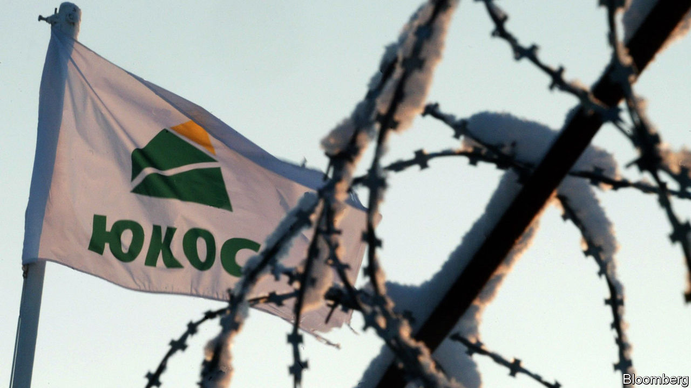

## Much ado about “such”

# The $50bn Yukos judgment against Russia turns on a single word

> Shareholders of an oil company dismantled by Vladimir Putin win big

> Feb 20th 2020THE HAGUE

RARELY ARE the ramifications of a four-letter word so great as in the case of Yukos, a defunct Russian oil firm. On February 18th a Dutch appeals court ruled that the Russian state owes Yukos’s shareholders $50bn, one of the largest awards ever, for bankrupting the company using bogus tax-fraud charges. That reinstated a decision in 2014 by the Permanent Court of Arbitration (PCA), an international dispute-resolution court in The Hague. In 2016 a lower Dutch court had overturned the ruling, finding that the PCA lacked jurisdiction. The issue largely hinged on a single clause in an international energy treaty—specifically on how to interpret its use of the word “such”.

The seizure of Yukos was a turning-point in President Vladimir Putin’s consolidation of power. In 2003 Mikhail Khodorkovsky, then Yukos’s CEO and largest shareholder (and Russia’s wealthiest man), had begun financing opposition parties and hinted at running for president. Mr Putin confronted him, and the government charged the company with $27bn in tax violations. Mr Khodorkovsky went to prison for a decade. Yukos was broken up and sold to state-controlled firms at fire-sale prices.

As the company was being devoured, its owners and managers began filing lawsuits. They no longer included Mr Khodorkovsky, who during his trial had transferred his shares to a partner. The biggest case was the one launched at the PCA by a holding company called GML that represents Yukos’s biggest shareholders. GML claimed that Russia’s seizure had violated the Energy Charter Treaty, an international investor-protection agreement that prescribes arbitration in case of a dispute. Russia had signed the ECT in 1994 but never ratified it. But the treaty states that signatories agree to apply it provisionally until ratification, “to the extent that such provisional application is not inconsistent with [their] constitution, laws or regulations”.

Here things get tricky. Russian law, like that of many countries, does not normally allow arbitration between private entities and the state. Russia’s lawyers thus argued that the parts of the ECT providing for arbitration did not apply, and the PCA had no jurisdiction. But the PCA ruled that it did, because “such” provisional application refers to that of the treaty as a whole, including the bits about arbitration.

Russia appealed to a Dutch district court, which rejected the PCA’S interpretation because it would render the phrase “to the extent that” meaningless. But last week the appeals court found that the PCA was right. Russia plans to take the case to the Dutch Supreme Court, a lengthy process.

GML’s lawyers still have to recover the money. Their efforts to do so in 2015, after the initial PCA ruling, did not go well. In Belgium efforts to seize Russian embassy bank accounts ran up against diplomatic immunity. When they tried to claim a $700m French government payment to Roscosmos, the Russian space agency, French courts ruled it was a private company unconnected to state debts. Belgium and France have since passed “Yukos laws” making it harder to attach the assets of sovereign states. Russia is pushing through constitutional changes that subordinate international law to its own.

Russia’s low regard for international law was highlighted again last week in a report that fingered the FSB, Russia’s main spy agency, in the killing of a Chechen dissident in Berlin last August. The report by Bellingcat, a cyberforensic investigative group, and journalists at the Insider and Der Spiegel used leaked mobile-phone metadata to identify an FSB associate as the likely assassin. The Yukos case will be less violent; the Kremlin has threatened tit-for-tat retaliation against any country that upholds seizures of its assets. ■

## URL

https://www.economist.com/europe/2020/02/20/the-50bn-yukos-judgment-against-russia-turns-on-a-single-word
