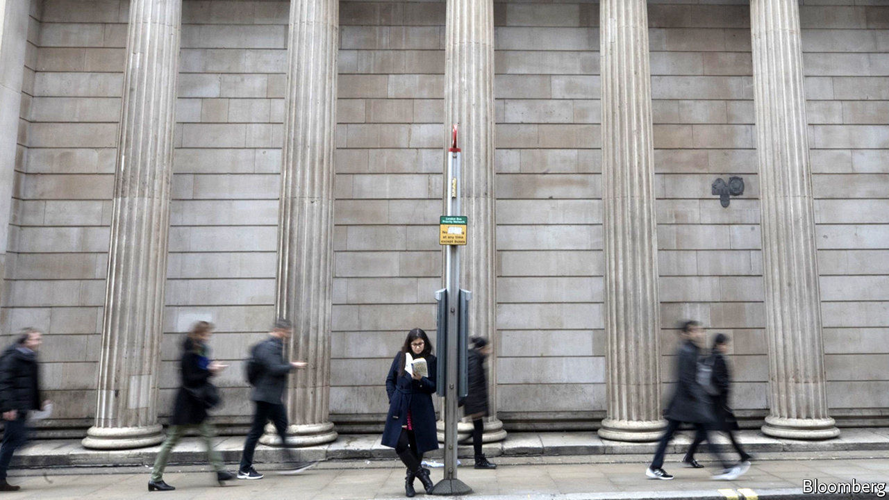

## Labour hoarding

# Are there too many central bankers?

> Euro-area banks look especially flabby

> Feb 22nd 2020

CENTRAL BANKERS around the world have long pondered the causes of a slowdown in productivity. Might they be part of the problem? Many national central banks in the euro area have shed staff in the two decades since they ceded many of their responsibilities to the ECB. Yet they still look flabby: the central banks of Germany, France and Italy have many more employees than the Bank of England, whose duties have grown over the same period. In their defence the Europeans could point to the payroll of America’s Federal Reserve system. Its Board of Governors in Washington, DC, where most responsibility resides, had about 2,800 employees at the last count. But its network of less important reserve banks had another 19,500. ■