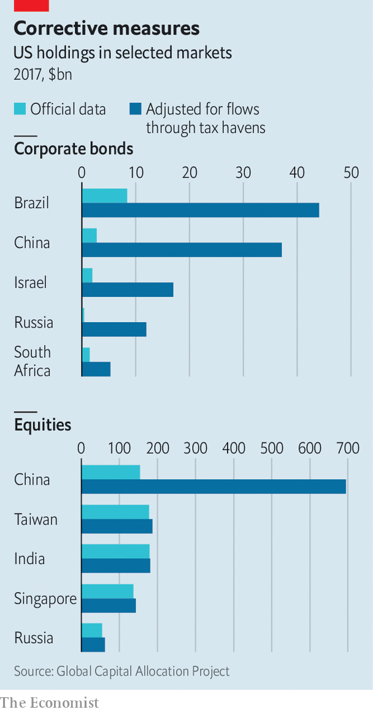

## Following the money

# Cash sloshes around the world in unexpected ways

> Economists are getting better at tracing cross-border capital flows

> Feb 20th 2020

MONEY MAKES the world go round. But where in the world is it going? In theory the answer lies in statistics published by the likes of America’s Treasury Department and the International Monetary Fund (IMF), which track cross-border flows of debt and equity investments. In practice creative corporate accounting mucks up the official figures. A growing body of research is trying to clean up the mess.

Accounting for corporate behaviour would be simple, if it could be organised neatly according to national boundaries. Petrobras, a Brazilian oil giant, would sell its bonds directly to American or European investors. In reality many companies raise funds through foreign subsidiaries set up for the purpose. Petrobras raises debt through its subsidiary Petrobras Global Finance BV, based in the Netherlands.

Such financial contortions cloud economists’ view of global investments. When a subsidiary transfers the cash from the loan to its parent, this can show up (misleadingly) as foreign direct investment (FDI). A recent study by Jannick Damgaard of the Danish central bank, Thomas Elkjaer of the IMF and Niels Johannesen of the University of Copenhagen estimated that as much as 40% of measured FDI flows were in fact “phantom” flows through shell companies.

Another recent study by Antonio Coppola of Harvard University, Matteo Maggiori of Stanford University, Brent Neiman of the University of Chicago and Jesse Schreger of Columbia University also tries to estimate just how much these financial gymnastics are distorting the official figures. Their motivation is the dramatic rise in the share of cross-border investments flowing through tax havens between 2007 and 2017, from around 40% to 55% for debt and from 10% to 50% for equity capital.

The authors stitch together seven data sets, including information on investor portfolios and the relationships between parent companies and their subsidiaries. Both debt and equity investments funnelled through tax havens are reallocated to the location of the parent company. What the official figures count as an American loan to Petrobras Global Finance BV in the Netherlands, the researchers reclassify as a loan to Petrobras in Brazil.

This amounts to a large adjustment to the official data. Around 12% of what looks like American investors’ holdings of foreign bonds turns out to be their holdings of domestic ones, mostly in the form of bundled corporate loans. American holdings of corporate bonds in emerging markets are revised up too: from $8bn to $44bn in the case of Brazil, and from $3bn to $37bn for China (see chart). As these bonds do not tend to be issued in the parent company’s currency, the adjustments bump up emerging markets’ exposure to foreign-currency debt, from 20% to 50% of Brazilian debt securities held by foreigners, and from 30% to 60% for Russian securities.

One of the most drastic revisions is to American holdings of equities in China, which official figures suggest were worth $160bn in 2017. That relatively low figure reflects the fact that the Chinese government restricts ownership in some key sectors. But it does not reflect Americans’ true financial stakes. In order to skirt the controls, Chinese companies set up “variable-interest entities”, which attempt to replicate the benefits of raising equity capital without falling foul of the rules. After the authors’ adjustments, Americans’ stake in Chinese equities rises to $700bn.

All this shows that rules often lead only to financial gymnastics. The findings also expose risks. Some large emerging markets are much more exposed to currency depreciations against the dollar than the official data suggest. If a crisis hits, governments will have to sort through the tangle of loans owed by domestic companies but held outside their jurisdiction. Mr Coppola and his co-authors call attention to American retail investors’ exposures to Chinese financial vehicles, which China’s government could rule as illegal (and worthless) on a whim. Economists may find incorporating these cross-border financial connections into their models hard. But without them, the picture is grossly misleading. ■

## URL

https://www.economist.com/finance-and-economics/2020/02/20/cash-sloshes-around-the-world-in-unexpected-ways
