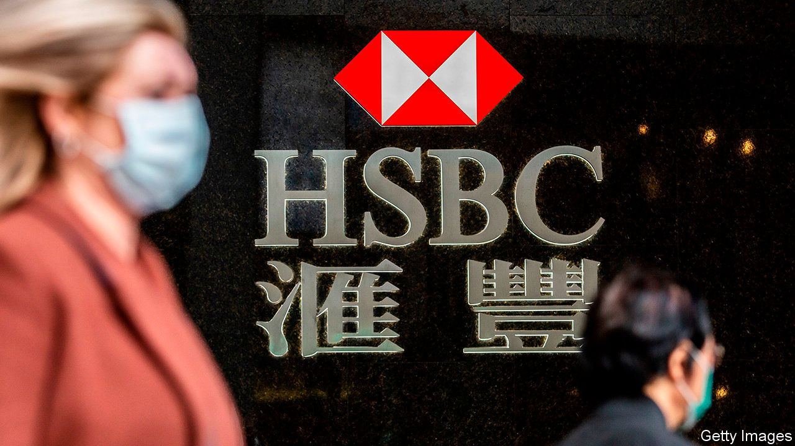

## The incredible shrinking bank

# HSBC undergoes yet another overhaul. It still may not be enough

> Europe’s largest bank has a new strategy—but no permanent boss

> Feb 20th 2020

LAST AUTUMN the board of HSBC asked Egon Zehnder, an executive-search firm, to find it a new chief executive. The bank had fired John Flint in August, after 18 months in the job, for being too shy about pursuing profits. HSBC then dodged the decision, appointing Noel Quinn, a no-nonsense insider, only on an interim basis. Mr Quinn soon made it clear he wanted the job permanently. He seemed a shoo-in.

Yet six months on his appointment is less certain. On February 18th HSBC, Europe’s largest bank by assets, unveiled results that fell short of already pale expectations. Hobbled by write-downs of $7.3bn (mainly at its global investment bank and European commercial bank), its profit slumped by a third in 2019, to $13.3bn. Its return on tangible equity (ROTE) slipped to 8.4%, down from 8.6% in 2018 (investors reckon 10% is par). And the chairman, Mark Tucker, said nothing about the top job.

Undaunted, Mr Quinn announced “one of the deepest restructuring and simplification programmes in our history”. The 155-year-old bank is to shed 35,000 of its 235,000 staff. It intends to cull risk-weighted assets by over $100bn, out of a total of $843bn, by 2022. Its investment bank, its European arm (where assets will shrink by 35%) and its American business (where it will shed 30% of branches) will bear the brunt of $4.5bn in annual cost cuts. It will thus become even more focused on Asia, where it already makes 90% of its profits.

Investors were unimpressed: the share price lost nearly 6% on the day. The overhaul is HSBC’s third since the global financial crisis of 2007-09. They had hoped that the bank would at last be able both to aim for higher returns and to hand out some of the bounty to its owners. Yet HSBC set its ROTE target for 2022 at 10-12%—in effect, no different from its previous objective of 11%. Worse, it said it would suspend share buy-backs for 2021 and 2022. Investors feel HSBC is “running to stand still”, says Tom Rayner of Numis Securities, a broker.

But even standing still may be difficult. Asia is feeling the chill of a global economic slowdown, and disruption caused by the coronavirus infection is likely to harm growth further. The bank estimates that the epidemic will cost it $200m-500m in the first quarter of 2020. Analysts expect more loans to sour in Hong Kong and mainland China. Elsewhere, commercial property is also starting to look iffy in post-Brexit Britain; negative interest rates are eating banks’ margins in Europe.

A bigger worry for investors is whether the bank can do as it promises. Joseph Dickerson of Jefferies, an investment bank, says the overhaul marks HSBC’s first real stab at trimming its bloated middle office. But controlling costs is becoming more difficult. For its previous round of scalpel-wielding, in 2015, which was aiming to generate about $5bn in annual cost cuts, HSBC booked $4.5bn in restructuring charges. The latest plan looks to generate similar savings, yet the bank this time expects to incur costs totalling $7.2bn.

Boosting sales while cutting expenses is not easy to pull off. Demoralised staff may be hesitant to launch new products. Scale matters in banking, and losing it will make it harder to gain an edge. The asset sales may compound the problem. Reinvesting $100bn in proceeds could take some time: HSBC’s Asian risk-weighted assets have barely budged since 2017. It also wants to grow its retail and wealth-management arms, but most investment banks, penalised by heftier capital requirements, are earlier at it. In the interim parking the cash in low-yielding, liquid alternatives, like money-market funds, may reduce income, notes Daniel Tabbush of Tabbush Report, a research firm.

The uncertain outlook makes HSBC’s dithering over its new chief executive all the more surprising. Mr Tucker has not yet entrusted Mr Quinn with the authority a boss needs to enforce a painful overhaul; yet recruiting an external candidate, after such a thorough restructuring has been announced, will be hard. Mr Tucker should make his choice, sharpish.■

## URL

https://www.economist.com/finance-and-economics/2020/02/20/hsbc-undergoes-yet-another-overhaul-it-still-may-not-be-enough
