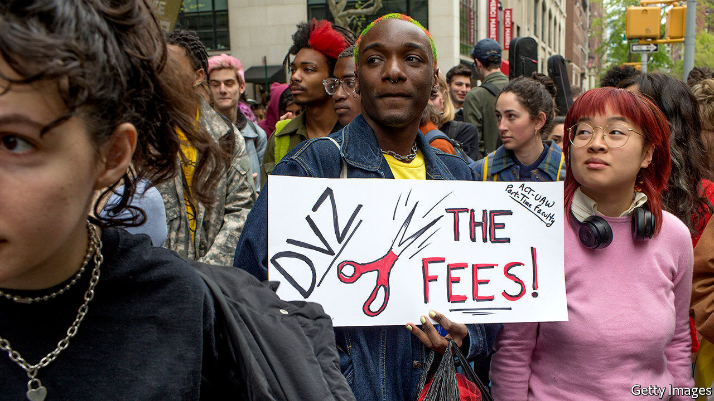
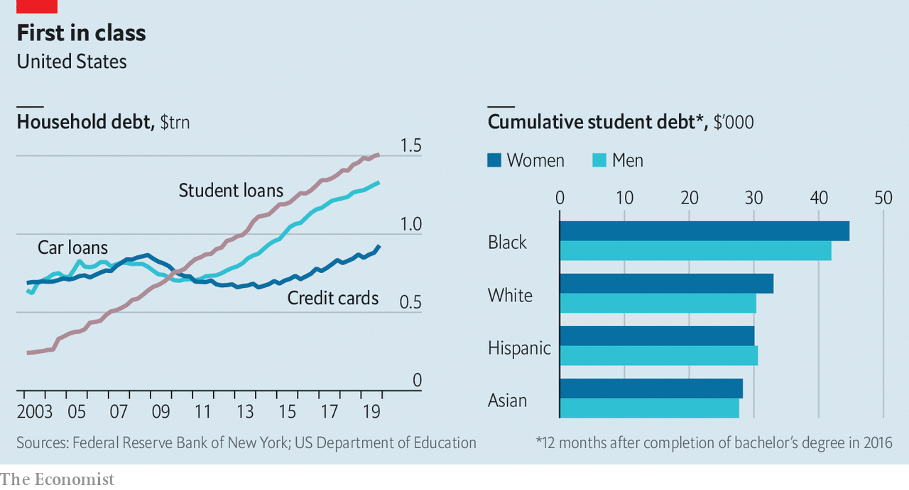

## Young, gifted and in the red

# Student debt in America amounts to over $1.5trn

> Mike Bloomberg is the latest politician to promise to tackle the problem

> Feb 22nd 2020

ON FEBRUARY 18TH Mike Bloomberg became the latest Democratic presidential candidate to promise to tackle student debt in America. The stock of loans amounts to over $1.5trn, around 7% of GDP. Fully 45m Americans owe an average of $37,000; a fifth are struggling to make repayments. Despite making up 56% of the student population, women owe two-thirds of total debt.■ 

## URL

https://www.economist.com/finance-and-economics/2020/02/22/student-debt-in-america-amounts-to-over-15trn
