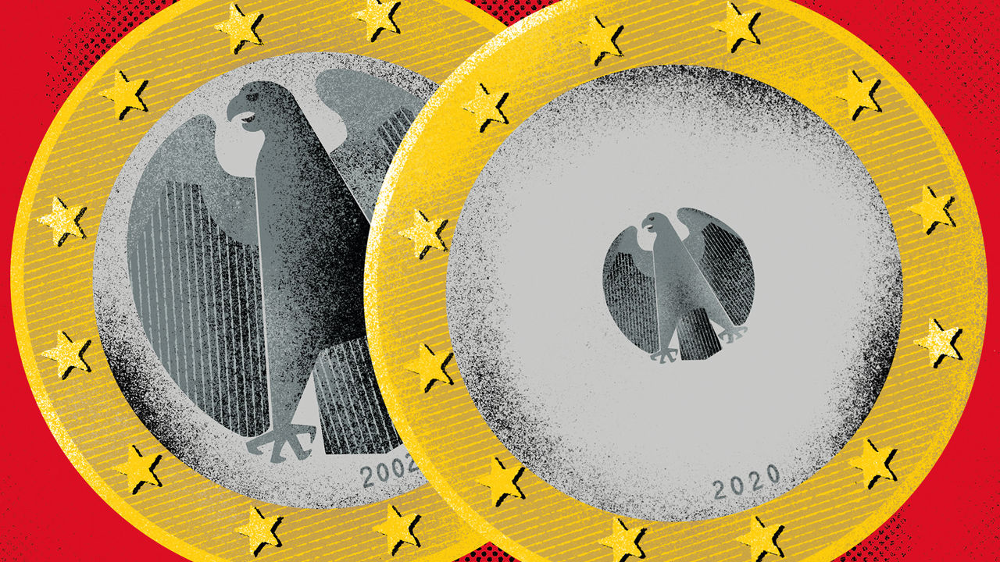
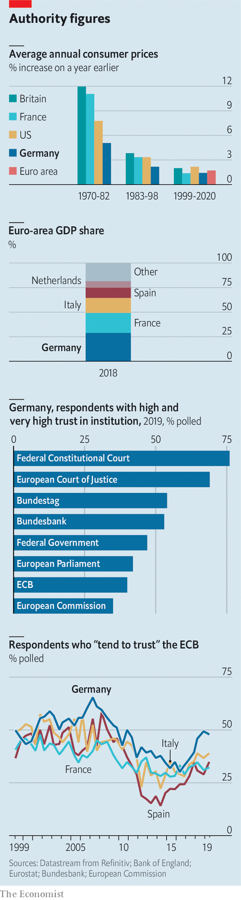

## Spheres of influence

# The Bundesbank is caught between a doveish ECB and a suspicious public

> Its influence over policy has waned, but it is still popular at home

> Feb 22nd 2020FRANKFURT

FRANKFURT IS BLESSED with not one but two central banks. In the north loom the brutalist headquarters of the Bundesbank—a raw-concrete structure that is three times wider than it is tall. Ascend to its higher floors and you get a splendid view of the city’s skyline to the south—including a gleaming glass tower completed in 2014. This is the European Central Bank (ECB), which in 1999 supplanted the Bundesbank as the monetary policymaker for Germany and much of Europe. Decisions made at the Bundesbank once sent tremors through the continent’s financial markets. Now, like the central banks in other euro member states, it has one seat out of 25 on the ECB’s governing council.

Though the ECB began life modelled on the Bundesbank, the past decade or so has seen fierce clashes between the two institutions over monetary policy. The hawkish Bundesbank sat on the sidelines as doves at the ECB, led by Mario Draghi, its boss in 2011-19, enacted extraordinary monetary stimulus. Now the Bundesbank is at an important moment. The euro-zone economy is floundering again and the German public is increasingly mistrustful of ECB policy, suggesting the risk of further fights over monetary loosening. But the arrival of a new boss, Christine Lagarde, at the ECB in November, and her year-long review of the ECB’s strategy, provides the Bundesbank with a chance to regain some influence over monetary policy.

The Bundesbank came into being in 1957 with a laser-like focus on monetary stability. Time and again it exercised its prized independence from politicians, provoking recessions in order to tame inflation. On its watch Germany had lower inflation than other rich countries, prompting many in Europe to peg their currencies to the Deutschmark. By the 1990s, many saw a common currency as a way to harness the bank’s credibility.

In order to sell the idea to the German public the ECB was located in Frankfurt. It also drew on German expertise. Otmar Issing, its first chief economist, and the architect of its strategy, was an old Bundesbank hand. Under him the ECB began life with a “reference value” for money-supply growth and a flinty view of inflation.

In some respects the Bundesbank still has heft at the ECB. It brings expert knowledge on the euro area’s largest member state to the ECB’s governing council. That is in part thanks to its 10,000 employees, nearly three times as many as the ECB (see [article](https://www.economist.com//finance-and-economics/2020/02/22/are-there-too-many-central-bankers)). Germany’s size, and Frankfurt’s status as the euro area’s biggest financial centre, also means that the Bundesbank plays an outsize role in the euro system. Together with its Italian counterpart it maintains the infrastructure for TARGET2, which settles high-value payments between national central banks. Germany’s TARGET2 system processes half of the volume of payments made in the euro area.

But when it comes to monetary-policy decisions, the Bundesbank has suffered a loss of influence. The ECB’s reference value for money supply has fallen by the wayside. A German has always occupied one of the six seats on the ECB’s executive board. But a Harvard-educated Irishman is now its chief economist; other top officials include a Belgian and an Italian.

Once admired for its willingness to act, in the past decade or so the Bundesbank has sought inaction. Mr Draghi derided its boss, Jens Weidmann, as saying “Nein zu allem” or “no to everything”. Various bond-buying programmes have gone ahead despite its objections.

In part the dissent stemmed from an old-fashioned view of inflation. The ECB’s price-stability target, of inflation “close to, but below 2%”, is asymmetric, reflecting the Bundesbank’s aversion to inflation. But the ECB has come to view its target as symmetrical. The Bundesbank has a higher tolerance for low inflation. It was nervous that loose monetary policy could cause inflation to snap back. But despite all the easing it has averaged 1% in the past five years.

Another reason for dissent was the Bundesbank’s views on the job of a central bank. It is part of the mainstream German economic tradition, which frets that making borrowing cheaper encourages laxity. The legitimacy of both Mr Draghi’s promise in 2012 to buy unlimited bonds of troubled sovereigns and the ECB’s quantitative-easing scheme has been questioned in German courts. (Mr Weidmann gave evidence against the former, though he now accepts a ruling by the European Court of Justice on its legality.)

As the euro zone’s economy has weakened, the Bundesbank has been determined that monetary policy not be seen as the only game in town, and that fiscal policy shoulders the burden of ginning up the economy. Mr Weidmann has urged Germany’s government not to “fetishise” its “black-zero”, or balanced-budget, rule. Doveish types, too, want governments to act. But they would argue that the ECB cannot afford to engage in a game of chicken with investors or governments, if the risk is a downturn or even a crisis.

Being part of a monetary union may have allowed the Bundesbank to become more dogmatic, knowing that the ECB will nevertheless act to avoid crisis. Despite its reputation for being uncompromising before the euro, it was in fact pragmatic from time to time, notes Adam Posen of the Peterson Institute for International Economics. It even briefly conducted asset purchases in the 1970s. Later on, Germany’s export-oriented growth model allowed its economy to outperform others in the euro zone during the sovereign-debt crisis of 2009-15. As Germany fared so well under the status quo, notes Mr Posen, the Bundesbank may have found it easy to oppose monetary loosening.

But its intransigence also stems from a desire to maintain public trust. A survey by the Bundesbank finds that it is held in higher esteem in Germany than the ECB and the federal government. Retaining that trust, though, is getting harder. The German press increasingly paints the ECB’s negative interest rates as an attack on the country’s savers. Mr Weidmann supported the latest round of interest-rate cuts in September, and has defended negative rates in interviews. But when he has dissented he has not been above using his press appearances to put pressure on the governing council. That may have given the public the impression that ECB policy hurts Germany.

Without change, further rows over policy loosening seem likely. But the relationship between the two institutions could well be at a turning point. Ms Lagarde is not an economist, and is therefore likely to be less of an influence on the details of policy than Mr Draghi. She also wants to be more consultative. That would give Mr Weidmann space to air his dissent within the ECB’s governing council rather than outside it. Her review of the ECB’s framework could clarify its inflation target and align views on when the bank should act.

And Germany’s appointment of Isabel Schnabel, a more consensus-minded economist than Mr Weidmann, to the ECB’s executive board might help the bank communicate directly with the public. In a speech on February 11th she tackled common misperceptions around negative interest rates.

A bigger shift at the Bundesbank could even come through adversity. Germany’s growth model is looking increasingly shaky, warns Mr Posen. In 2019 its economy fared better only than Italy’s in the euro zone; a repeat performance is expected in 2020. That would give the Bundesbank something to fight for. ■