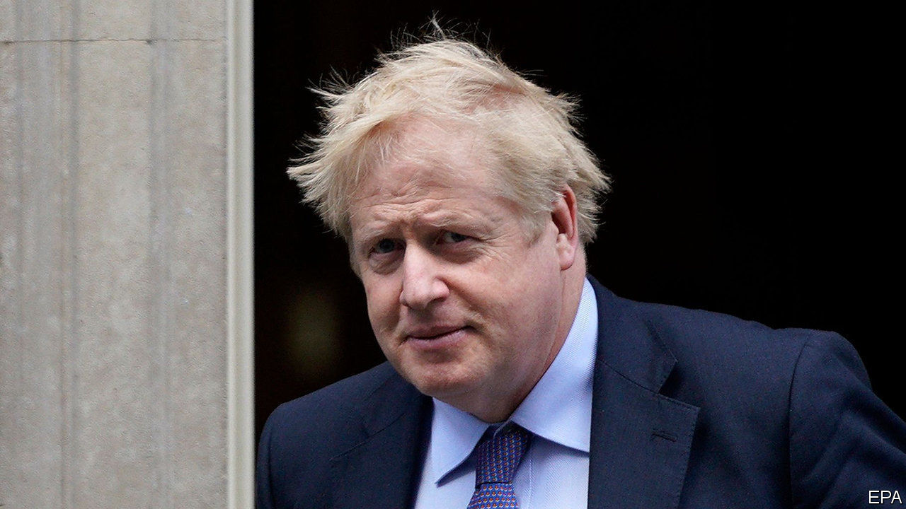

## British legal system

# Boris Johnson takes on the judges

> The government wants to restrict the power of the judiciary. It shouldn’t

> Feb 20th 2020

IN SEPTEMBER LAST year, when the Supreme Court overruled a government attempt to suspend Parliament during the Brexit negotiations, Boris Johnson called the decision “unusual”, but a source from Number 10 was franker: the court had made “a serious mistake in extending its reach into these political matters”. Payback, it seems, is coming. Mr Johnson has appointed a new attorney-general, Suella Braverman, who has made clear her enthusiasm for curbing the judiciary’s power (see [article](https://www.economist.com//britain/2020/02/20/why-pruning-the-british-judiciarys-powers-will-prove-tricky)).

That the power of judges has grown in the past few decades is not in doubt. This is the consequence of three factors: the public’s growing enthusiasm for taking the government to court through judicial review; the spread of law to corners of people’s lives into which it did not previously much intrude (such as family life and the environment); and the Blair government’s espousal of constitutional reform.

Among Britain’s messy constitutional arrangements, the rules governing the judiciary’s role were particularly anomalous. The top judges, for instance, sat in the House of Lords, the legislature’s second chamber. Tony Blair’s new dispensation took the judges out of the Lords and housed them in a new Supreme Court over the road, removed the power of appointing judges from the government and gave it to an independent Judicial Appointments Commission, and extended the judges’ powers through the Human Rights Act (HRA).

This government takes the view that the balance of power has tipped too far from politicians and towards an unelected caste of lawyers whose views are out of kilter with voters’. The argument is not driven purely by the judges’ willingness to put Mr Johnson’s nose out of joint. There is a genuine worry among its proponents about a popular backlash against Britain’s system of government, of which Brexit is Exhibit A. Judicial decisions—over the rights of foreign criminals to avoid deportation, for instance, or British forces’ treatment of enemy fighters in the wars in Afghanistan and Iraq, or Muslim clerics preaching hatred of Britain—that are out of line with public opinion are said to be stoking popular anger. In an article on the Conservative Home website published last month, which was widely interpreted as a job application, Ms Braverman criticised the judiciary for “trespass[ing] into inherently political terrain for which a legal answer is wholly insufficient”.

The best way, goes this argument, of discouraging newspapers from labelling judges “enemies of the people”—as the Daily Mail did when the High Court decided that Parliament should have oversight of a decision about Brexit—is to reassert a degree of political control over judges. Three main proposals are under discussion: a review of judicial review; putting the judges back in the House of Lords; and reintroducing some sort of political control over judicial appointments.

Sinister headlines aside (though they are not entirely beside the point, since the author of the Mail’s is now Mr Johnson’s official spokesman), claims of a backlash against the judiciary are ill-founded. A recent survey found that, whereas 81% of Britons trust judges, just 14% trust politicians. Nor is judicial overreach to blame for most of the decisions that are said to outrage the public. The extension of the purview of law into previously personal areas of life and the rise of judicial review are the result of new legislation, and are thus the politicians’ fault.

If the government thinks that the state intrudes too far into people’s lives, then it could legislate to that effect, thereby also curtailing judicial review. And if it reckons the HRA does not have public support, then, although this newspaper would regret it, it could repeal the act.

For the executive to curb the judiciary directly would neither achieve those ends nor serve the British people. An independent judiciary is an essential check on the tendency of majorities to mistreat minorities and of executives towards authoritarianism. Enthusiasm for undermining that independence, as in Poland and Hungary, is a good indicator of a government’s authoritarian instincts. The Supreme Court should remain physically separate from the House of Lords, for that is an expression of its independence. Judicial appointments should also be kept safely beyond the reach of politicians. Where that is not so, partisan rows over appointments undermine faith in the courts. The former attorney-general, Geoffrey Cox, said that the government did not intend to go down the American route; it is to be hoped that Ms Braverman takes a similar view.

Post-Brexit, the government is in a radical mood. That is a good thing. It should be open to ideas about how Britain might do things better. Limiting the power and independence of judges is not among them.■