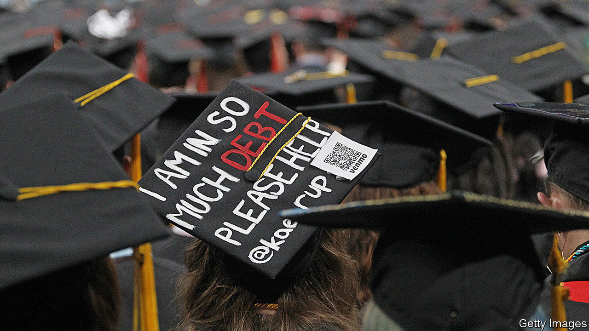
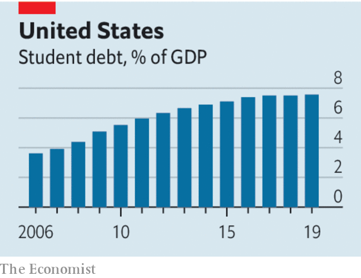

## Getting the maths right

# How the next president should fix America’s student-loan problem

> The Bloomberg and Biden plans are the best on offer

> Feb 20th 2020

AMERICA’S TOTAL student debt, at over $1.5trn, is larger than the national borrowing of most countries. It has quintupled in size since 2004, overtaking both borrowing on credit cards and car finance. This growth is often presented as evidence of a crisis. But the rise in total debt, though arresting, is not the real problem. It largely reflects increased borrowing by graduate students, such as budding lawyers, who will go on to be high earners. And 92% of student debt is owed to the federal government, meaning defaults pose no risk to the financial system (see [article](https://www.economist.com//finance-and-economics/2020/02/22/student-debt-in-america-amounts-to-over-15trn)). The real problem is that 11m Americans, many poor and non-white, and many duped into studying for worthless degrees, struggle to repay even modest debts.

Some Democratic candidates for president seem not to know this. Bernie Sanders, the front-runner, wants to cancel all student debt—a handout that would indeed provide relief to those who are struggling, but would also offer an enormous windfall to the well-off. Elizabeth Warren would cancel all debt up to $50,000, a policy that is similarly indiscriminate. Thankfully Joe Biden and Mike Bloomberg, who announced his student-debt policy on February 18th, have plans that are better suited to the problem.

Messrs Biden and Bloomberg want to put all existing and new borrowers for undergraduate degrees into an income-linked repayment scheme, under which borrowers must repay only a fraction of their annual earnings above a certain threshold. The Economist has long argued in favour of such a repayment mechanism, which works well in Britain. Linking repayments to income makes it impossible to be impoverished by student debt, and frees graduates to take risks early in their careers.

America already has income-linked repayment schemes for distressed borrowers, but they are flawed. The earnings thresholds at which repayments begin are too low: typically around $18,000, compared with £26,000 ($34,000) in Britain. The interest rates, which are typically around 6%, are unjustifiably high for borrowing from the government. And the schemes are an administrative nightmare. Students must choose from one of four options and fill out new paperwork every year to avoid penalties. Any outstanding debt is forgiven after 20 or 25 years, but debt-forgiveness is taxable, putting struggling debtors at the mercy of the Internal Revenue Service.

By enrolling everyone automatically, Mr Biden’s and Mr Bloomberg’s plans would greatly improve the status quo. Both would cut repayments from 10% of income above the threshold to 5%, less even than in the British system. Mr Biden would raise the repayment threshold to $25,000 and make all debt forgiveness tax-free. Mr Bloomberg would forgive debt that was incurred at failed or predatory for-profit universities and exempt debt forgiveness up to $57,000 from tax. Both candidates should also consider cutting the high rate of interest.

Making student loans less onerous for borrowers is only half of the remedy, however. Congress should also clamp down on low-quality, for-profit colleges. These institutions depend almost entirely on federal student loans for their revenues, charge the highest possible prices and market themselves aggressively. When students graduate and cannot repay their debts, the taxpayer foots the bill. Barack Obama’s White House tried to rein these colleges in, but Donald Trump’s has loosened the rules. All the Democratic candidates recognise this problem. Republicans are supposed to be suspicious of feeding frenzies at the government trough, but they are in denial.

A reform agenda might also include the federal government’s lending to graduate students. Unlike that to undergraduates, this is unlimited. Though not a large source of debt distress, it may be fuelling a pointless and costly arms race among the affluent. Governments have a part in helping finance higher education, but well-meaning policy can often go badly wrong.■

## URL

https://www.economist.com/leaders/2020/02/20/how-the-next-president-should-fix-americas-student-loan-problem
