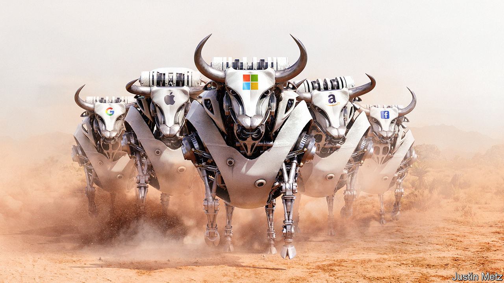

## Big tech

# How to make sense of the latest tech surge

> The big tech firms’ shares have been on a tear

> Feb 20th 2020

IN 2018 A new word entered Silicon Valley’s lexicon: the “techlash”, or the risk of a consumer and regulatory revolt against big tech. Today that threat seems empty. Even as regulators discuss new rules and activists fret about the right to privacy, the shares of the five biggest American tech firms have been on a jaw-dropping bull run over the past 12 months, rising by 52%. The increase in the firms’ combined value, of almost $2trn, is hard to get your head round: it is roughly equivalent to Germany’s entire stockmarket. Four of the five—Alphabet, Amazon, Apple and Microsoft—are each now worth over $1trn. (Facebook is worth a mere $620bn.) For all the talk of a techlash, fund managers in Boston, London and Singapore have shrugged and moved on. Their calculus is that nothing can stop these firms, which are destined to earn untold riches.

This surge in tech giants’ share prices raises two worries. One is whether investors have stoked a speculative bubble. The five firms, worth $5.6trn, make up almost a fifth of the value of the S&P 500 index of American shares. The last time the market was so concentrated was 20 years ago, before a crash that triggered a widespread downturn. The other, opposite concern is that investors may be right. The big tech firms’ supersized valuations suggest their profits will double or so in the next decade, causing far greater economic tremors in rich countries and an alarming concentration of economic and political power.

The question of a bubble is a reasonable one. Tech cycles are an integral part of the modern economy. The 1980s saw a semiconductor boom. Then, in the 1990s, came PCs and the internet. Each cycle fades or ends in a bust.

Today’s upswing got going in 2007 with the launch of the iPhone. By 2018 it, too, seemed to be showing its age. Sales of smartphones were stagnating. Data scandals at Facebook crystallised anger about the tech giants’ flippant approach to privacy. Global antitrust regulators were on the alert. And the loss-making antics of flaky tech “unicorns”, such as Uber and WeWork, evoked the kind of speculative froth often seen at the tail end of a long boom.

In fact, at least for the biggest tech giants, today’s valuations are built on more solid foundations. Together, the five biggest firms have cranked out $178bn of cashflow after investment in the past 12 months (see [Buttonwood](https://www.economist.com//finance-and-economics/2020/02/20/the-appeal-and-the-flaws-of-cash-based-accounting)). Their size has yet to slow their expansion: their median sales growth, of 17% in the latest quarter, is still as impressive as it was five years ago.

Consumers say they care about privacy but act as if they care much more about getting stuff, and preferably without having to pay for it in cash. Since the end of 2018 the number of people using Facebook’s services (including Instagram, Messenger and WhatsApp) has risen by 11%, to 2.3bn. Regulators have punished tech firms for tax, privacy and competition misconduct, but so far their efforts have been like bringing a pea-shooter to a gun fight: the fines and penalties they have imposed amount to less than 1% of the big five’s market value, a tolerable cost of doing business. And the agonies of some of the unicorns, and their biggest backer, SoftBank, have only demonstrated how hard it is to replicate the scale and network effects of the big five.

Meanwhile, the size of the opportunity is vast. As our special report in this issue explains, many parts of the economy have yet to digitise. In the West only a tenth of retail sales are online, and perhaps a fifth of computing workloads sit in the cloud with the likes of Amazon and Microsoft. Big tech operates globally, giving it more space to expand, especially in emerging economies where spending on digital technology is still relatively low.

The trouble is that if you think that tech firms will get much bigger and diversify into more industries, from health care to agriculture, it is logical to assume that the backlash against them will not fade away but, eventually, get bigger.

As big tech’s scope expands, more non-tech firms will find their profits dented and more workers will see their livelihoods disrupted, creating angry constituencies. One crude measure of scale is to look at global profits relative to American GDP. By this yardstick, Apple, which is expanding into services, is already roughly as big as Standard Oil and US Steel were in 1910, at the height of their powers. Alphabet, Amazon and Microsoft are set to reach the threshold within the next ten years.

When recession strikes it will fuel new resentments. Big tech could face a storm that few have yet paid much attention to (see [article](https://www.economist.com//business/2020/02/20/business-and-the-next-recession)). The big five firms employ 1.2m people and are now by far the biggest investors in corporate America, spending almost $200bn a year. Their decisions about whether to squeeze suppliers, slash investment or attack weaker rivals will prove as controversial as those of carmakers when Detroit still ruled in the 1970s, or even of Wall Street in 2007-08. Big tech’s role in politics is already toxic; social media and videos influence elections from Minnesota to Myanmar.

All this means that, far from having peaked, anger may be in the foothills. Executives hope that slick lobbying will protect them. But even today, the picture outside America is not of inaction but a tumult of regulatory experiments. China keeps its internet giants under tacit state control and wants to rely less on Silicon Valley, including Apple, which is already dealing with the covid-19 virus and other headwinds there. At least 27 countries have or are considering digital taxes. India has cracked down on e-commerce and online speech. The European Union (EU) wants individuals to own and control their own data, an approach this newspaper favours, although it may take years of innovation to create a system that is easy for consumers to use and profit from. This week the EU proposed curbs on artificial intelligence. Even in America, trustbusters may limit big tech’s ability to gobble up startups, a strategy which has been instrumental to the success of Alphabet and Facebook in particular.

The $5.6trn market value of tech’s formidable five is a testament to some of the most commercially successful companies ever created. But it also assumes that they will get a lot bigger even as the world stands by and watches placidly. Until today, big tech has been largely unscathed. The bigger it becomes, the more reason there is to doubt this can continue.■

## URL

https://www.economist.com/leaders/2020/02/20/how-to-make-sense-of-the-latest-tech-surge
