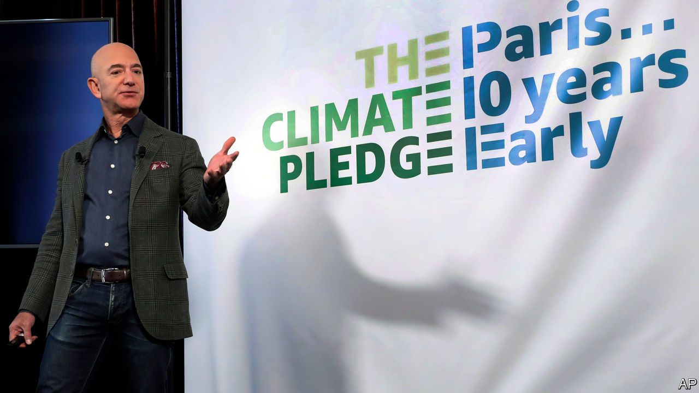
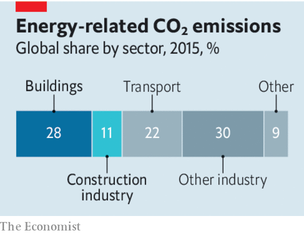

## Moonshots, from literal to metaphorical

# Jeff Bezos wants to help save the climate. Here is how he should do it

> Make no small plans

> Feb 22nd 2020

JEFF BEZOS, the boss of Amazon and the world’s richest man, has long had a reputation as a peculiarly frugal plutocrat. A quarter of a century after Amazon was founded, the firm, now worth over a trillion dollars, still does not pay dividends to its shareholders. Lately, though, his personal purse-strings have loosened. Earlier this month Mr Bezos paid $165m for a mansion in Beverly Hills. On February 18th he announced that he would be spending $10bn (around 8% of his fortune) setting up the Bezos Earth Fund. Climate change, he said, was the biggest threat facing humanity, and the fund’s resources would be available to any effort that offered a “real possibility to help preserve and protect the natural world”.

Mr Bezos has long been gripped by an environmentalist dream—albeit an unusual one. In the 1970s Gerard O’Neill, a Princeton physicist, advocated moving industry into orbit so that Earth’s environment could be repaired and preserved. Mr Bezos subscribes to this vision. He has invested billions of dollars in a rocketry firm, Blue Origin, devoted to the industrialisation of space. Now he is turning to the preservation of the Earth.

In the context of climate change, $10bn is both a lot and a little. The Earth Fund will have to hand out at least $500m a year to avoid tax penalties, and Mr Bezos could add to the pot. The next-biggest climate donor, the Hewlett Foundation, disburses around $120m a year in the area. But the scale of the problem dwarfs even Mr Bezos’s vast resources. The cost of meeting the Paris agreement, which aims to prevent the planet warming by more than 2°C, compared with pre-industrial levels, has been estimated at 2.5% of the world’s $86trn GDP every year.

As a technically minded space cadet, though, Mr Bezos surely knows his Archimedes. Moving the Earth is not a matter of brute force, but of finding the right lever. There are, broadly, two types of leverage open to him. One is political: turn the tide of opinion and politics in America, thereby adding a superpower’s force to his efforts. The other is technological; take things that the market is ignoring and build them up to the point where, in the right political environment, they can make money for other people. Then watch those other people do just that.

The political route is risky. Existing philanthropies have spent a great deal of money trying to shift the debate in America, to little avail. It is also, potentially, over-subscribed. Mike Bloomberg—another climate-conscious billionaire—is spending vast sums to try to oust Donald Trump from the White House.

In technology, progress will come from putting large amounts in well-chosen areas outside the mainstream. There is little point in ploughing money into solar and wind power, or electric vehicles. Better to focus on taking the risk out of things which the world needs but markets will not yet invest in. Building full-scale pilot plants for emissions-free steel-smelting and concrete-making would be helpful. So, too, would creating farms that maximise both crop yields and carbon storage, becoming sinks for greenhouse gases instead of sources.

A smaller chunk of the fund could be reserved for technologies much further from acceptance. One such is solar geoengineering—cooling the Earth by reflecting away some incoming sunlight. In most discussion of climate action this approach, widely seen as unpalatable and dangerous, is sidelined. Although by no means a silver bullet, or even necessarily a desirable strategy, assessing how it might be undertaken in a responsible way deserves more attention. Funding is feeble at present—perhaps $20m a year worldwide. Mr Bezos could double that at the stroke of a pen.

His goal of creating a new civilisation in the heavens to save Earth remains far-fetched and, to many, unattractive. But he does not need to achieve that to speed up the fight against climate change. He just needs to spend copiously, but wisely. And that is how he got rich in the first place.■

## URL

https://www.economist.com/leaders/2020/02/22/jeff-bezos-wants-to-help-save-the-climate-here-is-how-he-should-do-it
