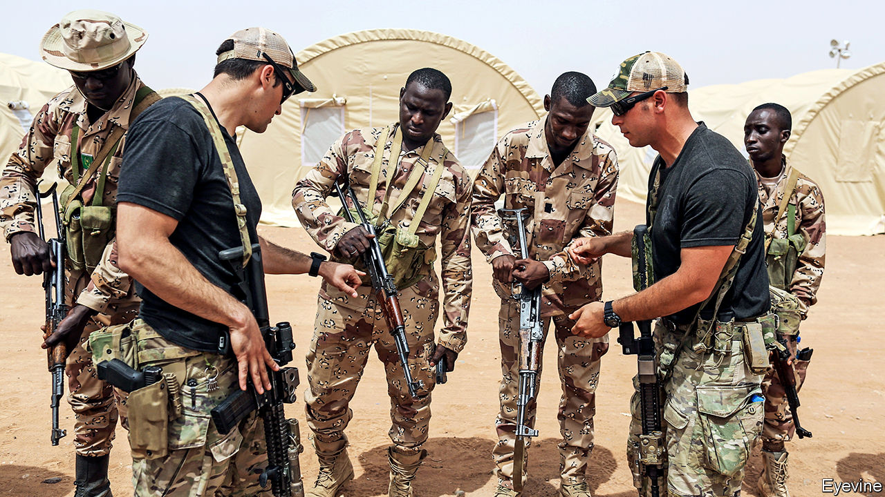

## A strategy on autopilot

# How America deals with Africa, despite Donald Trump

> The president is not interested. American diplomats must do their best

> Feb 20th 2020WASHINGTON, DC

THESE DAYS it is notable when both Republicans and Democrats oppose a foreign policy of Donald Trump’s in strident unison. When it was reported that Mark Esper, the secretary of defence, was set to remove American forces from the Sahel, where jihadists have been wreaking havoc across a vast swathe of Africa, members of Congress reacted angrily together, arguing vigorously against such a course.

A few weeks later Mike Pompeo, the secretary of state, sounding ambivalent on the matter, set off on the first tour of sub-Saharan Africa by any member of Mr Trump’s cabinet for a year and a half. The carefully chosen countries were Senegal, Angola and Ethiopia. Mr Pompeo made friendly noises in all three. The Senegalese urged America not to withdraw from the Sahel. In oil-rich Angola Mr Pompeo encouraged trading with America rather than China and warned against corruption. In Ethiopia he praised the Nobel-prize-winning prime minister for making peace and privatising bits of the economy.

But few Africa hands reckon the recent visit will mark a change of policy in the White House. Donald Trump has made no bones about his lack of interest in Africa. The continent is full of what he has described as “shit-hole countries”, one of them apparently called “Nambia”. Mr Trump took a year and a half to appoint an assistant secretary of state for African affairs and even longer to find an ambassador to South Africa, one of the top diplomatic posts south of the Sahara. That appointee is known mockingly, even among Republicans, as “the handbag lady”, since her expertise is in fashion, not diplomacy (she has a country-club friendship with Mr Trump). In three years he has received only two of his African counterparts in the White House (Nigeria’s Muhammadu Buhari and Kenya’s Uhuru Kenyatta). Recently he has sharply restricted immigration from Nigeria and started talks about a free-trade deal with Kenya. Little wonder that no one seems to know what American policy towards Africa actually is.

The last time one took shape was two years into the presidential term, when John Bolton, then the national security adviser, spelt out a strategy. Its main shift from Barack Obama’s was to stress a virulently hostile attitude to China in Africa and a scarcely less bellicose one to Russia. “China uses bribes, opaque agreements, and the strategic use of debt to hold states in Africa captive to Beijing’s wishes and demands,” he said, deploring China’s “ultimate goal of advancing Chinese global dominance”. He also articulated a more transactional approach to Africa, in keeping with Mr Trump’s worldview. “All US aid on the continent will advance US interests,” he stated baldly. Democracy and human rights were barely mentioned.

Since Mr Bolton’s abrupt removal from office last year, this policy—in the absence of any other grand statements—is presumed to persist. But no one is sure. Mr Pompeo was careful, on his tour, not to express any change of heart within the administration. The only senior appointee who has made waves in Africa is Mark Green, the head of the US Agency for International Development (USAID), who has won plaudits across the political spectrum. “He’s a star,” says a senior Democrat involved in Africa.

The assistant secretary for Africa, Tibor Nagy, a 70-year-old career diplomat brought back from academia, has had to get on with promoting American interests as he sees best, so long as he does not clash with the perceived views of Mr Trump or Mr Pompeo. (It was apt that Rex Tillerson, Mr Pompeo’s predecessor, was sacked while in Kenya, on his only tour of Africa.)

In the past year the cautious but canny Mr Nagy has made some moves. Ahead of the more sceptical west Europeans, he has embraced Félix Tshisekedi as the Democratic Republic of Congo’s president, despite the blatantly rigged election that brought him to power. America’s desire to stop Congo falling into China’s lap trumped any worries about democracy.

By contrast Mr Nagy went out of his way to condemn President Paul Biya for his harsh treatment of Anglophones in Cameroon, suspending it from the African Growth and Opportunity Act, which gives certain African countries easier access to US markets. That was more of a finger-wag than a slap; Cameroon’s trade with America is tiny.

More recently he has entered the Sudanese imbroglio, hosting the new government’s promising prime minister, Abdalla Hamdok, in Washington, dangling the prospect of Sudan’s removal from America’s list of countries that sponsor terrorism. America has also sought to mediate tensions over Ethiopia’s Grand Renaissance Dam, which enrages Egypt and worries Sudan since it will alter the downstream flow of the Nile.

But it is Mr Esper’s threat to withdraw American troops from the Sahel that has put a new spotlight on American policy in Africa—or lack of it. In fact, America’s footprint in the Sahel (chiefly in Chad, Mali and Niger) has been light, concerned mainly with intelligence, logistics and drones, alongside small units of special forces. Several hundred American special-operations forces have already been withdrawn from the area. About 500 are still fighting jihadists in Somalia.

Mr Trump’s lack of interest in Africa may unwittingly have given professional Africanists more scope, argues Jeffrey Smith of Vanguard Africa, a pro-democracy outfit in Washington. The congressional subcommittee for Africa, which has remained firmly bipartisan, has refused for instance to accept the swingeing cuts in spending on State Department or UN programmes for Africa that the White House has demanded. Some of America’s ambassadors on the ground—for instance, in Zimbabwe, Zambia and Uganda—have proved their mettle, robustly criticising their host governments for violations of democracy or human rights. “Ambassadors are doing largely what they were doing before, but less comfortably, because they are not sure of getting backup if they need it,” says a veteran Africanist.

“You always need [political] air cover” if you are to make a difference, says Chester Crocker, the longest-serving assistant secretary for Africa (1981-89). So far Mr Nagy’s quiet diplomacy has kept the White House off his back. But Washington’s Africa lobby is glum. “The Africa Bureau has been eviscerated, morale is low, senior officers have walked away,” laments Johnnie Carson, Mr Obama’s first assistant secretary for Africa. “When [the administration] isn’t paying attention, things roll backwards.” There is no sense that Africa matters to America, except as a place where China and Russia must be confronted.

But how? Americans point to the enduring success of aid schemes such as George W. Bush’s big spending on AIDS treatment and prevention. Mr Trump’s Prosper Africa initiative, intended to provide $60bn to encourage private investment, has yet to make strides. American complaints about China only irritate African governments that accept Chinese largesse and retort that America seems unwilling or unable to offer viable alternatives. Mr Pompeo’s tour is unlikely to herald a change of mood or policy. Africans will continue to bemoan the American president’s indifference. ■

## URL

https://www.economist.com/middle-east-and-africa/2020/02/20/how-america-deals-with-africa-despite-donald-trump
