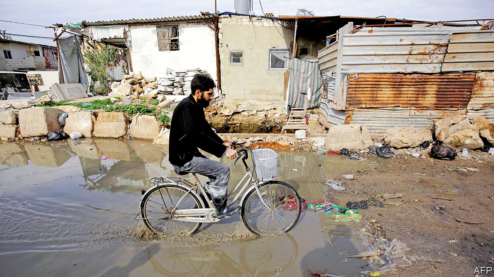

## A bit too austere

# Lessons for Lebanon from its struggling neighbours

> Why Arab states that have gone to the IMF for help remain in crisis

> Feb 20th 2020BEIRUT

IT IS PROBABLY the first time in years that Lebanon has wanted to turn down a loan. With the economy in free fall the country’s new government, seated in January after months of horse-trading, has reluctantly turned to the IMF for help. They held a first round of talks on February 20th. For now Lebanon seeks only technical advice on managing a public debt that exceeds 150% of GDP. Politicians are keen to resist money from the fund, because it would come with strings attached. But it may be necessary. Economists fret that Lebanon could run out of hard currency by the end of the year, leaving it unable to pay for needed imports.

Before they negotiate an agreement, though, Lebanon’s leaders might look at their neighbours. Economic crisis has been the norm in several Arab states for the past decade. Three of them took loans from the IMF. Egypt signed a $12bn deal in 2016 and is discussing a follow-on programme, though probably a non-financial one. Jordan and Tunisia each received two loans. (Morocco was given several precautionary lines of credit but did not tap them.) Put another way, of the Arab states without significant oil and gas revenue, more than half have needed IMF support since 2010.

They have won praise for enacting difficult fiscal and monetary reforms. To meet the requirements of its loan Egypt floated its currency, which quickly lost half its value; imposed a 13% value-added tax (later raised to 14%); and cut fuel subsidies. Jordan reduced its fuel subsidies in 2012 to qualify for an IMF loan, causing some prices to soar by 50% overnight. Tunisia has raised taxes and allowed the dinar to depreciate. These changes, many of them overdue, helped to tame deficits.

Yet none of these countries looks to be emerging from crisis. Poverty is increasing. Unemployment remains high. Reforms were meant to unlock a flood of new investment, but it has yet to materialise. In 2011, as Arabs rose up in disgust against their leaders, Masood Ahmed, then-director of the IMF’s Middle East programme, acknowledged the need for more “inclusive growth” in the region. But the recipients of IMF loans have continued to focus on cuts rather than structural reforms.

In the short term the pain is predictable. Higher taxes and lower subsidies leave consumers with less purchasing power. A long-suppressed government report, finally released in July, found that Egypt’s poverty rate has climbed five percentage points since 2015, to 33%. Though it has enrolled more than 9m people in two new cash-transfer schemes, these cover less than one-third of poor Egyptians. Jordan stopped publishing its poverty rate in 2010. It is thought to have climbed six points since then, to 20%. The World Bank estimates that 15% of Tunisians live below the national poverty line.

No surprise, then, that businesses are struggling. The January purchasing managers’ index, a measure of economic activity, showed Egypt’s non-oil private sector contracting at its quickest rate in almost three years. The index has shown expansion in only six of the past 54 months. Firms blame weak sales. Rapid subsidy cuts can also make it prohibitive to run a business. After years of austerity, Jordan’s government abruptly changed tack in December and announced a stimulus package. It lowered electricity tariffs for industry and trimmed the tax on small firms.

When Egypt signed its deal with the IMF, the fund projected that foreign direct investment (FDI) would exceed $9bn a year by June 2017. Inflows have actually fallen since then, to $6.8bn in 2018, a 16% drop from two years before. Jordan drew a paltry $950m in FDI in 2018. Both countries are attracting less investor interest now than they did a decade ago.

Austerity measures are painful, but easy to implement. It is far harder to fix broken bureaucracies or unpredictable legal systems. There are a few positive signs, from new bankruptcy laws to simpler regulations. But many Arab states remain difficult places to do business. The World Bank ranks Egypt 171st for the ease of trading across borders: getting a shipment out of the country requires 136 hours of work, compared with 32 in Morocco, which has built a viable car industry. Starting a business in Egypt or Jordan needs more than two weeks and visits to six government offices. Entrepreneurs in the United Arab Emirates can get started in four days.

Decades of under-investment mean that workers struggle to compete. The World Economic Forum (WEF) ranks Tunisia 96th of 141 economies for the quality of its workforce. Egypt comes in 99th. With budgets tight, governments are doing little to fix the problem. Egypt’s constitution requires the state to spend at least 4% of GDP on education. It usually ignores that proviso. Per-person education spending is lower now than it was in 2011.

Arab governments hobble one another, too. Countries in the region export just 16% of their goods to each other, compared with 52% among Asian states and 63% in the European Union. A recent report by the WEF and Majid al-Futtaim, a Dubai-based retail giant, wagered that cutting tariffs and other trade barriers would unlock $130bn in new business for firms. “There are huge opportunities for growth in the region, but it requires a proper integration,” says Alain Bejjani, the firm’s CEO.

If Lebanon strikes its own IMF deal, there is plenty of fat to trim. The state wastes billions on electricity subsidies and make-work jobs. A currency peg, in effect since the 1990s, is costly and makes exports artificially expensive. But austerity will hit hard in a country where one-third of the population is poor. And it will not fix the underlying problems that impoverished Lebanon in the first place. ■