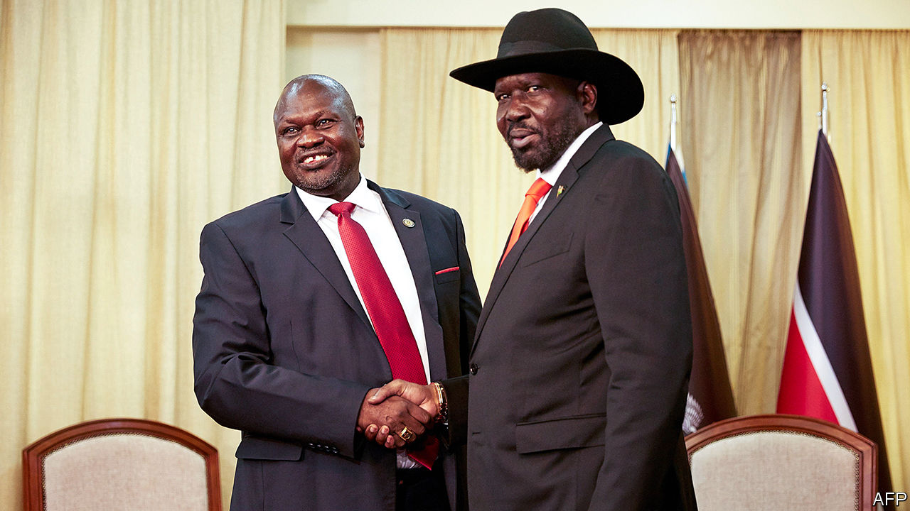

## A fraught path to peace

# South Sudan inches towards a unity government

> After 12 deals that did not bring peace, will the latest prove lucky?

> Feb 20th 2020ADDIS ABABA

ONCE FETED as liberation heroes, South Sudan’s ageing leaders are now better known for fighting each other and failing to make up. The country won independence from Sudan in 2011, after a referendum, and plunged into civil war two years later. Since then, President Salva Kiir and his former deputy turned nemesis, Riek Machar, have struck no fewer than 12 agreements, none of which brought lasting peace. On February 22nd the two sides are supposed to form an interim government of national unity—nine months and two missed deadlines behind schedule. Many observers worry it will be Groundhog Day for South Sudan. But as the deadline approaches there are tentative signs that this time it might not.

Mr Kiir and Mr Machar (pictured on next page; Mr Kiir in a hat) both belonged to the Sudan People’s Liberation Movement, the political arm of the rebel army that fought for independence. Rivalries between the two men and their respective tribes—Dinkas and Nuers—have roiled the country for years. A peace deal signed in 2015 saw the return of Mr Machar to the capital, Juba, to take up his post as vice-president in a coalition government. But in 2016 fighting erupted again and Mr Machar fled. It has led to hundreds of thousands of deaths and the flight of more than a third of the population.

Since September 2018, when the latest peace agreement was signed, violence has subsided. Rebel generals visit government-held towns, aid reaches most of the country and civilians can move about more or less unhindered. The hope is that this will allow Mr Machar to return to Juba again as vice-president. Rebels and government forces are to be integrated into a national army of 83,000 men and elections are to be held in three years.

Prospects brightened following diplomatic pressure from neighbouring countries and threats of more sanctions from America. On February 15th Mr Kiir announced that he had cut the number of states from 32 to ten. This is seen as a big concession. The opposition has long decried the Dinka-dominated government’s unilateral division of South Sudan into 28 states (later 32) as ethnic gerrymandering. “Everyone is hopeful now,” says Jale Richard of Eye Radio, a broadcaster in Juba. It also helps that some rebel groups that were not part of the current peace agreement signed a truce last month.

But it is too soon to celebrate. Mr Kiir has not simply restored South Sudan’s ten original states, as Mr Machar had demanded. Instead he wants to form ten states and three “administrative areas”. One of these will be Ruweng, a Dinka enclave in Unity, Mr Machar’s home state. As it happens, Ruweng holds about 80% of South Sudan’s oil—the country’s only sizeable export.

On February 17th Mr Machar flew to Juba with Lieutenant-General Abdel Fattah Abdelrahman Burhan, the head of Sudan’s sovereign council, in a last-ditch attempt to reach a compromise with Mr Kiir. Even if one is reached, Mr Machar needs convincing that he can safely return to Juba. Wary of what happened in July 2016, when the government sent helicopter-gunships to kill him, Mr Machar wants a 3,000-strong joint protection force. “He considers having military manpower in Juba the same as having political power,” notes Ahmed Soliman of Chatham House, a think-tank in London. Although the government has agreed to this joint force, it is reluctant to remove its own troops from the capital. Alternatives such as peacekeepers supplied by African governments would require lengthy discussions.

Still, a unity government is most likely to take shape in the coming weeks. The question then is how long it will last. The process of integrating rebels into the national army, which is far behind schedule, will be fraught. “How are you going to get 83,000 men who have spent more than six years slaughtering each other to work together?” asks Peter Martell, the author of a recent book on South Sudan.

The bigger issue is that the latest deal, like those before it, aims to do little more than restore the balance of power between the president and his rival. “We’re essentially trying to reset the button to 2013—back to the very problem which kick-started this war,” says Mr Martell. ■