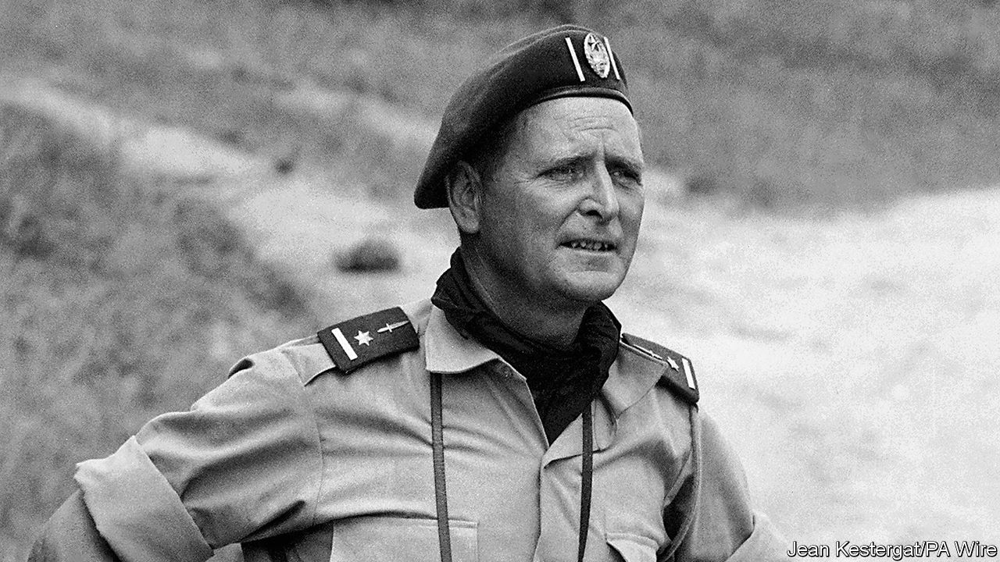

## Living dangerously

# “Mad Mike” Hoare died on February 2nd

> The commander of the “Wild Geese” mercenaries in Congo was 100

> Feb 22nd 2020

WHEN HE WAS back in civvy street, Mike Hoare was an accountant. It may have been a liking for neat columns on a page that made him so insistent on a trim troop. As the man in charge of 5 Commando, he did not tolerate beards or swearing. The men’s hair had to be as short as his own, barely showing below the black beret—which, combined with his wiriness and hawkishness, gave him a decent resemblance to Montgomery of Alamein. On Sundays, boots cleaned, they lined up for church parade.

They looked as good as any regular regiment. Yet they were soldiers for hire. The clue was on their flag and shoulder patches, which showed a wild goose flying. They were his Wild Geese, named after the fabled Irish mercenaries of the revolutionary wars. (He was Irish himself, both parents, and all the more so when he got sentimental.) Their job was to carry out operations ordinary armies could not. In 1964 and 1965 he and 5 Commando, at the invitation of Moise Tshombe and for up to $1,100 each a month, helped rid Congo of communists after independence. They stabilised breakaway Katanga province, defeated the Simba rebels and mopped up resistance in the east; most strikingly they helped retake Stanleyville (later Kisangani), rescuing nearly 2,000 hostages, most of them priests and nuns. These exploits made them, and him, world-famous. He was “Mad Mike” to Fleet Street, and in 1978, in “The Wild Geese”, Richard Burton played a mercenary heavily based on him. All that certainly beat totting up sums every day.

His task, though, had not been simple. He had to find recruits through small ads in the Johannesburg and Salisbury newspapers, appealing for men who both loved combat and were “tremendous romantics”—like himself. After wartime service in Burma and India he had married and settled in Durban, but stayed restless. He did marathon walks, rode a motorbike from Cape Town to Cairo and searched for the Lost City of the Kalahari. But none of this was living dangerously enough. In his 40s, when the Congolese invitation came through a business contact, he was ready.

He had fought before, under orders. Now he could lead men. Not ruffians, but hard men who could march 20 miles a day (nothing finer than a good march) and not grumble. To have control over their lives and deaths moved him in a strange way. Yet they were a ragbag of misfits when they arrived. Some were German, ex-Nazis, one still sporting his Iron Cross. All were white. Many, coming from apartheid countries, were racists. (He himself described African soldiers as realists whose main aim was to survive and, if ordered to go out and possibly get killed, would not do it; he was far ruder about the foul-mouthed, swaggering Belgian mercenaries he met.) Some recruits melted under fire. If that happened he might set an ostentatiously cool example, such as opening out his maps in the middle of an enemy ambush and calmly consulting them. If they misbehaved, he disciplined them ruthlessly. When a mutiny threatened, he plucked out the leader and pistol-whipped him. That proved a watershed in his life, the moment when everything stood or collapsed. Luckily for him, his authority stood.

He wanted his Wild Geese to look respectable. The word “mercenaries” annoyed him; they were “volunteers”. Money was not the point, or not for him. He was given a brick of gold once, when they stumbled on an abandoned mine, but was relieved when someone stole it. Glory was his purpose, not plunder. His men seized opportunities, as when they captured a United Nations helicopter, disassembled it and sold it back to the UN as spare parts. They took trophies, decorating their trucks with the spears, shields and heads of Simba warriors. After liberating Stanleyville they went on a rampage, draining hotel bars and dynamiting bank safes, while he stood by. But this was not, he thought, a shooting matter. It was their finest hour, having just released hostages so bruised and beaten that some no longer resembled human beings.

Other rescues had been carried out up-country, on his own initiative. He often went beyond instructions. Hijacking boats, piloting them himself under heavy fire, was his speciality: a role that pleased him, as his father had been a river pilot on the Hooghly in Calcutta. A commando unit had that flexibility. Were there atrocities? a reporter asked him once. Extremely few, he said; the savagery of the tribal revenge-killings he had witnessed, when fighting alongside the Congolese army, had been more than enough to see. Executions? Only after courts martial. Wholesale butchery happened only when Simba rebels, assured by their witch doctors that bullets would turn to water, attacked them en masse.

In eastern Congo, where he sent the Simbas’ Cuban officers packing, he dislodged Che Guevara too. That made him, he reckoned, the only man up till then to beat Che in a battle. It was one more part of the romantic history he liked to weave around him. By saving Congo he had helped save Africa, and hence the West, from the greatest cancer, communism. He reckoned the Wild Geese had killed 5,000-10,000 communists in 20 months of combat. But that was not enough; so in 1981, though retired to The Old Vicarage in Durban, he took up an invitation from the ex-president of the Seychelles to remove by force the leftist who had usurped him.

Since the Wild Geese had long flown, he recruited 46 brawny men to pose as ex-rugby players on a charity flight to the Seychelles to take toys to children. Beneath the toys, in each kit-bag, were disassembled AK47s. All went well until one of these was found at the airport. A gun battle broke out, during which a Boeing 707 landed to refuel; he and his men hijacked it to return to South Africa, drinking champagne on board, only to be arrested on arrival. They ended up in prison and, worse, ridiculed on every side. Most hurtfully, he was expelled from the Institute of Chartered Accountants.

His sentence was ten years. He served 33 months, memorising Shakespeare from a volume he had smuggled in. Such immersion suited him, since the man he had most wanted to be was Sir Francis Drake: the intrepid voyager and terror of Spaniards whose outrages were all forgotten when, on his return, he knelt before the queen and, though a robber, was made a knight. ■