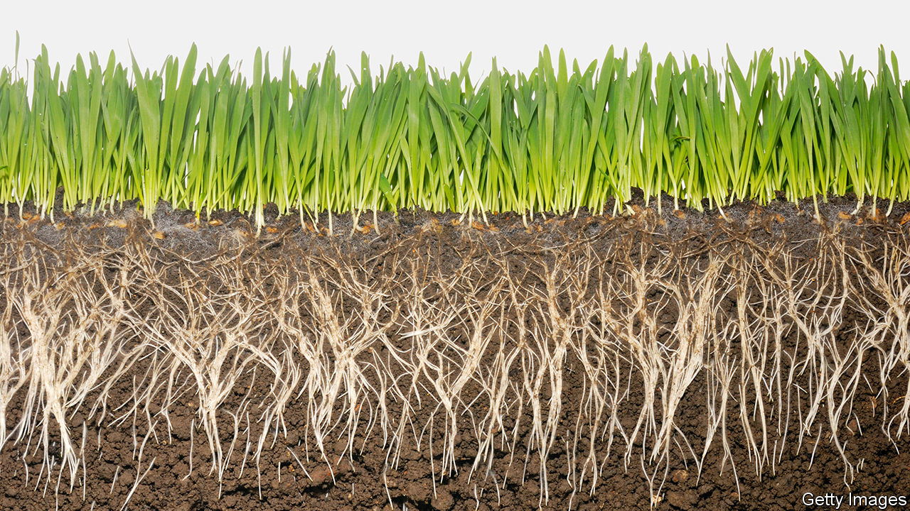

## Soil microbiology

# Knowing how plants and microbes work together can boost crop yields

> They have a complex relationship

> Feb 20th 2020SEATTLE

INTERACTIONS WITH microbes in the soil are crucial to the health of plants. Some bacteria turn nitrogen from the air into ammonia, and thence into nitrates, thus “fixing” that element in a form which plants can absorb and turn into proteins. Others, by secreting antibiotics, protect plants from pathogens. Others still, through the formation of colonies called biofilms on the surfaces of soil particles, help trap water in the soil. And fungi, which consist of long networks of hyphae that often penetrate plant roots, facilitate the uptake by those roots of nutrients from the soil

Also this means that soil microbes affect crop yields. Indeed, they are one of the most important influences on crop growth that has yet to be exploited systematically to raise those yields. But that will soon change, if researchers who study the rhizosphere, (as the zone of interaction between plants’ roots and microbes is known) have anything to do with it. This study is hard, for the rhizosphere is a habitat as complex, in its way, as a rainforest or a coral reef. It just operates at a smaller scale. As a group of researchers told the AAAS meeting in Seattle, the first step to understanding the rhizosphere is therefore to simplify it.

Previous investigators have known this, but have taken simplification too far, by isolating and studying single microbes. That, Jo Handelsman of the University of Wisconsin–Madison told the meeting, is where they have gone wrong. Soil microbes interact. And mixtures of species can do things individual bugs cannot manage. As an example, she gave an ecological triangle that her laboratory has been working on.

This triangle, which Dr Handelsman calls THOR (The Hitchhikers Of the Rhizosphere), consists of three species, Pseudomonas koreensis, Flavobacterium johnsoniae and Bacillus cereus. Each represents one of three main bacterial phyla found in the soil. Dr Handelsman, who was working on P. koreensis as part of her research (it kills organisms called oomycetes, which are serious pathogens of plants) decided on this trio because she found that when she tried to isolate samples of her target organism from the soil, the other two often came along for the ride, as hitchhikers.

Her experiments with THOR have found a strong interdependence between the three. In particular, the stability of the triangle depends on the fact that the Bacillus protects the Flavobacterium by reducing the production of antibiotics by the Pseudomonas. The advantage to its members of this triple alliance is that, acting together, the three organisms create a biofilm which can move about as a single entity. This presumably assists their feeding by allowing them to travel collectively to pastures new. None of this information would have emerged by studying the organisms in isolation, or even by pairwise comparison.

Even a triangle, however, is probably too much of a simplification. A typical soil sample contains hundreds or thousands of bacteria and fungi. A number of workers in the field think, though, that it is possible to strip things down to viable communities with a couple of dozen members.

One of these optimists is Kirsten Hofmockel of the Pacific Northwestern National Laboratory, in Richland, Washington. She has created simplified microbe communities by selecting for those dependent ultimately on a single food stuff. She started with chitin, the second most abundant carbohydrate polymer after cellulose. She mixed this material with sterile soil and then added an inoculum of organisms from natural soil, to see what survived. What emerged was a mixture of 20 organisms that subsequent experiments have shown live well together as a community.

Having proved her method, she then repeated the process with five other complex carbohydrates. The result is a set of ecological “cassettes” that can be used for experiments that do things like varying soil acidity and chemical composition, to see what thrives in which conditions.

Dr Hofmockel’s simplified communities are a step forward because they provide a basis for standardisation. This allows experiments to be repeated in different laboratories and the results compared meaningfully. Standard organisms make it easier for researchers to build on each others’ work. This is why fruit flies, small nematode worms, cress plants and mice are used so often in biology labs.

Standardised procedures are equally important. And, to that end, Trent Northen of Lawrence Berkeley National Laboratory described his EcoFAB to the meeting. This is a transparent silicone apparatus in which soil microbes can be brought into contact with plant roots in controlled conditions. Dr Northen hopes it will become ubiquitous, in the way that things like Petri dishes have, and has designed software that will direct a 3D printer to make plastic moulds from which the EcoFAB can be created by anyone who chooses to download the program.

The fruit of all this effort, researchers hope, will be ways to make soil healthier. There is already a market for so-called biofertilisers, which are enriched in micro-organisms reckoned to be good for the soil. But these products are like herbal medicines: sometimes they work and sometimes they don’t. And nobody really knows why. Dr Handelsman, Dr Hofmockel, Dr Northen and their numerous colleagues intend to bring rigour to the subject, just as chemists once turned willows, poppies and foxgloves into aspirin, morphine and digitalis. Then, by direct inoculation, or by the use of suitable chemicals to encourage some microbe species and discourage others, soils can be kept healthy and suitable for the crops growing in them.■