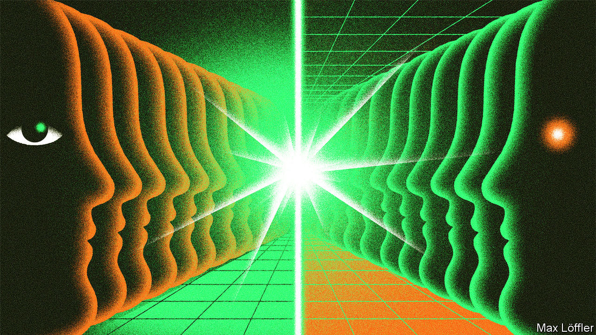
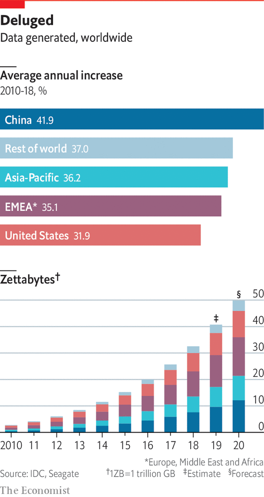

## The data economy

# A deluge of data is giving rise to a new economy

> Ludwig Siegele asks how it will work

> Feb 20th 2020

A N ARMY OF doppelgangers is invading the world. Digital copies of aircraft engines, wind turbines and other heavy equipment came first. Now the electronic ghosts of smaller and larger things are joining them in the virtual realm, from toothbrushes and traffic lights to entire shops and factories. Even humans have begun developing these alter egos. In America the National Football League is planning to design an electronic avatar for every player.

These “digital twins”, as geeks term them, are far more than replicas of the original. Think of them more as shadows that are, thanks to a multitude of sensors and wireless connectivity, intimately linked to their physical selves, and every day producing oceans of data. If something happens in the real world, it is rapidly reflected in this shadow realm. Some digital twins already come with the laws of nature programmed in. They double as a database of everything that has ever happened to the original. This makes it possible to look into their future. Sports coaches, for instance, will be able to run simulations, predict when an athlete might get injured and adjust training routines to avoid problems.

Digital twins are just one part of a vast shift in the world’s economy. They populate what David Gelernter of Yale University long ago forecast as “mirror worlds”: a new dimension of human life based on and fuelled by data. Year by year, ever more parts of the physical realm are coming to be represented and simulated in the virtual world—an inversion of Plato’s theory that real-world objects are just imperfect copies of their true being in the spiritual realm. The emergence of these mirror worlds will bring about a distinct economy. This development will require new markets, institutions, infrastructure, businesses and even geopolitical arrangements. It is the promises and pitfalls of the new “data economy” which will be the focus of this special report.

Mirror worlds are not mere mathematical representations of real ones. They also give new meaning to the adage that knowledge is power. Increasingly, digital copies are taking on lives of their own and acting on the physical world. They can be used to optimise everything, from the acoustics of a headset to an entire national railway network. They will enable all sorts of artificial-intelligence (AI) algorithms to recognise objects and faces, understand speech and even distinguish smells. And they make possible new business models: why buy heavy equipment if its wear and tear can be measured in detail and it can thus be rented by the minute?

A good place to start analysing any economy is by measuring it. A robust methodology has yet to be developed, but the data economy is already large. Statistics Canada, a government agency, last year tried to estimate the value of the country’s data (its stock plus related software and intellectual property in the field). The result was between C$157bn and C$218bn ($118bn and $164bn). If that number is close—a big “if”—the value of all the data in America, whose GDP is 12 times that of Canada, could amount to $1.4trn-2trn, which would be nearly 5% of America’s stock of private physical capital.

If the amount of data generated around the world is any guide, this new economy is growing fast. The first human genome (three gigabytes of data, which nearly fills a DVD) was sequenced 17 years ago; in April, 23andMe, a firm which offers genetic testing, claimed more than 10m customers. The latest autonomous vehicles produce up to 30 terabytes for every eight hours of driving (or some 6,400 DVDs). IDC, a market-research firm, estimates the world will generate about 90 zettabytes (19trn DVDs) this year and next (see chart), more than all data produced since the advent of computers.

Yet even more striking than the rapid growth of the data economy are the tensions and trade-offs it produces. Take its economics. In some ways, data are a natural resource, much like oil, which can be owned and traded (this newspaper called data the “world’s most valuable resource” in 2017). But data also have characteristics of a public good, which ought to be used as widely as possible to maximise wealth creation. New institutions must be created to reflect this tension, as was the case for intellectual property.

The infrastructure of the data economy, too, is torn between two poles. Currently, it mainly consists of huge data centres packed with servers where data are stored and crunched. Yet such centralisation has drawbacks, not least because it consumes huge amounts of energy and creates privacy risks. A decentralising counter-movement is already under way: more data are processed at the “edge”, closer to where they are collected.

Businesses are also facing a digital reversal. Many firms want to use data to infuse their corporate applications with AI. They have built central repositories such as “data lakes”, which hold all kinds of digital information. Such systems are of limited use, however, if a firm and its employees lack the required skills, refuse to believe the data or even to share them internally.

Finally, the geopolitics of data will not be simple, either. Online giants in particular have assumed that the data economy will be a global affair, with the digital stuff flowing to where processing is best done for technical and cost reasons. Yet governments are increasingly asserting their “digital sovereignty”, demanding that data not leave their country of origin.

This special report will tackle these topics in turn. It will conclude by discussing what is perhaps the biggest conundrum of the mirror world: the risk is that the wealth it creates will be even more unequally distributed than in its terrestrial twin.■

## URL

https://www.economist.com/special-report/2020/02/20/a-deluge-of-data-is-giving-rise-to-a-new-economy
