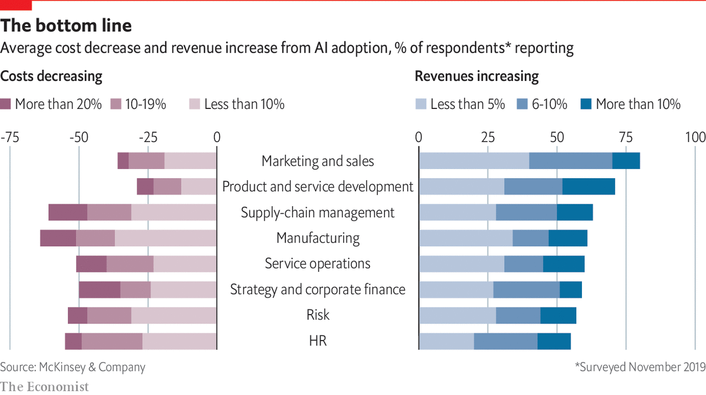

## Business

# Integrating data is getting harder, but also more important

> The search is on to find “digital truth”

> Feb 20th 2020

GEEKS ARE not known for being poets. But sometimes even they have a way with words, for example when trying to describe the main challenge of dealing with data. It is the search, they say, for “a single version of the truth”.

This also nicely describes what has been the goal of corporate information technology since it emerged 60 years ago. And the adage encapsulates the main tension for businesses in the data economy: finding digital truth—that is, identifying and combining data that accurately represent reality—is becoming more difficult and more important. More difficult because data and their sources are multiplying. And more important because firms need to get their data house in order to benefit from AI, which they must to stay competitive. AI boosts revenues and profits, according to a recent survey by McKinsey, a consultancy (see chart).

Happily, technology is coming to the rescue. Data-handling software and cloud computing are increasingly enabling what George Gilbert, an investor and veteran observer of the IT industry, calls the “AI-ssembly line”—in reference to what happened a hundred years ago, when electricity replaced steam as the main source of power in factories. Before, machines had to be grouped closely around the power source—a steam engine. Electricity then allowed power to be distributed to where it was needed, which made assembly lines feasible. What is happening now, however, is actually the inverse: the machines of the digital age—a firm’s business applications and software to build these—are virtually regrouping around a new power source: central digital repositories known as “data warehouses” or “data lakes”. In time this may allow companies to build entire digital twins of themselves.

Finding digital truth is hard because the data come from many sources and in a staggering variety of formats—which makes them hard to integrate. Even simple things such as a customer’s name can be defined and stored in many different ways. Companies can have thousands of software applications, each with its own database. Failed attempts to consolidate or link these digital repositories have cost armies of chief information officers their jobs.

Integrating data was already a major problem when IT existed mainly to keep track of a firm’s “transactions”, such as processing an order or managing the supply chain. It has only become more difficult since. In the 1990s firms started using their data to work out how they have been doing, something called “analytics”. A decade ago, they turned to mining their data to make predictions about their business, an approach first dubbed “big data” and now AI. Today a firm’s data are often not just spread across many local databases, but live in different cloud services and stream in from third parties and connected devices.

It is the data warehouses and data lakes that are now making it easier to use the digital stuff. They differ in the way they structure information—the first takes a more rigid approach than the second, although the differences are getting smaller—both can now live in the cloud. This makes them not only cheaper to manage, but they can more easily be fed with data from many different sources and used by many different users. One such is made by Snowflake, another startup, which has turned its data warehouse into what it calls a “data platform” that can stretch across different computing clouds. Big cloud providers such as Amazon Web Services and Microsoft Azure offer similar products.

A second improvement is specialised databases, which take care of certain types of data. Since data often no longer come in the form of static blocks, but rather real-time digital streams, they have to be treated differently, explains Jay Kreps, the chief executive of a startup appropriately named Confluent. It sells cloud services based on Apache Kafka, an open-source program, which analyse these streams and dump them into data lakes. Bosch, a German conglomerate, uses Confluent to gather and mine data from power tools to manage repair services and construction sites.

Yet it is a third group of software and services that turns all this into Mr Gilbert’s “AI-ssembly line”. Some of these tools prepare data for crunching, others make it easy to design and train an AI algorithm, deploy it in an application to automate decisions and continuously improve it. Enel, a utility, has used such tools to develop a service that helps it identify the power thieves it needs to go after first. Shell, an oil company, has designed algorithms that ensure that its thousands of spare parts are always available around the world. And Kiva, a non-profit lender, has built a data warehouse with Snowflake that allows it to make better decisions about who should receive its loans.

Many other firms were not so lucky, forgetting that technology is always only part of the solution. Motivated by studies that found that AI boosts profits and, in some cases, panicked by the possibility of being disrupted by a startup, some tried to cobble together an AI-assembly line themselves, but failed. They did not have the right type of developers and data scientists—or did not want to pay their exorbitant salaries. This has created an opening for IT vendors to sell more or less pre-packaged versions of AIassembly lines, but each coming at it from a different direction.

Take incumbents first, which are trying to build on their strengths. In the case of the granddaddy, IBM, this is services. It helps firms build what Arvind Krishna, soon its new boss, calls a “data plane”, a collection of programs to develop AI applications. It has also become a data refiner itself: for example, it collects and sells granular weather data that insurers can use to calculate rates, and utilities to predict where power cuts may occur. And it offers a range of AI services, including visual recognition and translation, that other firms can plug into their products.

Oracle, the world’s leading vendor of relational databases, still the workhorses of corporate IT, aims to extend that position by providing what it calls an “autonomous database”. This type of service combines and automates all sorts of digital repositories, plus bits of AI, so customers do not have to put together all these programs themselves. “It’s many data engines in a single engine,” explains Paul Sonderegger, the firm’s senior data strategist, adding that such integration will be key to increasing a firm’s “data productivity—increasing the dollar output per data input”.

As for younger IT firms, they are increasingly offering to help firms to get their digital ducks lined up, too. Salesforce, which grew up as a web-based service to manage customer relations, has spent billions in the past two years to develop its own AI technology, called Einstein, and acquire two big-data companies, MuleSoft and Tableau. The idea, says Bret Taylor, Salesforce’s president and chief operating officer, is to allow firms to consolidate and link their data so they can have a “single view of their customers”. This makes it easier for firms to anticipate what their customers will do, personalise offers and always recognise them, whether they show up in a retail store or online.

Then there is a host of smaller firms. Databricks has put together an AI platform, complete with tools to cleanse data, build algorithms and deploy them. C3.ai offers something similar, but mainly aims to help big firms through their digital transformation. Qlik is known for analytics and data visualisation, but has recently moved into AI.

But despite such tools, many AI projects still disappoint, says Debra Logan of Gartner, a market-research firm. One big problem is data silos which reflect a firm’s internal boundaries. Different departments within a company, afraid of relinquishing power, are loth to share their data or change what they collect and how (making the point that data structures are often just thinly veiled power structures). This has kept many firms from developing a coherent “data strategy” that would ensure they actually collect and analyse the information they need to achieve their business goals.

To overcome such digital divisions, some companies have made organisational changes. A growing number have appointed a “chief data officer” who can knock heads together to ensure that the IT department and business units work together, which they must to build anything resembling an AI-assembly line. Yet changes at the top, as well as in technology, are not worth much, if the rest of the company is not ready. “Poor data literacy” is the second biggest barrier to corporate data projects, preceded only by “cultural challenges to accept change”, according to a recent survey by Gartner. Changing this does not mean that all employees have to become data scientists, but that they have a basic grasp of what data can be used for and what not, says Mike Potter, the chief technology officer of Qlik.

Data, he argues, are never neutral and must always be questioned: they may be collected for political reasons or in a way that hides things. “We all think that data are so objective,” he says, “but they are actually as interpretable as Shakespeare.” Despite all the tech, there may never be a single version of the truth. ■

## URL

https://www.economist.com/special-report/2020/02/20/integrating-data-is-getting-harder-but-also-more-important
