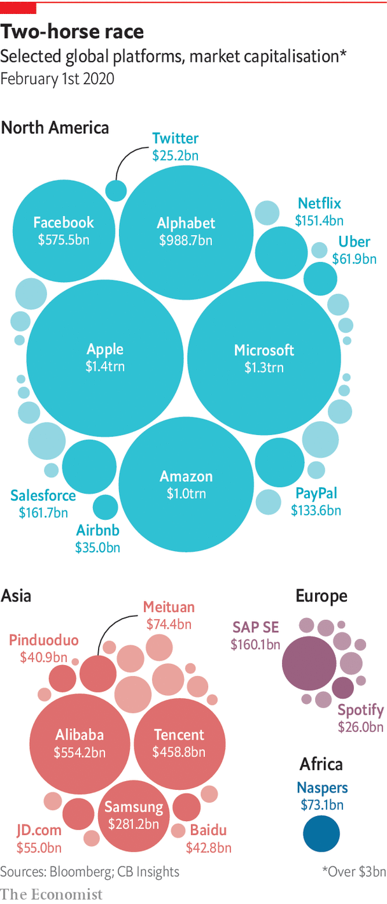

## Policy

# Who will benefit most from the data economy?

> It is already unequal and that inequality could get worse

> Feb 20th 2020

THE DATA economy is a work in progress. Its economics still have to be worked out; its infrastructure and its businesses need to be fully built; geopolitical arrangements must be found. But there is one final major tension: between the wealth the data economy will create and how it will be distributed. The data economy—or the “second economy”, as Brian Arthur of the Santa Fe Institute terms it—will make the world a more productive place no matter what, he predicts. But who gets what and how is less clear. “We will move from an economy where the main challenge is to produce more and more efficiently,” says Mr Arthur, “to one where distribution of the wealth produced becomes the biggest issue.”

The data economy as it exists today is already very unequal. It is dominated by a few big platforms. In the most recent quarter, Amazon, Apple, Alphabet, Microsoft and Facebook made a combined profit of $55bn, more than the next five most valuable American tech firms over the past 12 months. This corporate inequality is largely the result of network effects—economic forces that mean size begets size. A firm that can collect a lot of data, for instance, can make better use of artificial intelligence and attract more users, who in turn supply more data. Such firms can also recruit the best data scientists and have the cash to buy the best AI startups.

It is also becoming clear that, as the data economy expands, these sorts of dynamics will increasingly apply to non-tech companies and even countries. In many sectors, the race to become a dominant data platform is on. This is the mission of Compass, a startup, in residential property. It is one goal of Tesla in self-driving cars. And Apple and Google hope to repeat the trick in health care. As for countries, America and China account for 90% of the market capitalisation of the world’s 70 largest platforms (see chart), Africa and Latin America for just 1%. Economies on both continents risk “becoming mere providers of raw data...while having to pay for the digital intelligence produced,” the United Nations Conference on Trade and Development recently warned.

Yet it is the skewed distribution of income between capital and labour that may turn out to be the most pressing problem of the data economy. As it grows, more labour will migrate into the mirror worlds, just as other economic activity will. It is not only that people will do more digitally, but they will perform actual “data work”: generating the digital information needed to train and improve AI services. This can mean simply moving about online and providing feedback, as most people already do. But it will increasingly include more active tasks, such as labelling pictures, driving data-gathering vehicles and perhaps, one day, putting one’s digital twin through its paces. This is the reason why some say AI should actually be called “collective intelligence”: it takes in a lot of human input—something big tech firms hate to admit.

If history is any guide, the risk is not so much that humans will automate themselves away. Previous technological disruptions have at times even increased labour’s share of income, as new types of jobs emerged. The question is rather how much such data workers will be paid. As things stand, their work may become systematically undervalued, reckons Glen Weyl of Microsoft. One reason is the structure of online markets: big platforms are not just monopolies, but monopsonies, meaning that they have the power to hold down wages for data labour. Tellingly, none has ever really considered paying users for the data they generate. The economics of data, too, put pressure on the price of data labour: why, for instance, should a firm pay a high price for an individual’s data if it can infer them cheaply from another person’s information?

A data economy in which those who produce a large part of the main input are perennially underpaid is unlikely to be a healthy economy. Those with the greatest expertise, such as radiologists who can check the accuracy of an algorithm that recognises medical images, might hold back their knowledge and refuse to participate. Data workers with low pay and no say in the use of the information they generate will increasingly feel alienated, which could lower the quality of their work. And solving the problem through redistribution—as Gavin Newsom, California’s Democratic governor, wants to do with a “digital dividend” to be levied from tech giants and disbursed to the state’s citizens—would be a burden on the data economy and lead to trade conflicts. Such subsidies would be vulnerable to cuts as the political winds change.

All these complications explain why another proposed remedy keeps popping up: creating property rights on personal data to increase people’s bargaining power. Yet this in itself would not help much. If most people understandably ignore the complex privacy policies that come with online services, how can they be expected to shop around for the best price for their data? And property rights could actually make things worse. Since most personal data are fundamentally a social construct to which more than one person has the right, individuals could engage in a race to the bottom. Each member of a family, say, could sell their genetic information and by doing so reveal much of their relatives’ DNA.

Instead of giving citizens individual control over their data, they should hold it collectively, argues Mr Weyl. He and an activist organisation he helped found, RadicalxChange, want everyone to join what they call “data co-operatives”. These would act much like trade unions in the conventional economy. They would, among other things, negotiate rates for data work, ensure the quality of members’ digital output, bill data firms that benefit from this output, and distribute the proceeds.

Like data trusts, robust data co-operatives will not emerge overnight. They need support from all involved. There are early signs that this may be forthcoming. Some Western countries may soon discuss a “Data Freedom Act”, based on a draft by RadicalxChange, which would create a new regulated entity for that purpose. In a first for a tech-giant boss, Satya Nadella, the chief executive of Microsoft, at the World Economic Forum in Davos in January called on the industry to show more respect for “data dignity”—meaning to give people more control over their data and a bigger share of the value these data create. The public, for its part, is getting ever more concerned about what happens with its data. Roughly eight in ten Americans, for instance, now think they have very little or no control over the data which companies collect about them.

Expect debates about such ideas as data co-operatives to become more heated as the data economy grows. Encouragingly, as Mr Arthur points out, humanity has overcome a similar conundrum before. In the 1850s, the Industrial Revolution brought big increases in production, along with Dickensian social conditions. It took 100 years for societies to adapt; some never did. In the data economy, too, it will take a long time to build the appropriate mechanisms and institutions. No one yet worries that revolutions and wars will be fought over data, but there is no guarantee.■