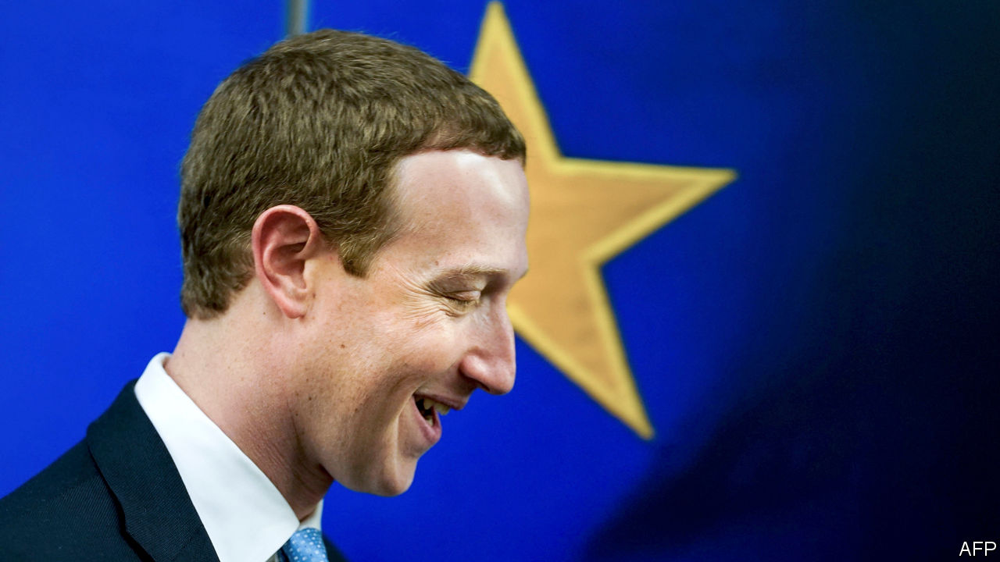
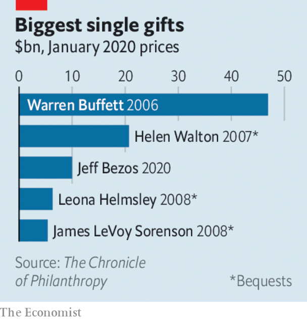

# Business this week

> Feb 22nd 2020

The European Commission published its wide-ranging digital strategy that, among other things, seeks a “guarantee” of human oversight over artificial intelligence and a raft of measures, such as data sharing, to restrain America’s tech giants. Mark Zuckerberg, Facebook’s boss, visited Brussels to push his alternative plan on regulating social-media content, which emphasises monitoring standards and systems rather than holding firms liable for content. See [article](https://www.economist.com//node/21780452).

The coronavirus outbreak in China caused Apple to lower its sales forecast for the quarter. The company said it was “experiencing a slower return to normal” than it had expected in a country where most of its products are assembled. Its renowned just-in-time supply chain has been disrupted by the restrictions on movement. See [article](https://www.economist.com//business/2020/02/20/apples-chinese-troubles).

HNA group, one of China’s most acquisitive conglomerates until the government told it and others to rein in their debt-fuelled spending, was reportedly on the verge of collapse. The group’s main asset is Hainan Airlines, which, along with other carriers in the region, has been hit hard by the coronavirus, complicating HNA’s debt- restructuring scheme.

A year after its merger plan with Siemens was derailed by the EU’s competition regulator, Alstom announced that it was buying Bombardier’s trainmaking business, which Bombardier valued at €7.5bn ($8.1bn). Alstom supplies many rail systems around the world (it built half the trains on the London Underground). The deal should help the French group compete against China’s globally ambitious state-backed train manufacturer, which has reportedly said it could build Britain’s HS2 high-speed rail line in just five years.

UBS appointed Ralph Hamers as its new chief executive. Mr Hamers currently headsING, a Dutch bank. He will start his new job in November, taking over from Sergio Ermotti, who turned the Swiss bank’s fortunes around after the tumult of the financial crisis.

Burdened with write-downs, HSBC’s pre-tax profit sank by a third last year, to $13.3bn. The bank announced yet another restructuring, slashing 35,000 jobs (analysts had expected 10,000), shedding $100bn in risk-weighted assets and shrinking its business in Europe and America in order to concentrate on Asia. See [article](https://www.economist.com//node/21780459).

Royal Bank of Scotland also unveiled a new strategy, through which it will pare its investment-banking business and become a “purpose-led organisation” tackling green issues. RBS, still majority-owned by the taxpayer after its bail-out a decade ago, is changing its group name outside Scotland to NatWest.

Morgan Stanley announced a takeover of E*Trade, an online trading platform that specialises in retail clients. The $13bn deal is one of the biggest in finance since the global crisis of 2007-09. In another big acquisition, Franklin Templeton, an asset manager, said it would buy Legg Mason, a rival, for $6.5bn. The combined business will manage $1.5trn in assets.

Japan seemed to be heading for a recession, as data showed the economy shrinking by 6.3% at an annualised rate in the final quarter of 2019. A rise in the consumption tax was blamed; an increase to the tax in 2014 led to a similar contraction. See [article](https://www.economist.com//node/21780421).

Britain’s annual inflation rate leapt to 1.8% in January from 1.3% in December, raising questions about the prospect of an interest-rate cut from the Bank of England.

The Turkish central bank lowered its benchmark interest rate by half a percentage point, to 10.75%. That was the smallest in a series of cuts over the past year but keeps the bank on course to fulfil a pledge by Turkey’s president, Recep Tayyip Erdogan, to get the rate into single figures as he seeks a return to growth backed by credit. The cut complicates the government’s attempts to stabilise a weakening lira.

A judge slapped a temporary injunction on Microsoft from working on the Pentagon’s Joint Enterprise Defence Infrastructure project, giving a new hope to Amazon in its legal claim that it was not awarded the contract because of Donald Trump’s feud with Jeff Bezos, the company’s boss. Amazon’s cloud-computing business had been the front-runner in the bidding for the $10bn contract. In a court filing, Amazon itself came under fire from Oracle, which questioned the incentives offered to two former Pentagon employees.

Under pressure from a green workers’ group at Amazon, Jeff Bezos pledged to give $10bn to scientists, activists and NGOs working to mitigate climate change. Amazon’s carbon footprint is substantial because of its vast delivery network and powerful data centres. “We can save Earth,” said Mr Bezos, who recently bought a sizeable chunk of earth when he paid $165m for a mansion estate in Beverly Hills. See [article](https://www.economist.com//leaders/2020/02/22/jeff-bezos-wants-to-help-save-the-climate-here-is-how-he-should-do-it).