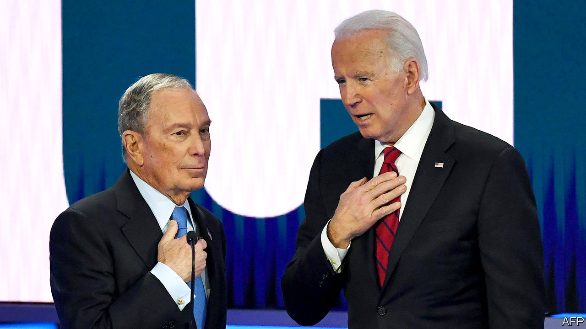
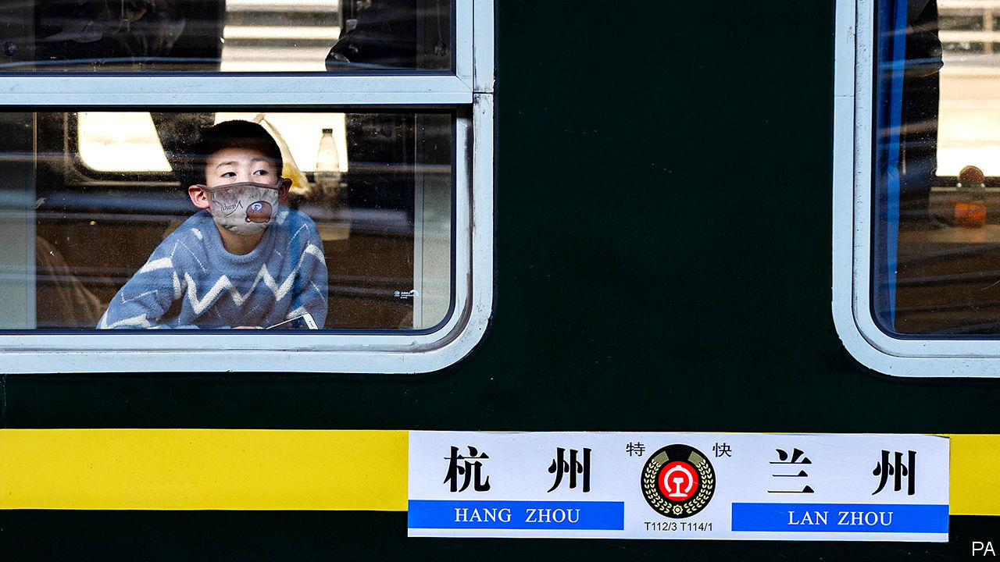

# Politics this week

> Feb 22nd 2020

Mike Bloomberg took part in a Democratic presidential debate for the first time, after a surge in his opinion-poll standing qualified him for inclusion. The other candidates attacked him over lewd comments he has made in the past and his billionaire status. Mr Bloomberg will reportedly sell his media company if he is elected president. See [article](https://www.economist.com//united-states/2020/02/22/michael-bloomberg-gives-an-unconvincing-performance-in-nevadas-democratic-debate).

More than 2,600 former lawyers and officials from the Justice Department signed a letter calling on William Barr to resign as attorney-general. Mr Barr recently intervened to reduce the recommended sentence in the case of Roger Stone, a disgraced confidant of the president.

Using the power of the presidency Mr Trump pardoned a Who’s Who of business and political felons. These included Michael Milken, the “junk-bond king”, who was imprisoned in the 1990s, and Rod Blagojevich, a former governor of Illinois, whose prison sentence for trying to sell a Senate seat was commuted.

The UN-backed government of Libya pulled out of peace talks with representatives of Khalifa Haftar, a rebellious general, after his forces attacked the port of Tripoli. The government is based in the capital, which has been under siege by General Haftar’s forces for a year. Turkey has intervened on the side of the government. Egypt, Russia and the United Arab Emirates back General Haftar. The EU said it would patrol the eastern Mediterranean, enforcing a long-ignored UN arms embargo on Libya.

Recep Tayyip Erdogan, Turkey’s president, said it is “only a matter of time” before he launches an operation to stop the Syrian army’s offensive on Idlib, the last rebel-held province in Syria. The regime of Bashar al-Assad, which is backed by Russia, has rejected Turkey’s demands to pull back. Turkey, which has troops in the area and supports some of the rebels, fears a new influx of refugees. The UN says its aid operation is “overwhelmed”.

Dozens of people were killed in Burkina Faso and Mali in ethnic or jihadist violence. They include 24 people gunned down in a church in northwestern Burkina Faso; jihadists were blamed for that attack. The deterioration in security comes after France promised to send another 600 troops to help stabilise the region.

Government forces in Cameroon were blamed for an attack that killed 22 civilians including 14 children in an English-speaking region. The government said the incident was an “unfortunate accident” during a firefight with rebels.

A gunman went on a shooting spree in the German city of Hanau, killing at least ten people and himself. The suspect was reported to have published racist videos and manifestos before the attack. Xenophobic terrorism in Germany appears to be growing; earlier this month police arrested 12 men suspected of planning attacks on mosques.

The British government set out plans to overhaul the immigration system. Workers from EU countries would be treated the same as non-EU workers if the plan becomes law. Fewer low-skilled migrants would be admitted, though the definition of “skilled” would expand. See [article](https://www.economist.com//britain/2020/02/20/britains-post-brexit-immigration-rules-worry-business).

A Dutch appeals court reinstated an international court’s ruling that Russia owes $50bn to the shareholders of Yukos, an oil company it bankrupted and dismantled in 2003-07. The firm’s seizure was a battle between President Vladimir Putin and Mikhail Khodorkovsky, the CEO of Yukos, who had political ambitions. Russia will appeal against the verdict to the Dutch supreme court. See [article](https://www.economist.com//europe/2020/02/20/the-50bn-yukos-judgment-against-russia-turns-on-a-single-word).

A Turkish court acquitted a group of civic activists who took part in protests to save a park in Istanbul from development in 2013 of conspiring to overthrow the government. President Recep Tayyip Erdogan’s repression of civil society worsened after the Gezi Park demonstrations. Prosecutors immediately re-arrested one of the activists on charges of taking part in an attempted coup in 2016. See [article](https://www.economist.com//europe/2020/02/20/turkey-acquits-the-gezi-park-protesters-then-rearrests-one).

Despite a fall in daily numbers of newly confirmed infections, many places in China maintained tight controls to curb the spread of covid-19. In Wuhan, where the new coronavirus was first discovered, officials banned outdoor activities. Beijing required anyone entering from another province to undergo 14 days of quarantine. In Japan, the quarantine of a cruise ship, the Diamond Princess, wound down, with hundreds of passengers allowed to leave. Over 600 others had been infected with the virus; two people died. Russia all but barred visits by Chinese citizens. See [article](https://www.economist.com//china/2020/02/22/in-china-newly-confirmed-cases-of-coronavirus-infection-are-falling).

China announced the expulsion of three China-based correspondents of the Wall Street Journal. It said this was in response to the newspaper’s publication of an opinion piece under the headline “China is the real sick man of Asia”. A day earlier, America designated five Chinese state-linked news organisations as “foreign missions”.

Afghanistan’s electoral commission announced the results of the presidential election, five months after the vote was held. It said the incumbent, Ashraf Ghani, had won with 50.6% of the vote, narrowly avoiding a run-off. His closest rival, Abdullah Abdullah, dismissed the results as fraudulent and declared himself the winner. See [article](https://www.economist.com//asia/2020/02/20/afghanistans-disputed-presidential-election-comes-at-a-tricky-time).

IMF officials held a round of talks with Argentina. The IMF said the country’s debt position was now “unsustainable”, meaning that private creditors must make a “meaningful contribution”. The IMF expects Argentina to repay the money it lent the government in full.

In Canada a protest by indigenous groups and environmentalists against a proposed pipeline to transport gas to the Pacific coast shut one of the country’s busiest rail routes, disrupting passenger and freight trains. See [article](https://www.economist.com//the-americas/2020/02/20/a-pipeline-through-historically-native-land-has-sparked-protests-in-canada).

Jair Bolsonaro, Brazil’s president, appointed General Walter Braga as his new chief of staff, bringing to nine the number of men in the 22-member cabinet who come from the armed forces. Mr Bolsonaro is a former army captain. He has remarked that the third floor of his presidential office “is now completely militarised”.

All those military minds in the presidential palace are trained on the biggest threat to Brazil in the next 20 years: France. A leaked document from the defence ministry suggested that although China, Russia and even Venezuela could be considered bigger menaces, the top brass is worried that France might try to interfere in the Amazon, possibly launching an invasion from next door French Guiana. France is Brazil’s main military partner.

## URL

https://www.economist.com/the-world-this-week/2020/02/22/politics-this-week
