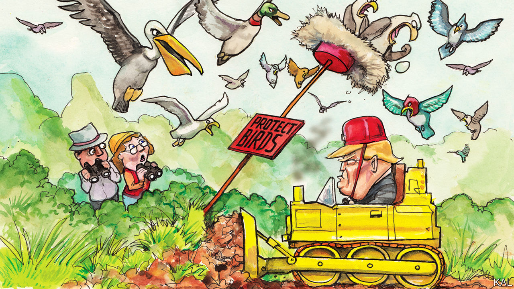

## Lexington

# Companies can now get away with killing America’s birds

> America owes its great love of its feathered friends to a century-old law that the administration is attempting to gut

> Feb 22nd 2020

ONE AFTERNOON in 1896, a Bostonian socialite called Harriet Lawrence Hemenway read an article about the devastation of a colony of nesting birds by plume-hunters. Disgust at their grisly trade, which was eradicating millions of birds a year to meet Americans’ demand for feathery swank, surged in her like a ball of regurgitated feathers and crustaceans from a grebe’s crop. This would prove to be a turning-point in America’s relationship with nature.

Following the example of some similarly well-connected British women—originators of the Royal Society for the Protection of Birds—Hemenway launched a campaign against wearing feathers for fashion. It was audacious. During two strolls through Manhattan, an ornithologist identified the remnants of 40 native species, including warblers and woodpeckers, on over 500 women’s heads. Yet Hemenway’s Massachusetts Audubon Society, named after the bird-painter James Audubon, was replicated by like-minded women in over a dozen states. The National Audubon Society they formed in 1905 was even more effective. It had heavyweight fans such as Theodore Roosevelt and a flair for sensationalism. “Woman as a bird enemy” was the title of one of its lectures.

Lobbying by Audubon groups helped produce a remarkable series of bird protections, including the Lacey Act of 1900 and, following a pro-bird pact with British Canada, the Migratory Bird Treaty Act (MBTA) of 1918, which made it illegal to harm most native birds not hunted for sport. This landmark environmental law—and model for later ones such as the Endangered Species Act—probably saved several decorative birds, such as the snowy egret and sandhill crane, from extinction. Following additional pro-bird treaties with Mexico, Japan and the Soviet Union, the act now covers over 1,000 species. Since the 1970s its implementation has been mainly focused on warding off the threat they face from industrial development and pollution. After over a million birds were killed in 2010 by an oil-spill in the Gulf of Mexico, the company responsible, BP, was fined $100m under the MBTA. Most of the money was spent on restoring contaminated bird habitat.

The success of the avian conservation movement has changed people as well as the outlook for birds. According to a survey by the US Fish and Wildlife Service (FWS), America has 45m birdwatchers—roughly three times the number of people who watch American football on television. Diverse and widely spread—though with a tendency to be white, well-educated and female—they are estimated to spend $41bn a year on bird-related travel and kit. This mass enthusiasm, which Lexington observed on a recent visit to the St Marks wildlife refuge in Florida—the first and last landfall for millions of avian migrants across the Gulf of Mexico—is not merely a response to America’s even more diverse birdlife. As in similarly bird-dotty Britain, it is a culture that has sprung from a political decision to treat birds as precious and inviolable.

Donald Trump’s administration wants to devalue them. A new regulation published by the FWS this month would eviscerate the MBTA by ending the decades-old practice of penalising the “incidental take” of protected birds. So long as a person or company can claim to have killed or injured birds accidentally, he or it would be free to do so. Thus, a contractor could hose cliff-swallow nests off a road bridge, because cleaning the bridge, not killing swallow chicks, was his intention. If BP killed another million seabirds, it would face no penalty under the MBTA.

Assailed by Hemenway, the powerful millinery industry claimed that most of its feathers had been shed naturally. The arguments for the Trump rewrite are equally hollow. Pointing to the statute’s ambiguous language on incidental take, the administration claims it “hangs the sword of Damocles” over economic development. In fact, after decades of fairly consistent implementation of the law, America’s industrial-scale bird-killers understand perfectly well the potential cost of failing to alert birds to their electric lines or to cover their oil pits. They also understand the benefits of working with the FWS to mitigate the slaughter. The administration’s depiction of government and industry at war over the MBTA is inaccurate. Its predecessors, Republican and Democratic alike, tended to view the law mainly as a means to improve industrial practice, and they therefore penalised only persistent or egregious offenders. The number of birds drowning in oil-pits, meanwhile, fell by half, to around 750,000 a year.

Despite improvements in signalling electric lines, these kill even more: perhaps 25m a year. Climate change and habitat loss may be bigger threats; a recent study found America’s bird population had fallen by 30% over the past 50 years. The fact that the administration is nonetheless intent on gutting birds’ main legal protection shows how far it is from honouring its spirit—and the decades-old bipartisan consensus behind it. A pronounced conservative association with bird-watching, and conservation more broadly, was a feature of that. Prominent Republican birders include John McCain and Laura Bush. Mr Trump prefers corporatism. The overseer of the MBTA rewrite, David Bernhardt, the secretary of the interior, is a former oil-industry lobbyist.

What of America’s bird-loving millions? If Mr Trump wins re-election, they are unlikely to stop his scheme. Like gun control or taxing the rich, conservation is something most voters support, but not forcefully enough to overcome resistance from a well-funded, politically favoured lobby. The fact that the FWS is already advising companies that they can get away with killing birds, accidentally on purpose, has sparked little protest.

Another question, if the administration gets its way, is what will become of America’s mass enthusiasm for the beauty and elusiveness of birds? It is a culture founded on law, regulation and the high status that birds have gained from them. If birds are less protected, that suggests, they may in time be less loved.■

## URL

https://www.economist.com/united-states/2020/02/22/companies-can-now-get-away-with-killing-americas-birds
