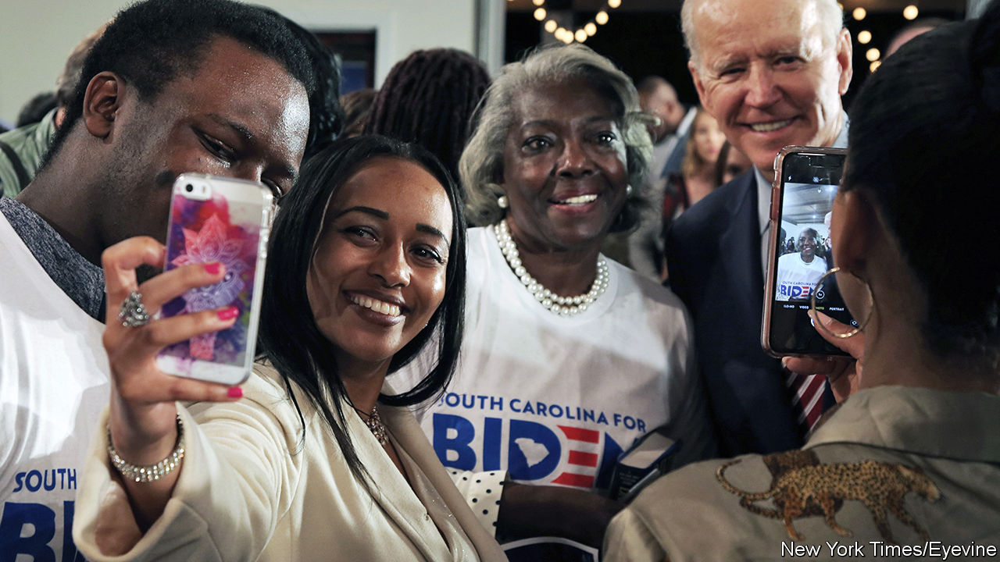

## Twilight of the moderates

# Joe Biden’s rivals scramble to capitalise on his woes in South Carolina

> What happened to the ex-frontrunner’s firewall?

> Feb 22nd 2020NORTH CHARLESTON

JILL BIDEN was in her element. A lifelong teacher, even during her two terms as Second Lady, she headlined an “Educators for Biden” event in a modest Baptist church in North Charleston. The smartly dressed, mostly African-American crowd was on the older side (it was mid-afternoon on a weekday), as is Joe Biden’s support generally. It felt less like a “getting to know you” than a “nice to see you again” event. Rev Bernard Brown, who said he had been “associated with” Mr Biden for a long time, called the former vice-president “a man of good character.” David Mack, a state representative from Charleston, said the Bidens had sent flowers after his mother died, just a few weeks earlier. The afternoon’s biggest applause was for a woman in the audience who said she was “voting for Joe because he’s an elder statesman. He’s been there.”

Being an elder statesman has not turned out to be the advantage the Biden campaign hoped. Mr Biden’s team has always seen South Carolina as his firewall. A resounding victory in its primary on February 29th, courtesy of a Democratic electorate that is majority-black, would protect him from results in Iowa and New Hampshire. South Carolina’s somewhat conservative African-American Democrats, the campaign thought, trust Mr Biden and appreciate his fidelity to Barack Obama. That argument, which treated black voters as more monolithic than they are, looks less plausible after drubbings in the first two states and falling numbers in South Carolina, where Mr Biden still leads but by less than five points, compared with 20 points at the start of the year.

The chief beneficiary of Mr Biden’s polling tumble, Mike Bloomberg, is not on the ballot in South Carolina (he skipped the four early states to focus on Super Tuesday). But that does not mean South Carolinians are not thinking about his candidacy—and particularly about his record on race. Many black voters seem less incensed about stop and frisk than white progressives think they should be. The practice, championed by Mr Bloomberg when he was mayor of New York, of stopping people, disproportionately young black and brown men, in an attempt to cut gun crime was found to be unconstitutional. Mr Bloomberg defended the policy for too long: for a data-nerd, he was reluctant to acknowledge evidence of his mistake.

South Carolina’s Democratic electorate, which is older and more churchgoing than the Democratic average, seem not to find it disqualifying. Clay Middleton, a major in South Carolina’s army national guard who previously held senior positions in the campaigns of Hillary Clinton and Cory Booker, expresses it this way: “I’m 38 years old and there’s one or two things I wish I hadn’t said or done. [Mr Bloomberg] is 78: I would have a problem if he didn’t regret some things. ...I’m not saying I would vote for Bloomberg, but if I don’t it won’t be because of stop and frisk.”

Mr Bloomberg may not be on the ballot, but a more mercenary version of his big-spending strategy is being road-tested in South Carolina—by Tom Steyer. The other billionaire in the Democratic race has spent nearly $19m in the state, building an extensive field operation, hiring prominent legislators as campaign advisers and ensuring that virtually no South Carolinian can open a web browser or mailbox without seeing a Steyer ad. Jerry Govan, who chairs South Carolina’s legislative black caucus and whose firm has been paid more than $40,000 by the Steyer campaign, says “there are no perfect candidates”, but that Mr Steyer represents “a good transition [and has] supported good causes”. Mr Steyer’s return on investment has been to eclipse Pete Buttigieg, Amy Klobuchar and Elizabeth Warren in South Carolina’s polls.

The bad news for Mr Steyer is that his war-chest is feeble compared with Mr Bloomberg’s. The former mayor has spent twice as much on advertising in Super Tuesday states as the rest of the field combined and already has a full-time campaign staff of 2,400. His record of entrepreneurship, three mayoral terms in New York and subsequent philanthropy also give him more to brag about than Mr Steyer.

If Mr Bloomberg can afford to sit-out and watch South Carolina without worrying about what the result there will do to his campaign infrastructure, Mr Buttigieg, Ms Klobuchar and Ms Warren cannot. Ms Warren’s South Carolina polling matches national trends: a rise last year, followed by a steady decline. Positioning herself as a candidate who can unify the party’s progressive and centrist wings has made neither one flap. After her fourth-place finish in New Hampshire, Ms Warren pulled her TV advertising in South Carolina, telegraphing pessimism about the outcome.

Mr Buttigieg has six field offices and 55 paid staff in-state, which outside Bloomberg-land counts as a sizeable operation. He has picked up at least one prominent backer. J.A. Moore, a young legislator who had backed Kamala Harris, endorsed Mr Buttigieg because in their conversations, “he listened more than he talked”, and “he can restore some grace and dignity to the office of president.” But he has still struggled mightily with African-American voters. Lauren Brown, his South Carolina spokesman, says his campaign is “looking at veterans, people of faith, rural voters—communities that cut across race”. That too sounds like expectations-lowering.

Ms Klobuchar’s presence in South Carolina, by contrast, is hardly detectable. A pro-Klobuchar SuperPAC is spending heavily on ads here and in Super Tuesday states. But she has no in-state endorsements, and has held fewer events than Kamala Harris and Mr Booker, neither of whom remains in the race.

If neither Mr Biden, Ms Klobuchar nor Mr Buttigieg can make the case that they are the best hope of the majority of Democrats—who do not yearn for socialism—they could still divide that part of the party into units so small that Mr Sanders is able to build up a commanding lead. That could set up a contest between Mr Sanders and Mr Bloomberg, and make the 2016 Democratic primary, which seemed bitter enough at the time, look like a love-in.■

Dig deeper:Sign up and listen to Checks and Balance, our new [newsletter](https://www.economist.com//checksandbalance/) and [podcast](https://www.economist.com//podcasts/2020/04/24/checks-and-balance-our-weekly-podcast-on-american-politics) on American politics

## URL

https://www.economist.com/united-states/2020/02/22/joe-bidens-rivals-scramble-to-capitalise-on-his-woes-in-south-carolina
