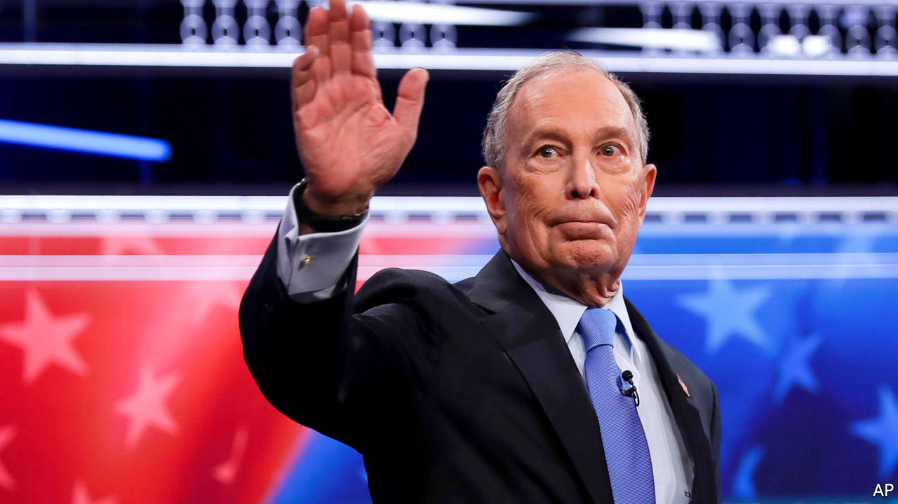

## Mike drop

# Michael Bloomberg gives an unconvincing performance in Nevada’s Democratic debate

> The world’s 12th richest man must learn to be quicker on his feet

> Feb 22nd 2020

IN ONE SENSE, political debates are evanescent. Six candidates squared off in Las Vegas on February 19th—the ninth such debate—ahead of the Nevada caucuses on February 22nd. They will spar again on February 25th, ahead of the primaries in South Carolina and the delegate-rich Super Tuesday primaries. But some debates matter more than others, and the one in Las Vegas came at an important moment in the Democratic campaign to choose a candidate to challenge President Donald Trump.

Ever since Bernie Sanders’s impressive performances in Iowa and New Hampshire, many Democrats have worried that nominating a self-declared socialist will cost them the election and their House majority. So in Las Vegas all eyes were on Mike Bloomberg, a billionaire former mayor of New York who has been closing the gap with Mr Sanders in the polls through an unorthodox self-funded advertising blitz. Mr Bloomberg is not standing in Nevada—he will enter the fray on Super Tuesday—but in Las Vegas he appeared on the campaign stage for the first time. The question was: how would he perform, and how would the other candidates react to him?

Elizabeth Warren answered the second question immediately, ripping into Mr Bloomberg for having made sexist remarks. Later, Ms Warren pressed Mr Bloomberg to release women who worked for him from non-disclosure agreements they had signed. Mr Bloomberg refused, saying “Maybe they didn’t like a joke I told,” and, finally, that the agreements “were made consensually” and he would not void them. That answer was smug, mandarin and indifferent. 

Debates are not Mr Bloomberg’s strong suit. He is not particularly charismatic, and perhaps the world’s 12th richest man, the founder of one of the world’s most prominent media and finance companies, does not often encounter people who disagree with him. Still, his flat-footedness in responding to this predictable question was surprising. His answer when challenged about stop-and-frisk—another predictable line—was too exculpatory and defensive. He was, though, the only candidate who really traded punches with Mr Sanders. Neither knocked the other off stride—neither man is lacking in self-assuredness—and their skirmishes here may have presaged the rest of the primary campaign.

Listen on: [Apple Podcasts](https://www.economist.com/https://itunes.apple.com/us/podcast/id1494037881?mt=2&ls=1) | [Spotify](https://www.economist.com/https://open.spotify.com/show/4jjKHhNPHfkIZHssgrQavP) | [Google](https://www.economist.com/https://www.google.com/podcasts?feed=aHR0cHM6Ly9yc3MuYWNhc3QuY29tL3RoZWludGVsbGlnZW5jZXBvZGNhc3Q) | [Stitcher](https://www.economist.com/https://www.stitcher.com/podcast/the-economist/checks-and-balance) | [TuneIn](https://www.economist.com/https://tunein.com/podcasts/News--Politics-Podcasts/The-Intelligence-p1186979/)

Oddly, Mr Bloomberg also seemed reluctant to trumpet all the good he has done. He has a record of giving generously to liberal candidates and causes, and of climate-change activism and philanthropy. Yet, he gave boilerplate answers when he has a far more substantive environmental record than anyone else on stage.

His closing statement made clear that he views the presidency as, in essence, a managerial role. It is certainly that, but not solely. Presidents must also inspire, lead and set the country’s tone. Perhaps enough Americans are yearning for quiet competence that they will be happy to pull the lever for a capable technocrat, and let the bully pulpit sit quiet for a while. He certainly came as a relief to many New Yorkers after the Sturm-und-Drang mayoralty of Rudy Giuliani. But it is quite a gamble. Being slightly quicker on his feet would help.■

Dig deeper:Sign up and listen to Checks and Balance, our new [newsletter](https://www.economist.com//checksandbalance/) and [podcast](https://www.economist.com//podcasts/2020/04/24/checks-and-balance-our-weekly-podcast-on-american-politics) on American politics

## URL

https://www.economist.com/united-states/2020/02/22/michael-bloomberg-gives-an-unconvincing-performance-in-nevadas-democratic-debate
